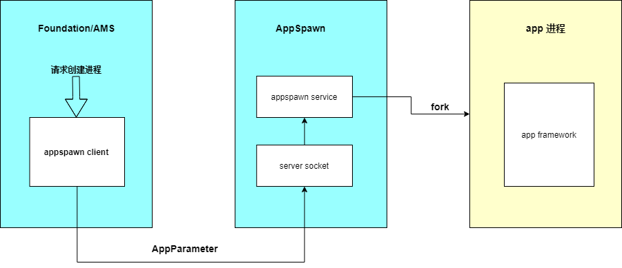

# appspawn应用孵化器部件

## 简介

应用孵化器，负责接受应用程序框架的命令孵化应用进程，设置其对应权限，并调用应用程序框架的入口。

**图1** appspawn应用孵化器组件框架图


## 目录
```
base/startup/appspawn_standard
├─adapter                # 适配外部依赖
│  └─sysevent            # 系统事件管理
├─common                 # 通用代码
├─etc
├─figures
├─interfaces             # 应用孵化器组件头文件以及对外接口
│  └─innerkits
│      ├─client          # 应用孵化器客户端源码
│      └─include         # 应用孵化器头文件
├─lite                   # 小型系统应用孵化器源码
├─standard               # 标准系统应用孵化器源码
├─test                   # 应用孵化器组件测试源码
└─util
    ├─include            # 应用孵化器工具类头文件
    └─src                # 应用孵化器工具类源码, 含json处理库及应用沙箱实现源码
```

## 说明

### 小型系统

  appspawn被init启动后，向IPC框架注册服务名称，之后等待接收进程间消息，根据消息解析结果启动应用服务并赋予其对应权限。

  appspawn注册的服务名称为“appspawn”，在安全子系统限制规则下，目前仅Ability Manager Service有权限可以向appspawn发送的进程间消息。

  appspawn接收的消息为json格式，如下所示：
  ```
  "{"bundleName":"testvalid1","identityID":"1234","uID":1000,"gID":1000,"capability":[0]}"
  ```

  **表 1** 小型系统字段说明
  | 字段名 | 说明 |
  | -------- | -------- |
  | bundleName | 即将启动的应用程序包名，长度≥7字节，≤127字节。 |
  | identityID | AMS为新进程生成的标识符，由appspawn透传给新进程，长度≥1字节，≤24字节。 |
  | uID | 即将启动的应用服务进程的uID。 |
  | gID | 即将启动的应用服务进程的gID。 |
  | capability | 即将启动的应用服务进程所需的capability权限，数量≤10个。 |

### 标准系统
  appspawn注册的服务名称为“appspawn”。appspawn 通过监听本地socket，接收来自客户端的请求消息。

  详细使用说明参考开发指南：[appspawn应用孵化组件](https://gitee.com/openharmony/docs/blob/master/zh-cn/device-dev/subsystems/subsys-boot-appspawn.md)

## 限制与约束
仅支持小型系统和标准系统。

## 相关仓
**[startup\_appspawn](https://gitee.com/openharmony/startup_appspawn)**

[startup\_init\_lite](https://gitee.com/openharmony/startup_init_lite)

[startup\_bootstrap\_lite](https://gitee.com/openharmony/startup_bootstrap_lite)