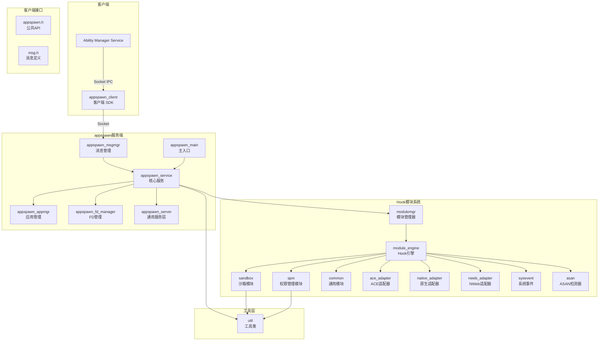
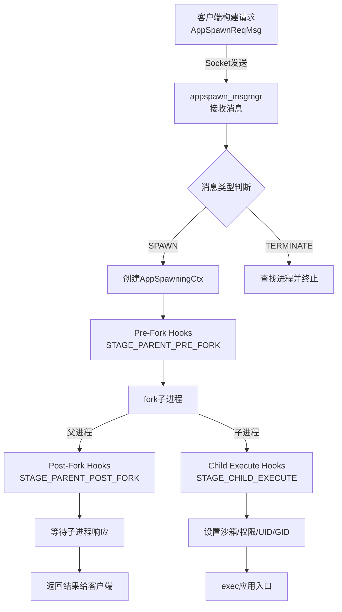
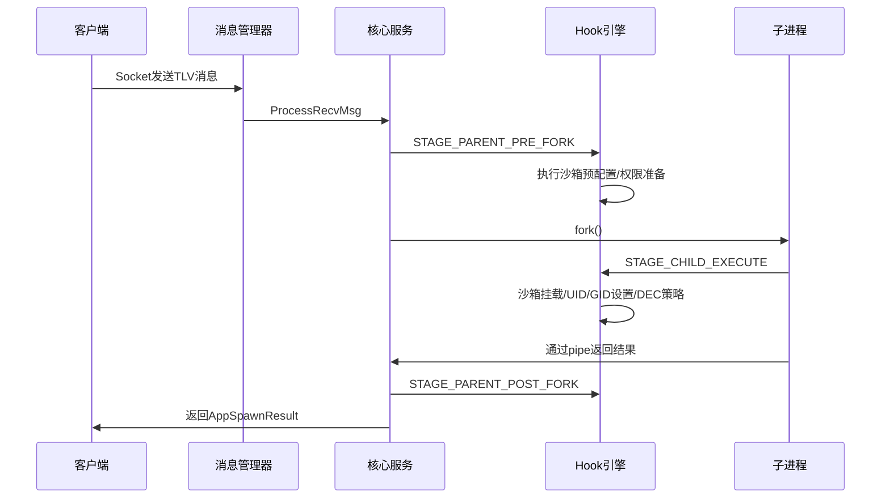
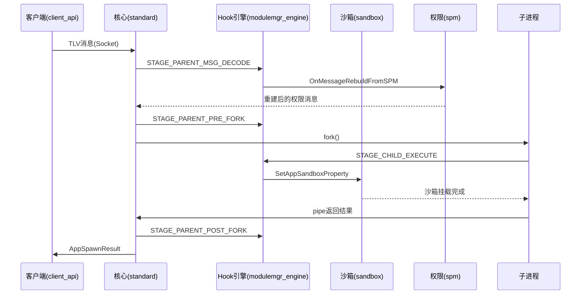

# appspawn 系统架构文档

## 1. 系统概述

appspawn 是 OpenHarmony 操作系统的**应用进程孵化器**（Application Process Spawner），负责接收应用框架（如 Ability Manager Service）的命令，孵化（fork）出应用进程，并为其配置安全沙箱、权限、UID/GID 等运行时环境。appspawn 在系统启动时由 init 进程拉起，通过本地 socket 监听来自客户端的孵化请求。

appspawn 支持多种孵化模式，包括标准应用孵化（appspawn）、NWeb 渲染进程孵化（nwebspawn）、原生进程孵化（nativespawn）、混合孵化（hybridspawn）以及 CJ 应用孵化（cjappspawn）。此外还支持冷启动模式（cold run），即在已 fork 的子进程中直接执行应用，跳过 fork 步骤以加速启动。

系统采用**模块化 Hook 架构**：核心服务通过 Hook 机制（`appspawn_hook.h` 中定义的 `AppSpawnHookStage`）将各个功能模块（沙箱、权限、SPM、ACE 适配等）以插件形式挂载到孵化流程的不同阶段。模块通过 `MODULE_CONSTRUCTOR` 宏在加载时自动注册 Hook，实现了核心逻辑与扩展功能的解耦。

---

## 2. 架构图

### 2.1 系统组件架构

### 2.2 进程孵化数据流

### 2.3 Hook 阶段流程

---

## 3. 模块清单

### Module: standard（标准系统核心）

- **位置**: `standard/`
- **职责**: appspawn 标准系统核心实现，包含主入口、核心服务、消息管理器、应用管理器、FD 管理器、看门狗等
- **关键文件**:
  - `standard/appspawn_main.c` - 主入口，解析参数并启动服务
  - `standard/appspawn_service.c` - 核心服务实现（fork、消息处理、子进程管理）
  - `standard/appspawn_msgmgr.c` - 消息接收与分发
  - `standard/appspawn_appmgr.c` - 已孵化应用进程的管理
  - `standard/appspawn_fd_manager.c` - 文件描述符管理
  - `standard/appspawn_manager.h` - 核心数据结构定义（AppSpawnMgr、AppSpawningCtx 等）
- **依赖**: common, modules/module_engine, modules/modulemgr, util
- **被依赖**: 无（顶层模块）

### Module: common（通用服务层）

- **位置**: `common/`
- **职责**: 提供 appspawn 服务注册和 trace 追踪等通用功能
- **关键文件**:
  - `common/appspawn_server.c` - 服务创建与 socket 监听
  - `common/appspawn_server.h` - `AppSpawnContent` 结构体和运行模式定义
  - `common/appspawn_trace.cpp` - 性能追踪（HiTrace）
- **依赖**: util, interfaces/innerkits
- **被依赖**: standard, lite

### Module: sandbox（沙箱模块）

- **位置**: `modules/sandbox/`
- **职责**: 应用沙箱的创建、挂载管理、DEC 策略、权限控制
- **关键文件**:
  - `modules/sandbox/normal/sandbox_core.cpp` - 沙箱核心逻辑
  - `modules/sandbox/normal/sandbox_common.cpp` - 沙箱通用工具
  - `modules/sandbox/normal/sandbox_shared_mount.cpp` - 共享挂载管理
  - `modules/sandbox/normal/sandbox_unlock_mount.cpp` - 解锁挂载
  - `modules/sandbox/appspawn_permission.c` - 沙箱权限
  - `modules/sandbox/sandbox_dec.c` - DEC（分布式加密）策略
- **依赖**: modules/module_engine, util, common
- **被依赖**: 通过 Hook 被 standard 调用

### Module: spm（安全进程管理器）

- **位置**: `modules/spm/`
- **职责**: SPM（Security Process Manager）内核安全进程管理，包括 tokenid/uid 引用计数管理、权限位图重建
- **关键文件**:
  - `modules/spm/spm.c` - SPM 核心逻辑
  - `modules/spm/spm_permission.c` - 权限操作
  - `modules/spm/tlv_builder.c` - TLV 消息构建
- **依赖**: modules/module_engine, interfaces/innerkits/permission
- **被依赖**: 通过 Hook 被 standard 调用

### Module: modulemgr（模块管理器）

- **位置**: `modules/modulemgr/`
- **职责**: 管理动态模块的加载/卸载，Hook 注册与执行
- **关键文件**:
  - `modules/modulemgr/appspawn_modulemgr.c` - 模块管理实现
  - `modules/modulemgr/appspawn_modulemgr.h` - 模块类型定义和接口
- **依赖**: modules/module_engine
- **被依赖**: standard

### Module: module_engine（Hook 引擎）

- **位置**: `modules/module_engine/`
- **职责**: 定义 Hook 阶段、Hook 优先级、扩展数据结构等基础设施
- **关键文件**:
  - `modules/module_engine/include/appspawn_hook.h` - Hook 阶段和接口定义
  - `modules/module_engine/include/appspawn_msg.h` - TLV 消息类型定义
- **依赖**: interfaces/innerkits/include
- **被依赖**: 几乎所有其他模块

### Module: common_modules（通用功能模块）

- **位置**: `modules/common/`
- **职责**: 提供 namespace 管理、cgroup 配置、ASAN 检测、DFX 转储、进程隔离等通用 Hook 模块
- **关键文件**:
  - `modules/common/appspawn_adapter.cpp` - 适配层
  - `modules/common/appspawn_cgroup.c` - Cgroup 配置
  - `modules/common/appspawn_namespace.c` - 命名空间管理
  - `modules/common/appspawn_isolate.c` - 进程隔离
  - `modules/common/appspawn_custom_config.cpp` - 自定义配置
  - `modules/common/appspawn_encaps.c` - 封装工具
  - `modules/common/appspawn_silk.c` - SILK 引擎集成
- **依赖**: modules/module_engine
- **被依赖**: 通过 Hook 被 standard 调用

### Module: ace_adapter（ACE 适配器）

- **位置**: `modules/ace_adapter/`
- **职责**: ACE（ArkUI Cross-platform Engine）适配，包括 checkpoint 管理、命令解析、预加载
- **关键文件**:
  - `modules/ace_adapter/ace_adapter.cpp` - ACE 适配主文件
  - `modules/ace_adapter/appspawn_checkpoint.c` - Checkpoint 管理
  - `modules/ace_adapter/command_lexer.cpp` - 命令解析器
  - `modules/ace_adapter/dfx_preload.cpp` - DFX 预加载
- **依赖**: modules/module_engine
- **被依赖**: 通过 Hook 被 standard 调用

### Module: client（客户端 SDK）

- **位置**: `interfaces/innerkits/client/`
- **职责**: 提供 appspawn 客户端 API，供 AMS 等外部服务调用
- **关键文件**:
  - `interfaces/innerkits/client/appspawn_client.c` - 客户端实现
  - `interfaces/innerkits/client/appspawn_msg.c` - 请求消息构造
  - `interfaces/innerkits/client/appspawn_client.h` - 客户端数据结构
  - `interfaces/innerkits/include/appspawn.h` - 公共 API 头文件
- **依赖**: 无（独立客户端库）
- **被依赖**: AMS, 外部服务

### Module: util（工具类）

- **位置**: `util/`
- **职责**: 通用工具函数，包括错误码定义、JSON 工具、parcel 序列化、DFX 工具
- **关键文件**:
  - `util/include/appspawn_utils.h` - 通用工具宏和函数
  - `util/include/appspawn_error.h` - 错误码定义
  - `util/src/appspawn_utils.c` - 工具函数实现
  - `util/src/appspawndf_utils.cpp` - DFX 工具实现
- **依赖**: 无
- **被依赖**: 几乎所有模块

### Module: lite（小型系统）

- **位置**: `lite/`
- **职责**: 小型系统（轻量级设备）的 appspawn 实现
- **关键文件**:
  - `lite/main.c` - 主入口
  - `lite/appspawn_service.c` - 服务实现
  - `lite/appspawn_message.c` - 消息处理
  - `lite/appspawn_process.c` - 进程孵化
- **依赖**: interfaces/innerkits
- **被依赖**: 无（独立于标准系统）

### Module: hnp（原生包管理服务）

- **位置**: `service/hnp/`
- **职责**: HNP（Harmony Native Package）原生包安装和管理服务
- **关键文件**:
  - `service/hnp/hnp_main.c` - HNP 服务主入口
  - `service/hnp/installer/src/hnp_installer.c` - 安装器
  - `service/hnp/pack/src/hnp_pack.c` - 打包器
  - `service/hnp/base/hnp_file.c` - 文件操作
  - `service/hnp/base/hnp_json.c` - JSON 处理
- **依赖**: interfaces/innerkits/hnp
- **被依赖**: 无（独立服务）

### Module: devicedebug（设备调试服务）

- **位置**: `service/devicedebug/`
- **职责**: 设备调试功能，包括进程 kill 操作
- **关键文件**:
  - `service/devicedebug/devicedebug_main.c` - 主入口
  - `service/devicedebug/kill/src/devicedebug_kill.c` - Kill 操作
- **依赖**: 无
- **被依赖**: 无（独立服务）

---

## 4. 数据流

### 4.1 应用孵化请求流程

1. **客户端构建请求**: AMS 调用 `AppSpawnReqMsgCreate()` 构建请求消息句柄，通过 `AppSpawnClientAddBundleInfo()` 等 API 填充 TLV 字段（bundle name, DAC info, permission 等），定义在 `interfaces/innerkits/include/appspawn.h:39-45`

2. **Socket 发送**: 客户端通过 `AppSpawnClientSendMsg()` 将消息通过本地 socket 发送给 appspawn 服务端，实现在 `interfaces/innerkits/client/appspawn_client.c`

3. **消息接收与解析**: appspawn_msgmgr 在 socket 上收到数据后，通过 `GetAppSpawnMsgFromBuffer()` 解析 TLV 格式消息，验证 magic（`APPSPAWN_MSG_MAGIC 0xEF201234`），定义在 `modules/module_engine/include/appspawn_msg.h:45`

4. **Hook 执行与 fork**: 核心服务在 `appspawn_service.c` 中按顺序执行 Hook：
   - `STAGE_PARENT_PRE_FORK`: fork 前准备（沙箱路径计算、权限准备）
   - `fork()`: 创建子进程
   - `STAGE_CHILD_EXECUTE`（子进程中）: 沙箱挂载、UID/GID 设置、DEC 策略
   - `STAGE_PARENT_POST_FORK`（父进程中）: 结果收集

5. **结果返回**: 子进程通过 pipe 向父进程返回 `AppSpawnResult`（包含 pid 和 result），父进程通过 socket 返回给客户端

### 4.2 消息格式

消息采用 TLV（Type-Length-Value）格式，定义在 `modules/module_engine/include/appspawn_msg.h:54-66`:

| TLV 类型 | 说明 |
|----------|------|
| TLV_BUNDLE_INFO | 应用包信息（bundle name, index） |
| TLV_MSG_FLAGS | 消息标志位 |
| TLV_DAC_INFO | DAC 信息（UID, GID, GID 表） |
| TLV_DOMAIN_INFO | 域信息（APL 等级） |
| TLV_OWNER_INFO | 所有者信息 |
| TLV_ACCESS_TOKEN_INFO | AccessToken |
| TLV_PERMISSION | 权限位图 |
| TLV_INTERNET_INFO | 网络权限 |
| TLV_RENDER_TERMINATION_INFO | 渲染终止信息 |
| TLV_CHECK_POINT_INFO | Checkpoint 信息 |

---

## 5. 关键接口

| 接口 | 提供方 | 使用方 | 机制 |
|------|--------|--------|------|
| AppSpawnClientInit/SendMsg | client SDK | AMS 等外部服务 | Socket IPC |
| AppSpawnReqMsgCreate | client SDK | AMS 等外部服务 | 函数调用 |
| StartSpawnService | standard/service | main 入口 | 函数调用 |
| AddAppSpawnHook | 各功能模块 | module_engine | Hook 注册 |
| AppSpawnHookExecute | modulemgr | standard/service | Hook 执行 |
| SetAppSandboxProperty | sandbox | 通过 CHILD_EXECUTE Hook | Hook 调用 |
| OnMessageRebuildFromSPM | spm | 通过 PARENT_MSG_DECODE Hook | Hook 调用 |
| AppSpawnCreateContent | common/server | standard/service | 函数调用 |

---

## 6. 外部依赖

| 依赖 | 用途 | 来源 |
|------|------|------|
| init_socket | Socket 创建与连接 | OpenHarmony init |
| loop_event | 事件循环（IO 多路复用） | OpenHarmony |
| hookmgr | Hook 管理器框架 | OpenHarmony |
| modulemgr | 动态模块加载框架 | OpenHarmony |
| cJSON | JSON 解析 | 第三方 |
| parameter | 系统参数读取 | OpenHarmony |
| securec | 安全 C 函数库 | OpenHarmony |
| hisysevent | 系统事件上报 | OpenHarmony |
| access_token | 访问令牌 | OpenHarmony |
| selinux | SELinux 安全上下文 | 系统 |
| seccomp | 系统调用过滤 | 系统 |

---

## 7. 跨模块关系 (Cross-Module Relationships)

### 7.1 跨模块数据流

### 7.2 共享数据结构

| Structure | Used By | Purpose |
|-----------|---------|---------|
| AppSpawnMgr | standard, sandbox, spm, common_modules | 全局管理器（孵化队列、服务状态） |
| AppSpawningCtx | standard, sandbox, spm, ace_adapter | 孵化请求上下文（消息、fork pipe、SPM 引用计数） |
| AppSpawnMsg | client_api, standard, modulemgr_engine | TLV 消息头（magic、msgType、processName） |
| AppSpawnContent | standard, server_common, sandbox | 服务内容（模式、函数指针表） |
| AppSpawnHookStage | modulemgr_engine, sandbox, spm, common_modules | Hook 阶段枚举 |

### 7.3 接口契约

| Contract | Provider | Consumer | Description |
|----------|----------|----------|-------------|
| TLV 消息格式 | client_api | standard | 客户端构造 TLV，服务端解析 TLV |
| Hook 注册 | modulemgr_engine | 所有功能模块 | 通过 `MODULE_CONSTRUCTOR` + `AddAppSpawnHook` |
| AppSpawningCtx 生命周期 | standard | sandbox, spm | standard 创建/销毁，其他模块读取 |
| 沙箱配置 JSON | sandbox（读取） | 根目录（定义） | `appdata-sandbox-*.json` 配置文件 |

---

## 8. 系统级模式 (System-Level Patterns)

### 8.1 Hook 驱动模式

所有功能扩展通过 Hook 实现。模块使用 `MODULE_CONSTRUCTOR` 在 .so 加载时注册 Hook，核心服务通过 `AppSpawnHookExecute` 按优先级执行。

### 8.2 函数指针表多态

`AppSpawnContent` 使用函数指针（`runAppSpawn`、`runChildProcessor`、`coldStartApp`）实现不同孵化模式的多态分发。

### 8.3 UID 白名单安全

仅允许特定 UID（root / foundation / app_fwk_update / storage_manager）的客户端连接，开发者模式下允许 shell。

### 8.4 引用计数资源管理

SPM 模块使用位图（`spmRefAdded`）跟踪 tokenid/uid 引用计数，确保 spawn abort 和进程退出时正确回收。
