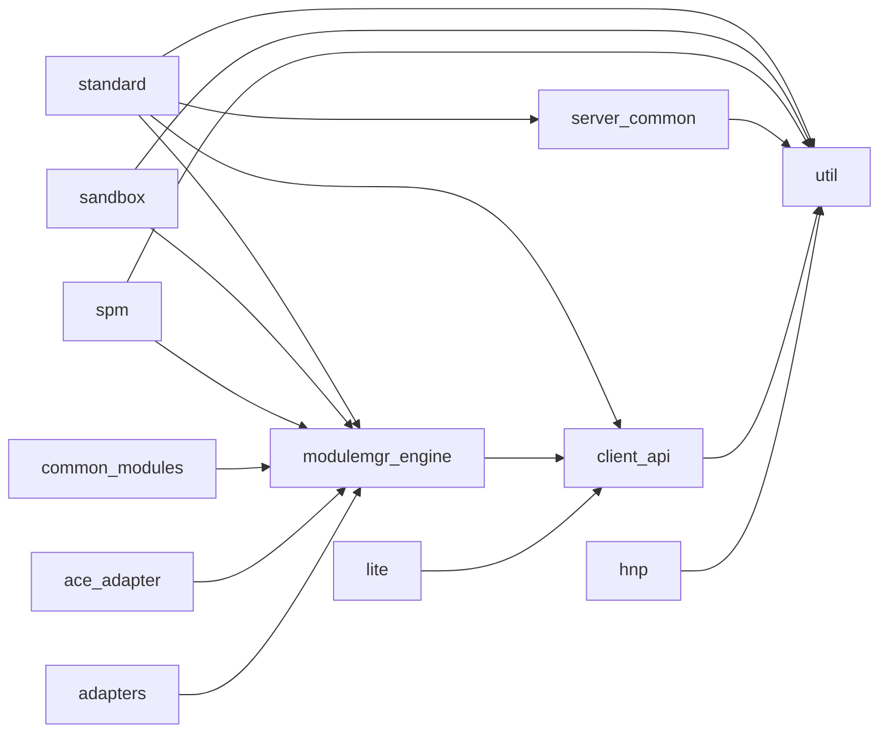

# 模块分解与知识点规划

## 1. 模块分解表

| # | 模块名称 | 源码目录 | 关键文件 | 复杂度 | 优先级 |
|---|----------|----------|----------|--------|--------|
| 1 | standard | `standard/` | appspawn_service.c, appspawn_main.c, appspawn_msgmgr.c, appspawn_appmgr.c, appspawn_manager.h, appspawn_fd_manager.c | High | P0 |
| 2 | sandbox | `modules/sandbox/` | sandbox_core.cpp, sandbox_common.cpp, sandbox_shared_mount.cpp, sandbox_unlock_mount.cpp, sandbox_dec.c, appspawn_permission.c | High | P0 |
| 3 | spm | `modules/spm/` | spm.c, spm_permission.c, tlv_builder.c | High | P0 |
| 4 | common_modules | `modules/common/` | appspawn_common.c, appspawn_cgroup.c, appspawn_namespace.c, appspawn_isolate.c, appspawn_adapter.cpp, appspawn_encaps.c | Medium | P1 |
| 5 | ace_adapter | `modules/ace_adapter/` | ace_adapter.cpp, appspawn_checkpoint.c, command_lexer.cpp, dfx_preload.cpp | Medium | P1 |
| 6 | client_api | `interfaces/innerkits/` | appspawn_client.c, appspawn_msg.c, appspawn.h, appspawn_client.h | Medium | P0 |
| 7 | modulemgr_engine | `modules/modulemgr/`, `modules/module_engine/` | appspawn_modulemgr.c, appspawn_hook.h, appspawn_msg.h | Medium | P1 |
| 8 | util | `util/` | appspawn_utils.c, appspawndf_utils.cpp, appspawn_error.h | Low | P2 |
| 9 | server_common | `common/` | appspawn_server.c, appspawn_server.h, appspawn_trace.cpp | Low | P2 |
| 10 | hnp | `service/hnp/` | hnp_main.c, hnp_installer.c, hnp_pack.c, hnp_base.h | Medium | P2 |
| 11 | lite | `lite/` | main.c, appspawn_service.c, appspawn_message.c, appspawn_process.c | Low | P2 |
| 12 | adapters | `modules/native_adapter/`, `modules/nweb_adapter/`, `modules/sysevent/`, `modules/asan/` | native_adapter.cpp, nwebspawn_adapter.cpp, appspawn_hisysevent.cpp, asan_detector.c | Low | P2 |

---

## 2. 知识点规划

### Module: standard

**KP-1 [P0]**: 进程孵化主流程 (appspawn_main.c → StartSpawnService → runAppSpawn)
- 待探索: main() 函数如何解析参数、选择模式、启动服务并进入事件循环
- 预期证据: `appspawn_main.c:101-162` 的 main 函数、模式选择逻辑
- 相关文件: `standard/appspawn_main.c`, `standard/appspawn_service.c`

**KP-2 [P0]**: fork 与子进程管理 (appspawn_service.c)
- 待探索: fork 流程、prefork 机制、子进程通过 pipe 通信、AppSpawningCtx 生命周期
- 预期证据: `appspawn_service.c` 中的 AppSpawnProcessMsg、AppSpawnChild 函数
- 相关文件: `standard/appspawn_service.c`, `standard/appspawn_manager.h`

**KP-3 [P0]**: 消息接收与 TLV 解析 (appspawn_msgmgr.c)
- 待探索: socket 消息接收、分片重组、TLV 格式解析、消息验证
- 预期证据: `appspawn_msgmgr.c` 中的 OnReceiveRequest、ProcessRecvMsg
- 相关文件: `standard/appspawn_msgmgr.c`, `modules/module_engine/include/appspawn_msg.h`

**KP-4 [P0]**: AppSpawnMgr 核心数据结构 (appspawn_manager.h)
- 待探索: AppSpawnMgr、AppSpawningCtx、AppSpawnedProcess 的关系和使用方式
- 预期证据: `appspawn_manager.h:161-181` 结构体定义
- 相关文件: `standard/appspawn_manager.h`

**KP-5 [P1]**: 已孵化进程管理 (appspawn_appmgr.c)
- 待探索: 进程注册、查找、终止、遍历操作
- 预期证据: `appspawn_appmgr.c` 中的 AddSpawnedProcess、GetSpawnedProcess
- 相关文件: `standard/appspawn_appmgr.c`

**KP-6 [P1]**: FD 管理与传递 (appspawn_fd_manager.c)
- 待探索: 文件描述符在父子进程间的传递机制
- 预期证据: `appspawn_fd_manager.c` 中的 FD 管理函数
- 相关文件: `standard/appspawn_fd_manager.c`, `standard/appspawn_fd_manager.h`

**KP-7 [P1]**: 信号处理与看门狗 (appspawn_kickdog.c, pid_ns_init.c)
- 待探索: SIGCHLD 处理、看门狗机制、PID namespace 初始化
- 预期证据: `appspawn_kickdog.c`、`pid_ns_init.c`
- 相关文件: `standard/appspawn_kickdog.c`, `standard/pid_ns_init.c`

**KP-8 [P0]**: 多种孵化模式（appspawn/nwebspawn/nativespawn/hybridspawn/cold run）
- 待探索: 不同模式（spawn vs cold run）的启动差异、RunMode 枚举的使用
- 预期证据: `appspawn_main.c:31-45` 的模式模板定义、`appspawn_service.h:65-71`
- 相关文件: `standard/appspawn_main.c`, `common/appspawn_server.h`

### Module: sandbox

**KP-1 [P0]**: 沙箱核心架构 (sandbox_core.h/cpp)
- 待探索: SandboxCore 类的设计、SetAppSandboxProperty 主入口、各阶段处理
- 预期证据: `sandbox_core.h:32-80` 的类定义、SetSandboxProperty 方法
- 相关文件: `modules/sandbox/normal/sandbox_core.cpp`, `modules/sandbox/normal/sandbox_core.h`

**KP-2 [P0]**: 沙箱挂载点管理 (DoAllMntPointsMount)
- 待探索: 如何从 JSON 配置读取挂载点、变量替换、mount 系统调用
- 预期证据: `sandbox_core.cpp` 中 DoAllMntPointsMount 实现
- 相关文件: `modules/sandbox/normal/sandbox_core.cpp`, `appdata-sandbox*.json`

**KP-3 [P0]**: 沙箱配置系统 (appdata-sandbox-*.json)
- 待探索: 多种沙箱配置文件（app/isolated/render/gpu/debug）的加载和差异
- 预期证据: 根目录下的 JSON 配置文件、`sandbox_core.cpp` 中的加载逻辑
- 相关文件: `appdata-sandbox.json`, `appdata-sandbox-isolated.json`, `appdata-sandbox-render.json`

**KP-4 [P1]**: 共享挂载管理 (sandbox_shared_mount.cpp)
- 待探索: 共享挂载的创建、解锁挂载机制
- 预期证据: `sandbox_shared_mount.cpp`、`sandbox_unlock_mount.cpp`
- 相关文件: `modules/sandbox/normal/sandbox_shared_mount.cpp`

**KP-5 [P1]**: DEC（分布式加密）策略 (sandbox_dec.c)
- 待探索: DEC 策略设置、目录加密、fscrypt 配置
- 预期证据: `sandbox_dec.c` 中的策略设置函数
- 相关文件: `modules/sandbox/sandbox_dec.c`, `modules/sandbox/sandbox_dec.h`

**KP-6 [P1]**: 沙箱权限控制 (appspawn_permission.c)
- 待探索: 沙箱内的权限检查和挂载权限
- 预期证据: `appspawn_permission.c` 中的权限函数
- 相关文件: `modules/sandbox/appspawn_permission.c`

### Module: spm

**KP-1 [P0]**: SPM 核心架构 (spm.h/spm.c)
- 待探索: SPM 权限管理的整体设计、与内核的交互、spawnId 机制
- 预期证据: `spm.c` 中的核心函数、`spm.h:74-83` 的接口定义
- 相关文件: `modules/spm/spm.c`, `modules/spm/spm.h`

**KP-2 [P0]**: 权限消息重建 (OnMessageRebuildFromSPM)
- 待探索: 从内核获取 SPM 数据并重建 TLV 消息的流程
- 预期证据: `spm.c` 中 OnMessageRebuildFromSPM 函数
- 相关文件: `modules/spm/spm.c`

**KP-3 [P1]**: 引用计数管理 (OnSpawnAbortUpdateRefCount, OnAppExitUpdateRefCount)
- 待探索: tokenid 和 uid 的引用计数管理、spawn abort 时的资源回收
- 预期证据: `spm.c` 中引用计数相关函数、`spm.h:37-39` 的标志位定义
- 相关文件: `modules/spm/spm.c`

**KP-4 [P1]**: TLV 构建器 (tlv_builder.c)
- 待探索: SPM 权限数据如何构建为 TLV 格式
- 预期证据: `tlv_builder.c` 中的构建函数
- 相关文件: `modules/spm/tlv_builder.c`, `modules/spm/tlv_builder.h`

**KP-5 [P1]**: APL 等级与权限映射 (spm_permission.c)
- 待探索: APL（Ability Privilege Level）等级如何映射到具体权限
- 预期证据: `spm_permission.c`、`spm.h:67-72` 的 AplLevel 枚举
- 相关文件: `modules/spm/spm_permission.c`

### Module: common_modules

**KP-1 [P1]**: Cgroup 配置管理 (appspawn_cgroup.c)
- 待探索: cgroup 路径设置、进程 cgroup 归属
- 预期证据: `appspawn_cgroup.c` 中的 cgroup 操作函数
- 相关文件: `modules/common/appspawn_cgroup.c`

**KP-2 [P1]**: 命名空间管理 (appspawn_namespace.c)
- 待探索: mount namespace、pid namespace 的设置
- 预期证据: `appspawn_namespace.c` 中的 namespace 操作
- 相关文件: `modules/common/appspawn_namespace.c`

**KP-3 [P1]**: 进程隔离 (appspawn_isolate.c)
- 待探索: 进程隔离机制的实现
- 预期证据: `appspawn_isolate.c` 中的隔离函数
- 相关文件: `modules/common/appspawn_isolate.c`

**KP-4 [P2]**: 通用适配层 (appspawn_adapter.cpp)
- 待探索: 外部依赖适配、SELinux 上下文设置
- 预期证据: `appspawn_adapter.cpp` 中的适配函数
- 相关文件: `modules/common/appspawn_adapter.cpp`

**KP-5 [P2]**: 封装工具与 SILK 引擎 (appspawn_encaps.c, appspawn_silk.c)
- 待探索: 进程信息封装、SILK 引擎集成
- 预期证据: `appspawn_encaps.c`、`appspawn_silk.c`
- 相关文件: `modules/common/appspawn_encaps.c`, `modules/common/appspawn_silk.c`

### Module: ace_adapter

**KP-1 [P1]**: ACE 适配主流程 (ace_adapter.cpp)
- 待探索: ACE 引擎适配、模块注册、Hook 挂载
- 预期证据: `ace_adapter.cpp` 中的模块初始化和 Hook 注册
- 相关文件: `modules/ace_adapter/ace_adapter.cpp`

**KP-2 [P1]**: Checkpoint/镜像进程管理 (appspawn_checkpoint.c)
- 待探索: 镜像进程的创建和管理、checkpoint ID 机制
- 预期证据: `appspawn_checkpoint.c` 中的 checkpoint 函数
- 相关文件: `modules/ace_adapter/appspawn_checkpoint.c`

**KP-3 [P2]**: 命令解析器与 DFX 预加载
- 待探索: 命令行解析、DFX 预加载机制
- 预期证据: `command_lexer.cpp`、`dfx_preload.cpp`
- 相关文件: `modules/ace_adapter/command_lexer.cpp`, `modules/ace_adapter/dfx_preload.cpp`

### Module: client_api

**KP-1 [P0]**: 客户端 SDK 架构 (appspawn.h)
- 待探索: 公共 API 设计、AppSpawnClientHandle/AppSpawnReqMsgHandle 句柄模型
- 预期证据: `appspawn.h:39-45` 的类型定义和 API 声明
- 相关文件: `interfaces/innerkits/include/appspawn.h`

**KP-2 [P0]**: 消息构造与发送 (appspawn_msg.c, appspawn_client.c)
- 待探索: TLV 消息构建流程、socket 通信、线程安全设计
- 预期证据: `appspawn_msg.c` 中的消息构建、`appspawn_client.c` 中的发送逻辑
- 相关文件: `interfaces/innerkits/client/appspawn_msg.c`, `interfaces/innerkits/client/appspawn_client.c`

**KP-3 [P0]**: DAC/权限信息设置 API
- 待探索: AppSpawnClientSetAppDacInfo、AppSpawnClientAddPermission 等 API
- 预期证据: `appspawn.h` 中的 API 声明、`appspawn_msg.c` 中的实现
- 相关文件: `interfaces/innerkits/include/appspawn.h`, `interfaces/innerkits/client/appspawn_msg.c`

**KP-4 [P1]**: 客户端连接管理
- 待探索: 连接池、超时重试、多线程支持
- 预期证据: `appspawn_client.h:74-82` 的 AppSpawnReqMsgMgr 结构体
- 相关文件: `interfaces/innerkits/client/appspawn_client.h`, `interfaces/innerkits/client/appspawn_client.c`

### Module: modulemgr_engine

**KP-1 [P0]**: Hook 阶段定义与执行 (appspawn_hook.h)
- 待探索: AppSpawnHookStage 枚举的各阶段含义、Hook 优先级机制
- 预期证据: `appspawn_hook.h:60-87` 的阶段和优先级定义
- 相关文件: `modules/module_engine/include/appspawn_hook.h`

**KP-2 [P1]**: 模块加载与管理 (appspawn_modulemgr.c)
- 待探索: 模块动态加载（dlopen）、MODULE_CONSTRUCTOR 宏、模块类型过滤
- 预期证据: `appspawn_modulemgr.c` 中的加载函数
- 相关文件: `modules/modulemgr/appspawn_modulemgr.c`, `modules/modulemgr/appspawn_modulemgr.h`

**KP-3 [P1]**: TLV 消息类型系统 (appspawn_msg.h)
- 待探索: TLV 消息结构体、AppSpawnMsg 格式、magic 验证
- 预期证据: `appspawn_msg.h:54-66` 的类型枚举、`:135-142` 的消息头
- 相关文件: `modules/module_engine/include/appspawn_msg.h`

### Module: util

**KP-1 [P2]**: 通用工具函数 (appspawn_utils.c)
- 待探索: 字符串处理、路径操作、日志宏
- 预期证据: `appspawn_utils.c` 中的工具函数
- 相关文件: `util/src/appspawn_utils.c`, `util/include/appspawn_utils.h`

**KP-2 [P2]**: 错误码体系 (appspawn_error.h)
- 待探索: 错误码分类和定义
- 预期证据: `appspawn_error.h` 中的错误码枚举
- 相关文件: `util/include/appspawn_error.h`

### Module: server_common

**KP-1 [P2]**: AppSpawnContent 与服务创建 (appspawn_server.c/h)
- 待探索: AppSpawnContent 结构体的设计、socket 服务创建流程
- 预期证据: `appspawn_server.h:98-120` 的 AppSpawnContent 定义
- 相关文件: `common/appspawn_server.c`, `common/appspawn_server.h`

**KP-2 [P2]**: 性能追踪 (appspawn_trace.cpp)
- 待探索: HiTrace 集成、性能埋点
- 预期证据: `appspawn_trace.cpp` 中的 trace 函数
- 相关文件: `common/appspawn_trace.cpp`, `common/appspawn_trace.h`

### Module: hnp

**KP-1 [P2]**: HNP 服务架构
- 待探索: 原生包安装服务的主流程
- 预期证据: `hnp_main.c` 中的服务入口
- 相关文件: `service/hnp/hnp_main.c`, `service/hnp/installer/src/hnp_installer.c`

### Module: lite

**KP-1 [P2]**: 小型系统 appspawn 实现
- 待探索: 轻量级 appspawn 的简化实现
- 预期证据: `lite/main.c`、`lite/appspawn_service.c`
- 相关文件: `lite/main.c`, `lite/appspawn_service.c`

### Module: adapters

**KP-1 [P2]**: 原生适配器与 NWeb 适配器
- 待探索: nativespawn 和 nwebspawn 的适配逻辑
- 预期证据: `native_adapter.cpp`、`nwebspawn_adapter.cpp`
- 相关文件: `modules/native_adapter/native_adapter.cpp`, `modules/nweb_adapter/nwebspawn_adapter.cpp`

**KP-2 [P2]**: 系统事件与 ASAN 检测
- 待探索: HiSysEvent 上报、ASAN 检测器
- 预期证据: `appspawn_hisysevent.cpp`、`asan_detector.c`
- 相关文件: `modules/sysevent/appspawn_hisysevent.cpp`, `modules/asan/asan_detector.c`

---

## 3. 模块依赖图



---

## 4. 探索顺序建议

1. **modulemgr_engine** — 无外部依赖（仅依赖 client_api 的头文件），是所有 Hook 模块的基础
2. **client_api** — 定义了消息格式和公共 API，是理解所有通信的基础
3. **util** — 工具层，被所有模块依赖
4. **standard** — 核心服务，依赖前三者
5. **server_common** — 通用服务层
6. **sandbox** — 沙箱模块，依赖 modulemgr_engine
7. **spm** — 权限管理，依赖 modulemgr_engine
8. **common_modules** — 通用功能模块
9. **ace_adapter** — ACE 适配
10. **adapters** — 各类适配器
11. **hnp** — 独立服务
12. **lite** — 小型系统实现

---

## 5. 并行化机会

```
并行组 1: modulemgr_engine, client_api, util（无相互依赖）
并行组 2: standard, server_common（依赖组 1）
并行组 3: sandbox, spm, common_modules, ace_adapter, adapters（依赖组 1，彼此独立）
并行组 4: hnp, lite（独立服务，可随时探索）
```
