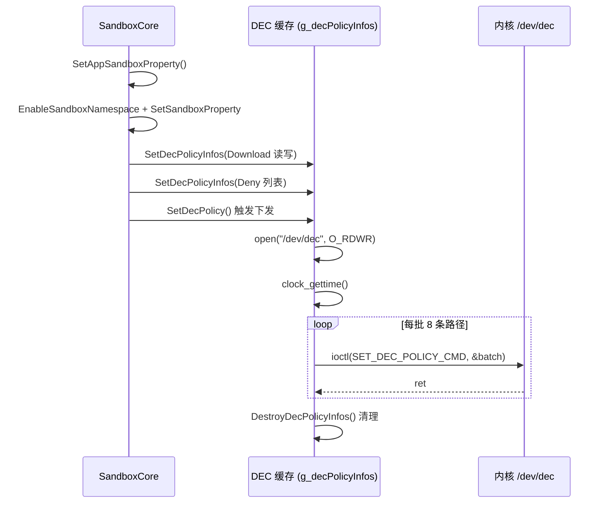

# Module: sandbox

> 返回: [索引](../index.md)


## Overview

sandbox 模块负责应用沙箱的创建和管理，是 appspawn 安全隔离的核心组件。它在子进程的 `STAGE_CHILD_EXECUTE` Hook 阶段被调用，为应用进程构建隔离的文件系统视图。

沙箱模块通过读取 JSON 配置文件（`appdata-sandbox-*.json`）定义挂载点、符号链接和权限规则，使用 Linux mount namespace（`CLONE_NEWNS`）实现文件系统隔离。支持多种沙箱类型：标准应用沙箱、隔离沙箱、渲染沙箱、GPU 沙箱、调试 HAP 沙箱等。

## Source Location
- Directory: `modules/sandbox/`
- Files: 7 C/C++ 源文件, 7 头文件
- Estimated LOC: ~5,198

## Dependencies
- Depends on: modulemgr_engine, util
- Used by: 通过 Hook 被 standard 模块调用

---

## KP-1: 沙箱核心架构

**Priority**: P0

### Summary

`SandboxCore` 类（`sandbox_core.h`）是沙箱模块的核心，提供静态方法处理沙箱的各个方面：挂载点管理、namespace 设置、DEC 策略、debug HAP 等。

### Key Code

#### SandboxCore 类定义
```cpp
// modules/sandbox/normal/sandbox_core.h:32
class SandboxCore {
public:
    static int32_t DoAllMntPointsMount(const AppSpawningCtx *appProperty, cJSON *appConfig,
        const char *typeName, const std::string &section = "app-base");
    static int32_t SetCommonAppSandboxProperty(const AppSpawningCtx *appProperty, std::string &sandboxPackagePath);
    static int32_t SetPrivateAppSandboxProperty(const AppSpawningCtx *appProperty);
    static int32_t SetPermissionAppSandboxProperty(AppSpawningCtx *appProperty);
    static int32_t SetAppSandboxProperty(AppSpawnMgr *content, AppSpawningCtx *appProperty,
        uint32_t sandboxNsFlags = CLONE_NEWNS);
    static int32_t SetSandboxProperty(AppSpawningCtx *appProperty, std::string &sandboxPackagePath);
    // ...
};
```

#### Namespace 创建
```cpp
// modules/sandbox/normal/sandbox_core.cpp:60
int SandboxCore::EnableSandboxNamespace(AppSpawningCtx *appProperty, uint32_t sandboxNsFlags)
{
    int rc = unshare(sandboxNsFlags);
    if ((sandboxNsFlags & CLONE_NEWNET) == CLONE_NEWNET) {
        rc = EnableNewNetNamespace();
    }
    return 0;
}
```
通过 `unshare()` 系统调用创建新的 mount namespace 和可选的 network namespace。

---

## KP-2: 沙箱挂载点管理

**Priority**: P0

### Summary

`DoAllMntPointsMount` 方法遍历 JSON 配置中的挂载点定义，执行变量替换后进行 mount 系统调用。

### Key Code

#### 挂载点路径获取
```cpp
// modules/sandbox/normal/sandbox_core.cpp:137
std::string SandboxCore::GetSandboxPath(const AppSpawningCtx *appProperty, cJSON *mntPoint,
    const std::string &section, std::string sandboxRoot)
{
    const char *tmpSandboxPathChr = GetStringFromJsonObj(mntPoint, SandboxCommonDef::g_sandBoxPath);
    if (section.compare(SandboxCommonDef::g_permissionPrefix) == 0) {
        sandboxPath = sandboxRoot + SandboxCommon::ConvertToRealPathWithPermission(appProperty, tmpSandboxPath);
    } else {
        sandboxPath = sandboxRoot + SandboxCommon::ConvertToRealPath(appProperty, tmpSandboxPath);
    }
}
```
变量替换将配置中的占位符（如 `&bundleName&`、`&userId&`）替换为实际值。

---

## KP-3: 沙箱配置系统

**Priority**: P0

### Summary

沙箱配置存储在多个 JSON 文件中，每种沙箱类型对应一个配置文件。

| 配置文件 | 加载时机 | 说明 |
|----------|----------|------|
| `appdata-sandbox-app.json` | EXT_DATA_APP_SANDBOX | 标准应用沙箱 |
| `appdata-sandbox-isolated.json` | EXT_DATA_ISOLATED_SANDBOX | 隔离沙箱 |
| `appdata-sandbox-isolated-new.json` | EXT_DATA_ISOLATED_SANDBOX | 新隔离沙箱 |
| `appdata-sandbox-render.json` | EXT_DATA_RENDER_SANDBOX | 渲染进程沙箱 |
| `appdata-sandbox-gpu.json` | EXT_DATA_GPU_SANDBOX | GPU 进程沙箱 |
| `appdata-sandbox-debug.json` | EXT_DATA_DEBUG_HAP_SANDBOX | 调试 HAP 沙箱 |
| `appdata-sandbox-asan.json` | - | ASAN 检测沙箱 |

扩展数据类型定义：
```c
// modules/module_engine/include/appspawn_hook.h:40
typedef enum {
    EXT_DATA_APP_SANDBOX,
    EXT_DATA_NAMESPACE,
    EXT_DATA_ISOLATED_SANDBOX,
    EXT_DATA_RENDER_SANDBOX,
    EXT_DATA_GPU_SANDBOX,
    EXT_DATA_DEBUG_HAP_SANDBOX,
    EXT_DATA_COUNT,
} ExtDataType;
```

### KP-3 扩展：JSON 字段语义详解 (G-3 补全)

#### 完整文件清单

| 文件 | 大小 | 适用场景 |
|------|------|----------|
| `appdata-sandbox.json` | 58KB | 标准应用沙箱主配置（含权限/条件/命名组） |
| `appdata-sandbox-app.json` | 30KB | 应用级简化配置（common + individual） |
| `appdata-sandbox64.json` | 3.2KB | 64 位系统专用 |
| `appdata-sandbox-isolated.json` | 3.4KB | 隔离进程（WebView 等） |
| `appdata-sandbox-isolated-new.json` | 2.2KB | 新版隔离配置 |
| `appdata-sandbox-render.json` | 3.4KB | NWeb 渲染进程 |
| `appdata-sandbox-gpu.json` | 3.4KB | GPU 进程（Vulkan/shader cache） |
| `appdata-sandbox-debug.json` | 1.4KB | 调试 HAP（`/mnt/debugtmp/...`） |
| `appdata-sandbox-asan.json` | 4.4KB | AddressSanitizer 内存检测 |

#### 顶层 Schema（主配置）

```json
{
  "global":         { "sandbox-root", "sandbox-ns-flags" },
  "required":       { "system-const": {...}, "app-variable": {...} },
  "conditional":    { "permission": [], "spawn-flag": [], "package-name": [] },
  "name-groups":    []
}
```

#### 核心字段表

| 字段 | 类型 | 语义 |
|------|------|------|
| `sandbox-root` | string | 沙箱根路径（含占位符） |
| `sandbox-ns-flags` | array | namespace 标志（`pid` / `net`） |
| `top-sandbox-switch` / `sandbox-switch` | string | 顶层 / 条目级开关（`ON`/`OFF`） |
| `src-path` | string | 源路径（可含占位符） |
| `sandbox-path` | string | 沙箱内目标路径 |
| `sandbox-flags` | array | 挂载标志，映射到 `MS_*` |
| `sandbox-flags-customized` | array | 自定义标志（如 `MS_NODEV`） |
| `check-action-status` | string | `"true"` / `"false"` 是否校验执行结果 |
| `fs-type` | string | 文件系统类型（如 `sharefs`） |
| `options` | string | 挂载选项（如 `override_support_delete`） |
| `dac-override-sensitive` | string | DAC 覆盖敏感标志 |
| `mount-groups` | array | 挂载组名（如 `el2`, `el3`, `user-public`） |
| `mount-paths-deps` | object | 依赖路径（`deps-mode: not-exists`） |
| `target-name` / `link-name` | string | symlink 目标 / 链接名 |
| `dec-paths` / `dec-readonly-paths` | array | DEC 加密路径列表 |
| `gids` / `uid` / `gid` / `mode` | mixed | 权限三件套 |

#### 路径占位符（`sandbox_def.h:105-115`）

| 占位符 | 含义 |
|--------|------|
| `<currentUserId>` | 当前用户 ID |
| `<PackageName>` | 应用包名 |
| `<variablePackageName>` | 可变包名（DLP 等场景） |
| `<PackageName_index>` | 包名索引（DLP 管理器） |
| `<arkWebPackageName>` | ArkWeb 渲染包名 |
| `<hostUserId>` | 宿主用户 ID |
| `<lib>` | 库路径（lib / lib64） |

#### sandbox-flags → mount(2) 映射

由 `sandbox_common.cpp:355-370` 的 `GetMountFlagsFromConfig` 解析：

| 字符串 | 系统宏 | 语义 |
|--------|--------|------|
| `bind` | `MS_BIND` | 绑定挂载 |
| `rec` | `MS_REC` | 递归挂载 |
| `move` | `MS_MOVE` | 移动挂载点 |
| `slave` | `MS_SLAVE` | 从属挂载 |
| `shared` | `MS_SHARED` | 共享挂载 |
| `rdonly` | `MS_RDONLY` | 只读 |
| `nosuid` / `nodev` / `noexec` | 对应 `MS_*` | 安全限制 |
| `noatime` / `lazytime` | 对应 `MS_*` | 时间戳策略 |
| `remount` | `MS_REMOUNT` | 重新挂载 |
| `unbindable` | `MS_UNBINDABLE` | 不可绑定 |

#### 配置差异速览

| 维度 | app | isolated | render / gpu | debug | asan |
|------|------|----------|--------------|-------|------|
| 沙箱根 | `.../app-root` | `.../app-root-isolated` | `com.ohos.render/{render,gpu}-root` | `/mnt/debugtmp/...` | 标准路径 |
| namespace | `[net]` | `[net]` | `[pid, net]` | 无 | `[pid, net]`（可选） |
| 库路径 | 标准 | 标准 | 标准 + NWeb | 标准 | `/system/asan/lib*`, `/vendor/asan/lib*` |

#### 解析代码入口

| 函数 | 位置 | 用途 |
|------|------|------|
| `GetJsonObjFromFile` | `util/src/appspawn_utils.c:272` | 读文件 + cJSON 解析 |
| `ParseJsonConfig` | `util/src/appspawn_utils.c:282` | 多目录配置策略加载 |
| `LoadAppSandboxConfigCJson` | `modules/sandbox/normal/sandbox_common.cpp:146` | 沙箱配置加载入口 |
| `GetSandboxNsFlags` | `modules/sandbox/normal/sandbox_common.cpp:50` | 解析 `sandbox-ns-flags` |
| `GetMountFlagsFromConfig` | `modules/sandbox/normal/sandbox_common.cpp:355` | 解析 `sandbox-flags` |
| `DoAllMntPointsMount` | `modules/sandbox/normal/sandbox_core.cpp:640` | 执行挂载 |
| `DoAllSymlinkPointslink` | `modules/sandbox/normal/sandbox_core.cpp:812` | 执行 symlink |

#### JSON 示例（基础挂载）

```json
{
  "global": {
    "sandbox-root": "/mnt/sandbox/<currentUserId>/app-root-isolated",
    "sandbox-ns-flags": ["net"]
  },
  "required": {
    "system-const": {
      "mount-paths": [
        { "src-path": "/system/lib", "sandbox-path": "/system/lib" }
      ],
      "symbol-links": [
        { "target-name": "/system/lib", "link-name": "/lib", "check-action-status": "false" }
      ]
    }
  }
}
```

#### JSON 示例（权限条件挂载）

```json
{
  "conditional": {
    "permission": [{
      "name": "ohos.permission.FILE_ACCESS_MANAGER",
      "sandbox-switch": "ON",
      "gids": ["file_manager", "user_data_rw"],
      "mount-paths": [{
        "src-path": "/mnt/user/<currentUserId>/nosharefs/docs",
        "sandbox-path": "/storage/Users"
      }],
      "mount-groups": ["user-public"]
    }]
  }
}
```

---

## KP-4: 共享挂载管理

**Priority**: P1

### Summary

`sandbox_shared_mount.cpp` 和 `sandbox_unlock_mount.cpp` 管理应用间的共享挂载和解锁挂载操作。共享挂载允许同一应用的多个进程实例共享文件系统视图。

### Key Code

`SandboxSharedMount` 类管理共享挂载的创建和路径标记。解锁挂载（unlock mount）用于在应用卸载或特殊场景下解除挂载锁定。

---

## KP-5: DEC 策略详解 (G-5 补全，修正 fscrypt 误述)

**Priority**: P1

### Summary

DEC（Dynamic Enhance Control，动态增强控制）是 OpenHarmony 内核的**专有访问控制机制**，通过 `/dev/dec` 字符设备和自定义 ioctl 命令下发基于 tokenId + 路径的策略。DEC 全称（Dynamic Enhance Control）未在仓库代码注释中给出，由维护者口述确认；早期 AI agent 推测的 "Distributed Encryption Control" 是错误的。

**重要修正**：早期版本误将 DEC 描述为"使用 fscrypt 加密"——**本仓库代码中不存在任何 fscrypt 调用**。DEC 与 Linux 标准 fscrypt 是两套独立机制：

| 特性 | DEC（本仓库使用） | fscrypt（未使用） |
|------|-------------------|-------------------|
| 粒度 | tokenId + 路径访问控制 | 文件系统级加密 |
| 内核接口 | `/dev/dec` + ioctl | keyring + sysfs |
| 用户态 API | `sandbox_dec.c` 封装 | 无 |
| 用途 | 沙箱路径权限/继承控制 | 数据加密存储 |

### 源码位置

| 文件 | 行数 | 用途 |
|------|------|------|
| `modules/sandbox/sandbox_dec.h` | 102 | ioctl 命令、数据结构声明 |
| `modules/sandbox/sandbox_dec.c` | 281 | 策略收集、批处理、下发 |
| `modules/sandbox/normal/sandbox_core.cpp` | 1297-1450 | DEC 集成到沙箱流程 |
| `interfaces/innerkits/dec_util/src/dec_api.cpp` | 166 | DEC 配置 JSON 解析（独立接口层） |

### ioctl 命令集（`sandbox_dec.h:32-51`）

```c
#define DEV_DEC_MINOR           0x25
#define HM_DEC_IOCTL_BASE       's'
#define SET_DEC_POLICY_CMD      _IOWR(BASE, 1, DecPolicyInfo)        // 设置策略
#define DEL_DEC_POLICY_CMD      _IOWR(BASE, 2, DecPolicyInfo)        // 删除策略
#define CHECK_DEC_POLICY_CMD    _IOWR(BASE, 4, DecPolicyInfo)        // 校验策略
#define DESTORY_DEC_POLICY_CMD  _IOW (BASE, 5, uint64_t)             // 销毁策略
#define CONSTRAINT_DEC_POLICY_CMD _IOW(BASE, 6, DecPolicyInfo)       // 约束目录
#define DENY_DEC_POLICY_CMD     _IOWR(BASE, 7, DecPolicyInfo)        // DENY 策略
#define SET_DEC_PREFIX_CMD      _IOWR(BASE, 8, DecPolicyInfo)        // 前缀目录
#define SET_DEC_IGNORE_CASE_CMD _IOWR(BASE, 12, DecPolicyInfo)       // 忽略大小写
```

### 数据结构（`sandbox_dec.h:61-86`）

```c
typedef struct PathInfo {
    char *path; uint32_t pathLen; uint32_t mode; bool flag;
} PathInfo;

typedef struct DecPolicyInfo {
    uint64_t tokenId;                                  // accessTokenIdEx
    uint64_t timestamp;
    PathInfo path[KERNEL_BATCH_SIZE];                  // 内核批处理上限 = 8
    uint32_t pathNum;
    int32_t  userId;
    uint64_t reserved[DEC_POLICY_HEADER_RESERVED];
    bool flag;
} DecPolicyInfo;

// 全局缓存版（最多 64 条）
typedef struct GlobalDecPolicyInfo {
    /* 同上，但 path[MAX_POLICY_NUM] = path[64] */
} GlobalDecPolicyInfo;
```

### 完整数据流

| # | 函数 | 位置 | 行为 |
|---|------|------|------|
| 1 | `SetAppSandboxProperty` | `sandbox_core.cpp:1110` | 沙箱总入口，依次执行 namespace + mount + DEC |
| 2 | `SetDecWithDir` | `sandbox_core.cpp:1297` | 为 Download 目录设置读写策略 |
| 3 | `SetDecDenyWithDir` | `sandbox_core.cpp:1418` | 为无权限目录设置 DENY 策略 |
| 4 | `SetDecPolicyInfos` | `sandbox_dec.c:97` | 累积到全局缓存 `g_decPolicyInfos`（≤64 条） |
| 5 | `SetDecPolicy` | `sandbox_dec.c:241` | `open("/dev/dec")` + `clock_gettime` + 循环批处理 |
| 6 | `SetDecPolicyBatch` | `sandbox_dec.c:208` | 每批 ≤8 条 → `ioctl(SET_DEC_POLICY_CMD, &batch)` |
| 7 | `DestroyDecPolicyInfos` | `sandbox_dec.c:78` | 释放所有 path 字符串 |

### 关联 Hook

| Hook 阶段 | 函数 | 用途 |
|-----------|------|------|
| 启动时（`HOOK_PRIO_COMMON`） | `SetDenyConstraintDirs` | 约束 `/storage/Users` 等 |
| 启动时（`HOOK_PRIO_COMMON`） | `SetForcedPrefixDirs` | 强制前缀 `/storage/Users/currentUser/appdata` |
| 启动时（`HOOK_PRIO_HIGHEST`） | `SetIgnoreCaseDirs` | 忽略大小写目录策略 |
| `STAGE_CHILD_EXECUTE` | `SetDecWithDir` / `SetDecDenyWithDir` / `SetDecPolicy` | 应用级 DEC 策略 |

### 批处理代码（`sandbox_dec.c:208`）

```c
APPSPAWN_STATIC int SetDecPolicyBatch(int fd, GlobalDecPolicyInfo *all,
    uint64_t ts, uint32_t start, uint32_t count) {
    DecPolicyInfo batch = {0};
    batch.tokenId = all->tokenId;
    batch.timestamp = ts;
    batch.pathNum = count;
    batch.userId = all->userId;
    for (uint32_t i = 0; i < count; i++) {
        batch.path[i] = all->path[start + i];   // 浅拷贝指针
    }
    return ioctl(fd, SET_DEC_POLICY_CMD, &batch);
}
```

### Mermaid 序列图



### 关键发现

1. **DEC ≠ fscrypt**：本仓库无 fscrypt 代码，早期文档描述错误
2. **批处理优化**：内核单次 ioctl 仅接收 8 条路径，appspawn 负责分批
3. **缓存策略**：先累积到 64 条再批量下发，减少 ioctl 次数
4. **独立接口层**：`interfaces/innerkits/dec_util/` 提供 JSON 配置解析（见下文 G-6）
5. **时间戳**：每批策略附带 `clock_gettime` 时间戳，内核用于版本仲裁

### DEC util 接口层 (G-6 补全)

**路径**: `interfaces/innerkits/dec_util/src/dec_api.cpp` (166 行)

**定位**: 独立于 `modules/sandbox/sandbox_dec.c`（运行时下发）的**配置预解析层**——在孵化启动阶段从 `appdata-sandbox.json` 提取 DEC 路径并按权限组织成映射表，供后续查询。

#### 核心函数

| 函数 | 位置 | 用途 |
|------|------|------|
| `GetDecPathMap` | `dec_api.cpp:138` | 主入口，返回 `map<permission, vector<path>>` |
| `InitDecConfig` | `dec_api.cpp:24` | 通过 `GetCfgFiles("etc/sandbox")` 多目录策略加载 JSON |
| `ProcessConfig` | `dec_api.cpp:116` | 遍历 `conditional.permission[]` 数组 |
| `AddDecPathsByPermission` | `dec_api.cpp:71` | 从 `mount-paths[].dec-paths` 提取 DEC 路径 |
| `ConvertDecPath` | `dec_api.cpp:54` | 占位符替换 |
| `GetIgnoreCaseDirs` | `dec_api.cpp:152` | 获取忽略大小写目录列表（依赖 `IsNoShareFsEnable()`） |
| `DestroyDecConfig` | `dec_api.cpp:44` | 释放 cJSON 对象 |

#### 占位符替换（硬编码）

```cpp
// dec_api.cpp:54-69
static std::string ConvertDecPath(std::string path) {
    std::vector<std::pair<std::string, std::string>> replacements = {
        {"<currentUserId>", "currentUser"},
        {"<PackageName>", "com.ohos.dlpmanager"}    // 硬编码为 DLP 管理器
    };
    /* 逐对替换 */
}
```

**重要语义**: `<PackageName>` 被统一替换为 `com.ohos.dlpmanager`，表明 DEC 路径机制**当前主要服务于 DLP（Data Loss Prevention）场景**，非 DLP 应用按 generic 路径处理。

#### 数据来源

DEC 路径来自 `appdata-sandbox.json` 的嵌套结构：

```
conditional.permission[]
  └── <权限名>[]
       └── mount-paths[]
            └── dec-paths: ["path1", "path2", ...]
```

#### 与 sandbox_dec.c 的关系

| 维度 | dec_util（本节） | sandbox_dec |
|------|------------------|-------------|
| 时机 | 启动期预解析 | 每次孵化 STAGE_CHILD_EXECUTE |
| 输入 | JSON 配置 | 运行时上下文 + dec_util 的映射表 |
| 输出 | `map<permission, paths>` | ioctl 下发到 `/dev/dec` |
| 依赖 | cJSON, config_policy_utils | `/dev/dec` 设备 |

#### NoShareFs 特性联动

`GetIgnoreCaseDirs` 通过 `IsNoShareFsEnable()`（见 util 模块）切换不同的忽略大小写目录列表，反映 NoShareFS 特性对 DEC 行为的影响。

---

## KP-6: 沙箱权限控制

**Priority**: P1

### Summary

`appspawn_permission.c` 提供沙箱内的权限检查和挂载权限管理。通过权限索引判断应用是否有权访问特定挂载点。

---

## Key Data Structures

| Structure | File | Purpose |
|-----------|------|---------|
| SandboxCore | `sandbox_core.h:32` | 沙箱核心逻辑类 |
| SandboxMountConfig | `sandbox_def.h` | 挂载配置 |
| SandboxSharedMount | `sandbox_shared_mount.h` | 共享挂载管理 |
| SandboxContext | `appspawn_hook.h:191` | 沙箱上下文（前向声明） |

## Cross-Module Interactions

| Interaction | With Module | Mechanism | Direction |
|-------------|-------------|-----------|-----------|
| 获取孵化上下文 | standard | AppSpawningCtx | Incoming |
| 消息解析 | modulemgr_engine | GetAppSpawnMsgInfo | Incoming |
| 变量替换 | modulemgr_engine | AddVariableReplaceHandler | Outgoing |
| 扩展沙箱配置 | modulemgr_engine | RegisterExpandSandboxCfgHandler | Outgoing |
| 日志/工具 | util | APPSPAWN_CHECK 宏 | Outgoing |

---

## Related Modules
| Module | Relationship | Link |
|--------|-------------|------|
| modulemgr_engine | depends_on | [module_modulemgr_engine.md](module_modulemgr_engine.md) |
| standard | used_by | [module_standard.md](module_standard.md) |
| spm | shares_with | [module_spm.md](module_spm.md) |
| util | depends_on | [module_util.md](module_util.md) |

**另见**: 本模块与上述模块存在依赖关系。具体交互细节请参考 [系统架构](../architecture.md) 中的跨模块关系章节。
