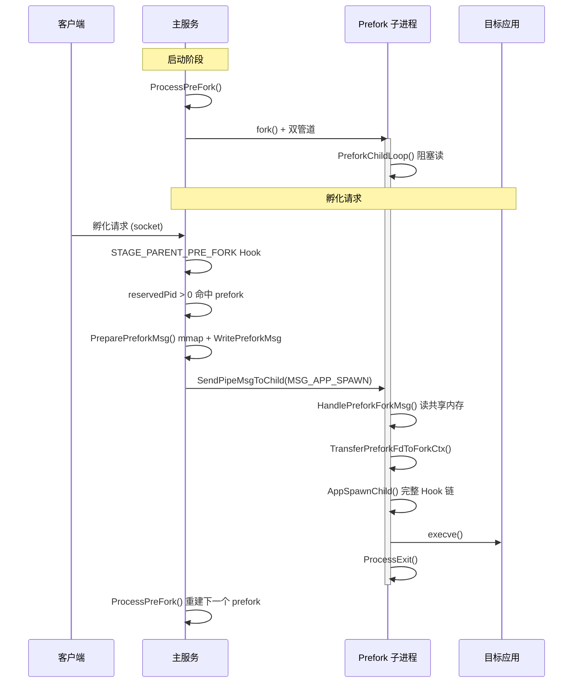
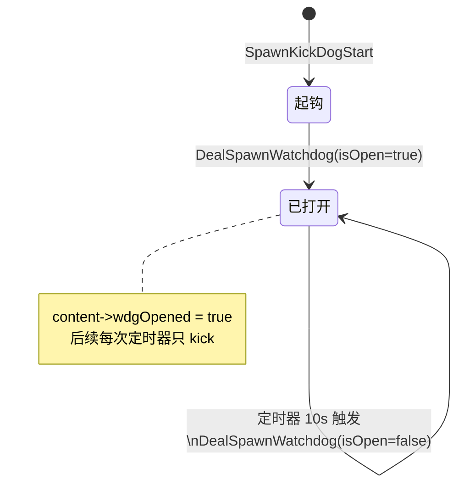

# Module: standard

> 返回: [索引](../index.md)


## Overview

standard 模块是 appspawn 在标准系统（而非小型系统）上的核心实现。它负责解析启动参数、创建 socket 服务、接收客户端孵化请求、管理 fork 流程、处理子进程生命周期以及管理已孵化进程。

该模块是整个 appspawn 系统的控制中枢，通过 Hook 机制将沙箱、权限、SPM 等功能模块编排到孵化流程的各个阶段。

## Source Location
- Directory: `standard/`
- Files: 7 C 源文件, 5 头文件
- Estimated LOC: ~4,137

## Dependencies
- Depends on: common（通用服务层）, modulemgr_engine（Hook 引擎）, util（工具类）, client_api（消息定义）
- Used by: 无（顶层入口模块）

---

## KP-1: 进程孵化主流程

**Priority**: P0

### Summary

appspawn 的主入口位于 `appspawn_main.c` 的 `main()` 函数。它解析命令行参数选择孵化模式（appspawn/nwebspawn/nativespawn/hybridspawn/cold run），然后调用 `StartSpawnService()` 初始化服务，最后通过 `content->runAppSpawn()` 进入事件循环。

### Key Code

#### 模式选择与启动参数模板
```c
// standard/appspawn_main.c:31
static AppSpawnStartArgTemplate g_appSpawnStartArgTemplate[PROCESS_INVALID] = {
    {APPSPAWN_SERVER_NAME, {MODE_FOR_APP_SPAWN, MODULE_APPSPAWN, APPSPAWN_SOCKET_NAME, APPSPAWN_SERVER_NAME, 1}},
    {NWEBSPAWN_SERVER_NAME, {MODE_FOR_NWEB_SPAWN, MODULE_NWEBSPAWN, NWEBSPAWN_SOCKET_NAME, NWEBSPAWN_SERVER_NAME, 1}},
    {"app_cold", {MODE_FOR_APP_COLD_RUN, MODULE_APPSPAWN, APPSPAWN_SOCKET_NAME, APPSPAWN_SERVER_NAME, 0}},
    ...
};
```
`g_appSpawnStartArgTemplate` 定义了所有支持的孵化模式，每个模式包含运行模式（RunMode）、模块类型、socket 名称、服务名称以及是否为孵化服务（`initArg`，1=服务进程，0=冷启动子进程）。

#### 主函数入口
```c
// standard/appspawn_main.c:101
int main(int argc, char *const argv[])
{
    InitCommonEnv();
    CheckPreload(argv);
    (void)signal(SIGPIPE, SIG_IGN);
    // ...根据编译宏选择默认模式模板...
    argTemp = GetAppSpawnStartArg(argv[MODE_VALUE_INDEX], ...);
    arg = &argTemp->arg;
    AppSpawnContent *content = StartSpawnService(arg, argvSize, argc, argv);
    if (content != NULL) {
        content->runAppSpawn(content, argc, argv);
    }
    return 0;
}
```
`main()` 首先初始化通用环境（`InitCommonEnv`），处理 LD_PRELOAD（`CheckPreload` 确保加载 helper 库），然后根据命令行 `-mode` 参数选择孵化模式。

#### LD_PRELOAD 处理
```c
// standard/appspawn_main.c:54
static void CheckPreload(char *const argv[])
{
    char *preload = getenv("LD_PRELOAD");
    char *pos = preload ? strstr(preload, APPSPAWN_PRELOAD) : NULL;
    // ...如果已设置 preload，重新组合后 execv 自身...
    ret = execv(buf, argv);
}
```
该函数确保 `libappspawn_helper.z.so` 被 LD_PRELOAD 加载，通过 `execv` 重启自身来应用新的环境变量。

### Data Structures

| 结构体 | 文件 | 用途 |
|--------|------|------|
| AppSpawnStartArgTemplate | `appspawn_service.h:73` | 模式启动参数模板 |
| AppSpawnStartArg | `appspawn_service.h:65` | 启动参数（mode, moduleType, socketName, serviceName） |
| RunMode | `appspawn_server.h:33` | 运行模式枚举 |

### Flow

1. init 进程启动 appspawn（通过 `appspawn.cfg` 配置）
2. `main()` 解析 `-mode` 参数，选择孵化模式
3. `CheckPreload()` 确保 helper 库已加载
4. `StartSpawnService()` 初始化服务、加载模块
5. `runAppSpawn()` 进入事件循环

---

## KP-2: fork 与子进程管理

**Priority**: P0

### Summary

核心孵化逻辑在 `appspawn_service.c` 中。appspawn 使用 `fork()` 创建子进程，父进程通过 pipe 等待子进程的执行结果，子进程在 fork 后执行 Hook 链（沙箱设置、权限配置等）并通过 pipe 返回结果。还支持 prefork 机制，预创建子进程池以加速启动。

### Key Code

#### 连接接受与 UID 检查
```c
// standard/appspawn_service.c:425
static int OnConnection(const LoopHandle loopHandle, const TaskHandle server)
{
    LE_StreamInfo info = {};
    info.baseInfo.close = OnClose;
    info.disConnectComplete = OnDisConnect;
    info.sendMessageComplete = SendMessageComplete;
    info.recvMessage = OnReceiveRequest;
    info.handleRecvMsg = HandleRecvMessage;
    LE_STATUS ret = LE_AcceptStreamClient(loopHandle, server, &stream, &info);
    // 检查客户端 UID
    struct ucred cred = {-1, -1, -1};
    getsockopt(LE_GetSocketFd(stream), SOL_SOCKET, SO_PEERCRED, &cred, &credSize);
    if (!OnConnectionUserCheck(cred.uid)) { ... 拒绝连接 ... }
}
```
`OnConnection` 通过 `SO_PEERCRED` 获取客户端 UID，仅允许 root(0)、foundation(5523)、app_fwk_update(3350)、storage_manager(1090) 以及开发者模式下的 shell(2000) 连接。

#### UID 白名单检查
```c
// standard/appspawn_service.c:402
APPSPAWN_STATIC bool OnConnectionUserCheck(uid_t uid)
{
    const uid_t uids[APPSPAWN_MSG_USER_CHECK_COUNT] = {
        0, 3350, 5523, 1090,
    };
    for (int i = 0; i < APPSPAWN_MSG_USER_CHECK_COUNT; i++) {
        if (uid == uids[i]) return true;
    }
    if (uid == 2000 && IsDeveloperModeOn()) return true;
    return false;
}
```

#### Fork 上下文初始化
```c
// standard/appspawn_service.c:637
static int InitForkContext(AppSpawningCtx *property)
{
    if (pipe(property->forkCtx.fd) == -1) {
        return errno;
    }
    int flags = fcntl(property->forkCtx.fd[0], F_GETFL);
    if (flags >= 0) {
        (void)fcntl(property->forkCtx.fd[0], F_SETFL, (unsigned int)flags | O_NONBLOCK);
    }
    return 0;
}
```
创建非阻塞 pipe，用于子进程向父进程通知 fork 结果。

#### 子进程结果监听
```c
// standard/appspawn_service.c:735
static int AddChildWatcher(AppSpawningCtx *property)
{
    uint32_t defTimeout = IsChildColdRun(property) ? COLD_CHILD_RESPONSE_TIMEOUT : WAIT_CHILD_RESPONSE_TIMEOUT;
    LE_WatchInfo watchInfo = {};
    watchInfo.fd = property->forkCtx.fd[0];
    watchInfo.flags = WATCHER_ONCE;
    watchInfo.processEvent = ProcessChildResponse;
    LE_STATUS status = LE_StartWatcher(LE_GetDefaultLoop(), &property->forkCtx.watcherHandle, &watchInfo, property);
    // 创建超时定时器
    status = LE_CreateTimer(LE_GetDefaultLoop(), &property->forkCtx.timer, WaitChildTimeout, property);
    status = LE_StartTimer(LE_GetDefaultLoop(), property->forkCtx.timer, timeout * 1000, 0);
}
```
父进程在 fork 后注册 IO watcher 监听 pipe 读端，并设置超时定时器（正常 3s，冷启动 10s）。

### Data Structures

| 结构体 | 文件 | 用途 |
|--------|------|------|
| AppSpawningCtx | `appspawn_manager.h:84` | 孵化过程中的上下文，包含 fork pipe、消息、状态等 |
| AppSpawnForkCtx | `appspawn_manager.h:74` | fork 上下文（pipe fd, watcher, timer, 共享内存） |
| AppSpawnConnection | `appspawn_service.h:59` | 客户端连接，包含消息接收上下文 |

### Edge Cases & Error Handling

- 客户端 UID 不在白名单内：直接关闭连接 (`appspawn_service.c:448`)
- 子进程超时未响应：`WaitChildTimeout` 定时器触发，kill 子进程 (`appspawn_service.c:63`)
- pipe 创建失败：返回 errno 给调用方 (`appspawn_service.c:640`)
- 消息未完整接收：保存为 `incompleteMsg`，等待下一次数据到达 (`appspawn_service.c:523`)

---

## KP-3: 消息接收与 TLV 解析

**Priority**: P0

### Summary

消息接收和 TLV 解析逻辑分布在 `appspawn_msgmgr.c` 中。消息格式采用 TLV（Type-Length-Value），消息头为 `AppSpawnMsg`（包含 magic、msgType、msgLen、msgId、tlvCount、processName），后跟若干 TLV 字段。支持分片接收和扩展 TLV。

### Key Code

#### 消息头验证
```c
// standard/appspawn_msgmgr.c:126
static inline int CheckRecvMsg(const AppSpawnMsg *msg)
{
    APPSPAWN_CHECK(msg->magic == APPSPAWN_MSG_MAGIC, return -1, ...);
    APPSPAWN_CHECK(msg->msgLen < MAX_MSG_TOTAL_LENGTH, return -1, ...);
    APPSPAWN_CHECK(msg->msgLen >= sizeof(AppSpawnMsg), return -1, ...);
    APPSPAWN_CHECK(msg->tlvCount < MAX_TLV_COUNT, return -1, ...);
    return 0;
}
```
验证 magic（`0xEF201234`）、消息长度上限（64KB）、TLV 数量上限（128）。

#### TLV 解码
```c
// standard/appspawn_msgmgr.c:264
int DecodeAppSpawnMsg(AppSpawnMsgNode *message)
{
    uint32_t bufferLen = message->msgHeader.msgLen - sizeof(AppSpawnMsg);
    uint32_t currLen = 0;
    while (currLen < bufferLen) {
        AppSpawnTlv *tlv = (AppSpawnTlv *)(message->buffer + currLen);
        ret = CheckMsgTlv(tlv, bufferLen - currLen);
        if (tlv->tlvType < TLV_MAX) {
            message->tlvOffset[tlv->tlvType] = currLen;  // 标准 TLV
        } else {
            message->tlvOffset[TLV_MAX + tlvCount] = currLen;  // 扩展 TLV
            tlvCount++;
        }
        currLen += tlv->tlvLen;
    }
}
```
解码器遍历 buffer，按 TLV 格式解析。标准 TLV（type < TLV_MAX）直接索引到 `tlvOffset` 数组，扩展 TLV 追加在 `TLV_MAX` 之后。

#### 必需字段检查
```c
// standard/appspawn_msgmgr.c:185
int CheckAppSpawnMsg(const AppSpawnMsgNode *message)
{
    if (message->tlvOffset[TLV_BUNDLE_INFO] == INVALID_OFFSET ||
        message->tlvOffset[TLV_MSG_FLAGS] == INVALID_OFFSET ||
        message->tlvOffset[TLV_ACCESS_TOKEN_INFO] == INVALID_OFFSET ||
        message->tlvOffset[TLV_DOMAIN_INFO] == INVALID_OFFSET ||
        message->tlvOffset[TLV_DAC_INFO] == INVALID_OFFSET) {
        return APPSPAWN_MSG_INVALID;
    }
    // bundle name 不能包含 \ 或 /
    if (strstr(bundleInfo->bundleName, "\\") != NULL ||
        strstr(bundleInfo->bundleName, "/") != NULL) {
        return APPSPAWN_MSG_INVALID;
    }
}
```

---

## KP-4: AppSpawnMgr 核心数据结构

**Priority**: P0

### Summary

`AppSpawnMgr` 是 appspawn 的全局管理器，维护服务进程信息、已孵化进程队列、孵化中队列、死亡队列等。`AppSpawningCtx` 是单个孵化请求的上下文，`AppSpawnedProcess` 是已孵化进程的跟踪信息。

### Key Code

#### AppSpawnMgr 结构体
```c
// standard/appspawn_manager.h:161
typedef struct TagAppSpawnMgr {
    AppSpawnContent content;          // 服务内容（模式、沙箱标志等）
    struct SpawnTime spawnTime;       // 孵化时间统计
    uint32_t diedAppCount;            // 死亡进程计数
    uint32_t flags;                   // 全局标志
    pid_t servicePid;                 // 服务进程 PID
    TaskHandle server;                // socket 服务 task
    SignalHandle sigHandler;          // 信号处理
    struct ListNode appQueue;         // 已孵化进程队列
    struct ListNode diedQueue;        // 死亡进程队列（nwebspawn 用）
    struct ListNode appSpawnQueue;    // 孵化中队列
    struct ListNode extData;          // 扩展数据
    struct ListNode dataGroupCtxQueue; // Data Group 上下文
    struct ListNode checkPointIdQueue; // Checkpoint 进程队列
    struct ListNode spawningFdsQueue;  // 孵化 FD 队列
} AppSpawnMgr;
```

#### AppSpawningCtx 结构体
```c
// standard/appspawn_manager.h:84
typedef struct TagAppSpawningCtx {
    AppSpawnClient client;            // 客户端标识
    struct ListNode node;             // 链表节点
    AppSpawnForkCtx forkCtx;          // fork 上下文（pipe fd, watcher, timer）
    AppSpawnMsgNode *message;         // 孵化请求消息
    bool isPrefork;                   // 是否为 prefork 进程
    pid_t pid;                        // 子进程 PID
    int state;                        // 状态（IDLE, SPAWNING）
    struct timespec spawnStart;       // 孵化开始时间
    bool allowDumpable;               // 是否允许 dump
    uint64_t checkPointId;            // 镜像进程 ID
    uint8_t spmRefAdded;              // SPM 引用计数位图
    bool lockBundleRefAdded;          // bundle 锁引用计数标志
    char *lockPath;                   // 沙箱锁路径
} AppSpawningCtx;
```

---

## KP-5: 已孵化进程管理

**Priority**: P1

### Summary

`appspawn_appmgr.c` 负责管理已孵化进程的生命周期，包括注册（`AddSpawnedProcess`）、查找（`GetSpawnedProcess`/`GetSpawnedProcessByName`）、终止（`TerminateSpawnedProcess`）和遍历（`TraversalSpawnedProcess`）。

### Key Code

#### 创建并注册进程
```c
// standard/appspawn_appmgr.c:155
AppSpawnedProcess *AddSpawnedProcess(pid_t pid, const char *processName, uint32_t appIndex,
    bool isDebuggable, uint64_t tokenid)
{
    AppSpawnedProcess *node = calloc(1, sizeof(AppSpawnedProcess) + len + 1);
    node->pid = pid;
    node->appIndex = appIndex;
    node->isDebuggable = isDebuggable;
    node->tokenid = tokenid;
    OH_ListAddWithOrder(&g_appSpawnMgr->appQueue, &node->node, AppInfoCompareProc);
    return node;
}
```
进程按 PID 排序插入 `appQueue` 链表。

#### NWeb 死亡队列
```c
// standard/appspawn_appmgr.c:183
void TerminateSpawnedProcess(AppSpawnedProcess *node)
{
    OH_ListRemove(&node->node);
    if (!IsNWebSpawnMode(g_appSpawnMgr)) {
        free(node);  // 非 nwebspawn 直接释放
        return;
    }
    // nwebspawn 模式移入 diedQueue（最多保留 5 个）
    if (g_appSpawnMgr->diedAppCount >= MAX_DIED_PROCESS_COUNT) {
        // 移除最旧的
    }
    OH_ListAddTail(&g_appSpawnMgr->diedQueue, &node->node);
}
```
nwebspawn 模式下保留最近 5 个死亡进程信息，用于查询渲染进程终止状态。

---

## KP-6: FD 管理与传递

**Priority**: P1

### Summary

`appspawn_fd_manager.c` 管理孵化过程中父子进程间的文件描述符传递。通过 `recvmsg` 的辅助消息（`SCM_RIGHTS`）接收客户端传递的 FD。

### Key Code

#### FD 接收
```c
// standard/appspawn_service.c:365
static int HandleRecvMessage(const TaskHandle taskHandle, uint8_t *buffer, int bufferSize, int flags)
{
    struct msghdr msg = { .msg_iov = &iov, .msg_control = ctrlBuffer, ... };
    int recvLen = recvmsg(socketFd, &msg, flags);
    for (cmsg = CMSG_FIRSTHDR(&msg); cmsg != NULL; cmsg = CMSG_NXTHDR(&msg, cmsg)) {
        if (cmsg->cmsg_level == SOL_SOCKET && cmsg->cmsg_type == SCM_RIGHTS) {
            int fdCount = (cmsg->cmsg_len - CMSG_LEN(0)) / sizeof(int);
            memcpy_s(connection->receiverCtx.fds, fdCount * sizeof(int), fd, fdCount * sizeof(int));
            connection->receiverCtx.fdCount = fdCount;
        }
    }
}
```

---

## KP-7: 信号处理与进程退出

**Priority**: P1

### Summary

appspawn 使用 signalfd 机制处理信号，主要通过 SIGCHLD 处理子进程退出，SIGTERM 处理服务终止。

### Key Code

#### SIGCHLD 处理
```c
// standard/appspawn_service.c:202
APPSPAWN_STATIC void ProcessSignal(const struct signalfd_siginfo *siginfo)
{
    switch (siginfo->ssi_signo) {
        case SIGCHLD: {
            pid_t pid;
            int status;
            while ((pid = waitpid(-1, &status, WNOHANG)) > 0) {
                HandleDiedPid(pid, siginfo->ssi_uid, status);
            }
            break;
        }
        case SIGTERM: {
            StopAppSpawn();
            break;
        }
    }
}
```

#### 进程死亡处理
```c
// standard/appspawn_service.c:171
APPSPAWN_STATIC void HandleDiedPid(pid_t pid, uid_t uid, int status)
{
    if (pid == content->reservedPid) {
        CleanupSpawningFdsByPid((AppSpawnMgr *)content, pid);
        content->reservedPid = 0;
    }
    AppSpawnedProcess *appInfo = GetSpawnedProcess(pid);
    if (appInfo == NULL) { WaitChildDied(pid, status); return; }
    WriteSignalInfoToFd(appInfo, content, signal);
    ProcessMgrHookExecute(STAGE_SERVER_APP_DIED, GetAppSpawnContent(), appInfo);
    ProcessMgrHookExecute(STAGE_SERVER_APP_CLEANUP, GetAppSpawnContent(), appInfo);
    TerminateSpawnedProcess(appInfo);
}
```

---

## KP-8: 多种孵化模式

**Priority**: P0

### Summary

appspawn 支持多种孵化模式，通过 `RunMode` 枚举区分。每种模式有对应的 socket 名称和服务名称。冷启动模式（cold run）是已 fork 子进程中直接执行应用。

### Data Structures

| 模式 | socket 名称 | 服务名称 | 模块类型 | 说明 |
|------|------------|----------|----------|------|
| MODE_FOR_APP_SPAWN | AppSpawn | appspawn | MODULE_APPSPAWN | 标准应用孵化 |
| MODE_FOR_NWEB_SPAWN | NWebSpawn | nwebspawn | MODULE_NWEBSPAWN | NWeb 渲染进程孵化 |
| MODE_FOR_NATIVE_SPAWN | NativeSpawn | nativespawn | MODULE_NATIVESPAWN | 原生进程孵化 |
| MODE_FOR_HYBRID_SPAWN | HybridSpawn | hybridspawn | MODULE_HYBRIDSPAWN | 混合孵化 |
| MODE_FOR_APP_COLD_RUN | AppSpawn | app_cold | MODULE_APPSPAWN | 应用冷启动 |
| MODE_FOR_CJAPP_SPAWN | CJAppSpawn | cjappspawn | MODULE_APPSPAWN | CJ 应用孵化 |

### 模式判断函数
```c
// standard/appspawn_manager.h:246
APPSPAWN_INLINE int IsAppSpawnMode(const AppSpawnMgr *content) {
    return content->content.mode == MODE_FOR_APP_SPAWN ||
           content->content.mode == MODE_FOR_APP_COLD_RUN;
}
APPSPAWN_INLINE int IsColdRunMode(const AppSpawnMgr *content) {
    return content->content.mode == MODE_FOR_APP_COLD_RUN ||
           content->content.mode == MODE_FOR_NWEB_COLD_RUN || ...;
}
```

## KP-9: devicedebug 调试服务 (G-2 补全)

**Priority**: P2

### Summary

devicedebug 是一个**独立 CLI 可执行程序**（`ohos_executable("devicedebug")`），用于开发者模式下向可调试应用进程发送信号。它通过 appspawn 客户端 SDK 向主服务发送 `MSG_DEVICE_DEBUG` 消息，由主服务验证后转发 `kill()` 到目标进程。

### 源码位置

- 客户端目录: `service/devicedebug/`
- 服务端处理: `standard/appspawn_service.c:2215-2244`（消息分发）与 `2183-2203`（kill 实现）
- 构建定义: `service/devicedebug/BUILD.gn:17`

### 命令路由表

```c
// service/devicedebug/devicedebug_main.c:46-50
DeviceDebugManagerCmdInfo g_deviceDebugManagerCmd[] = {
    {"help", DeviceDebugShowHelp},
    {"-h",   DeviceDebugShowHelp},
    {"kill", DeviceDebugCmdKill},
};
```

`main()` 解析 `argv[1]` 作为子命令，调用对应处理函数。

### 客户端 → 服务端协议

消息类型 `MSG_DEVICE_DEBUG`（`interfaces/innerkits/include/appspawn.h:124`），通过 `AppSpawnReqMsgAddExtInfo(reqHandle, "devicedebug", jsonString, len)` 携带 JSON 载荷：

```json
{ "app": <pid>, "op": "kill", "args": { "signal": <n> } }
```

### 服务端处理链

| 步骤 | 函数 | 位置 | 行为 |
|------|------|------|------|
| 1. 消息分发 | `ProcessAppSpawnDeviceDebugMsg` | `appspawn_service.c:2215` | 解析 ext-info JSON，提取 `app/op/args` |
| 2. 操作路由 | `AppspawnDevicedebugDeal` | `appspawn_service.c` | 按 `op` 字符串路由（"kill" → 下一步） |
| 3. 进程查找 | `GetSpawnedProcess(pid)` | `appspawn_appmgr.c` | 从 `appQueue` 查 `AppSpawnedProcess` |
| 4. 可调试校验 | `appInfo->isDebuggable` | `appspawn_service.c:2193` | 不满足返回 `APPSPAWN_DEVICEDEBUG_ERROR_APP_NOT_DEBUGGABLE` |
| 5. 信号发送 | `kill(pid, signal)` | `appspawn_service.c:2200` | 标准库调用 |

### 关键校验

- **开发者模式前置**：客户端入口 `IsDeveloperModeOpen()`（`devicedebug_kill.c:133`），未开启直接返回 `DEVICEDEBUG_ERRNO_NOT_IN_DEVELOPER_MODE`。
- **信号范围**：`signal > 0 && signal <= SIGRTMAX`（`devicedebug_kill.c:148`）。
- **目标存在性**：服务端必须能在 `appQueue` 中找到 `pid`，否则返回 `APPSPAWN_DEVICEDEBUG_ERROR_APP_NOT_EXIST`。

### 与主孵化服务的关系

| 维度 | 关系 |
|------|------|
| 进程身份 | 独立可执行文件 `devicedebug`，非主服务进程 |
| 代码复用 | 共享 `interfaces/innerkits/client` 客户端库与 `util:libappspawn_util` |
| IPC | Socket（与普通孵化请求同一 socket） |
| 主服务改动 | 仅增加 `MSG_DEVICE_DEBUG` case 分支，无侵入性扩展 |

### 相关文件

- `service/devicedebug/devicedebug_main.c`（主入口）
- `service/devicedebug/kill/src/devicedebug_kill.c`（kill 子命令）
- `service/devicedebug/base/devicedebug_base.h`（公共头）
- `service/devicedebug/kill/include/devicedebug_kill.h`
- 测试: `test/unittest/devicedebug_test/`、`test/autotest/sub_startup_appspawn_devicedebug/`

## KP-10: Prefork 机制详解 (G-4 补全)

**Priority**: P1

### Summary

prefork 是 appspawn 的启动加速机制：**预先 fork 一个空闲子进程**（名为 `"PreforkProcess"`），通过共享内存（mmap）+ 管道信号传递孵化请求，避免每次孵化都付出 `fork()` 系统调用开销。**注意：本机制是"单进程预留"而非进程池**，一次只维护 1 个 prefork 子进程。

### 启用条件

| 维度 | 取值 |
|------|------|
| 系统参数 | `persist.sys.prefork.enable = "true"`（默认启用，`appspawn_service.c:1949` `IsEnablePrefork`） |
| 编译开关 | `appspawn_support_prefork = true`（`appspawn.gni:35`） |
| 运行时条件 | `IsBootFinished()` 且 `IsSupportPrefork()`：模式为 `MODE_FOR_APP_SPAWN`，非冷启动，非 `APP_FLAGS_CHILDPROCESS`（`appspawn_service.c:1440-1458`） |

不满足条件时回退到 `NormalSpawnChild`。

### 关键数据结构

```c
// common/appspawn_server.h:72-96
typedef struct AppSpawnPreforkMsg {
    uint32_t id;        // 客户端 ID
    uint32_t flags;     // 协商标志
    uint32_t msgLen;
} AppSpawnPreforkMsg;

typedef struct AppSpawnPipeMsg {
    AppSpawnMsgType type;   // MSG_APP_SPAWN 或 MSG_LOCK_STATUS
    union { AppSpawnPreforkMsg preforkMsg; AppSpawnUnlockMsg unlockMsg; } msg;
} AppSpawnPipeMsg;
```

```c
// standard/appspawn_fd_manager.h:48-75
typedef enum { TYPE_CHILD_PARENT, TYPE_PARENT_CHILD, TYPE_INVALID } SpawningFdType;

typedef struct {
    struct ListNode node;
    SpawningFdType type;
    uint32_t count;
    pid_t pid;              // 0 表示全局 fd
    uint64_t timestamp;
    int fds[0];             // 柔性数组
} AppSpawnFds;
```

`AppSpawnContent.reservedPid` 字段保存当前可用的 prefork 子进程 PID。

### 完整调用链

| # | 函数 | 位置 | 作用 |
|---|------|------|------|
| 1 | `RunAppSpawnProcessMsg` | `appspawn_service.c:1469` | 入口分流：prefork vs normal |
| 2 | `IsSupportPrefork` | `appspawn_service.c:1440` | 条件判定 |
| 3 | `AppSpawnProcessMsgForPrefork` | `appspawn_service.c:1401` | prefork 主逻辑 |
| 4 | `PreparePreforkMsg` | `appspawn_service.c:1273` | mmap 共享内存 + `WritePreforkMsg` |
| 5 | `SendPipeMsgToChild` | `appspawn_service.c:1312` | 通过 `parentToChildFd[1]` 写管道 |
| 6 | `TransferPreforkFdToForkCtx` | `appspawn_service.c:1361` | FD 队列迁移 + 设非阻塞 |
| 7 | `ProcessPreFork` | `appspawn_service.c:1235` | 为下一个请求重建 prefork 子进程 |
| 8 | `ForkAndRegisterFds` | `appspawn_service.c:1110` | 双管道创建 + fork + 注册到 `spawningFdsQueue` |
| 9 | `PreforkChildLoop` | `appspawn_service.c:1180` | 子进程主循环（阻塞读 `parentToChildFd[0]`） |
| 10 | `HandlePreforkForkMsg` | `appspawn_service.c:1053` | 收到 MSG_APP_SPAWN，读共享内存，调用 `AppSpawnChild` |
| 11 | `CleanupPreforkChild` | `appspawn_service.c:1342` | 失败回退清理 |
| 12 | `TryLevel1PreforkUnlock` | `appspawn_service.c:2457` | Level 1 解锁优化（复用 prefork 进程，零 fork） |

### 与正常 fork 对比

| 维度 | NormalSpawnChild | Prefork |
|------|------------------|---------|
| 进程创建 | 每次请求 `fork()` | 复用预留子进程 |
| 管道 | 单 `forkCtx.fd` | 双管道：`childToParentFd` + `parentToChildFd` |
| 消息传递 | 完整 socket 消息 | mmap 共享内存 + 管道信号 |
| 进程名 | 应用进程名 | `"PreforkProcess"` |
| 生命周期 | 临时进程 | 长期阻塞读，使用一次后销毁重建 |
| 解锁挂载 | Level 2（fork） | Level 1（复用 prefork，零 fork） |
| 失败恢复 | 直接返回错误 | 自动回退到 normal fork |

### Mermaid 序列图



### 注意事项

1. **非进程池**：`reservedPid` 只保存一个 PID，无并发 prefork
2. **PID 继承**：prefork 子进程的 PID 最终成为目标应用进程的 PID
3. **零拷贝**：通过 mmap 共享内存避免消息二次序列化
4. **自动回退**：任何 prefork 失败都退回 `NormalSpawnChild`
5. **路径**：共享内存位于 `/dev/shm/appspawn/prefork_{clientId}`，按 `MAX_MSG_BLOCK_LEN`（4KB）对齐

---

## KP-11: KickDog 看门狗 (G-7 补全)

**Priority**: P2

### Summary

KickDog 是 appspawn 的内核看门狗看护机制：通过定时（默认 10s）向内核 proc 文件写入 "kick" 字符串，防止内核看门狗因 appspawn 长时间未响应而触发系统重启。

### 源码位置

- 实现: `standard/appspawn_kickdog.c`（147 行）
- 头文件: `standard/include/appspawn_kickdog.h`

### 注册机制

```c
// standard/appspawn_kickdog.c:145-147
MODULE_CONSTRUCTOR(void)
{
    AddPreloadHook(HOOK_PRIO_COMMON, SpawnKickDogStart);
}
```

通过 `MODULE_CONSTRUCTOR`（.so 加载时自动执行）注册到 preload hook 链，优先级 `HOOK_PRIO_COMMON`。

### 启用条件

```c
// standard/appspawn_kickdog.c:127-143
APPSPAWN_STATIC int SpawnKickDogStart(AppSpawnMgr *mgrContent) {
    APPSPAWN_CHECK_ONLY_EXPER(mgrContent->content.mode != MODE_FOR_NATIVE_SPAWN, return 0);
    APPSPAWN_CHECK((mgrContent->content.mode == MODE_FOR_APP_SPAWN) ||
                   (mgrContent->content.mode == MODE_FOR_NWEB_SPAWN) ||
                   (mgrContent->content.mode == MODE_FOR_HYBRID_SPAWN),
                   return 0, ...);
    if (CheckKernelType(&mgrContent->content.isLinux) != 0) return 0;
    DealSpawnWatchdog(&mgrContent->content, true);   // 首次打开
    CreateTimerLoopTask(&mgrContent->content);       // 启动定时器
    return 0;
}
```

仅在 appspawn / nwebspawn / hybridspawn 三种模式启用，**nativespawn 不启用**（独立 native 进程无需看护 appspawn 看门狗）。

### 关键调用链

| 步骤 | 函数 | 位置 | 行为 |
|------|------|------|------|
| 1 | `SpawnKickDogStart` | `appspawn_kickdog.c:127` | 入口，模式与内核类型校验 |
| 2 | `CheckKernelType` | `appspawn_kickdog.c:109` | `uname()` 区分 Linux / 鸿蒙 |
| 3 | `DealSpawnWatchdog(content, true)` | `appspawn_kickdog.c:73` | 首次写入"打开"内容 |
| 4 | `CreateTimerLoopTask` | `appspawn_kickdog.c:98` | 创建 10s 周期定时器 |
| 5 | `ProcessTimerHandle`（回调） | `appspawn_kickdog.c:86` | 首次：打开；之后：kick |
| 6 | `DealSpawnWatchdog(content, false)` | `appspawn_kickdog.c:73` | 写入"kick"内容 |
| 7 | `OpenAndWriteToProc` | `appspawn_kickdog.c:20` | `open(O_WRONLY\|O_CLOEXEC)` + `write` + `close` |

### proc 文件与内容路由

通过 `GetProcFile` 和 `GetProcContent` 按内核类型 / 孵化模式 / 操作类型（open/kick）三维度路由：

| 维度 | Linux | 鸿蒙 appspawn | 鸿蒙 nwebspawn | 鸿蒙 hybridspawn |
|------|-------|---------------|----------------|------------------|
| 文件 | `LINUX_APPSPAWN_WATCHDOG_FILE` | `HM_APPSPAWN_WATCHDOG_FILE` | 同左 | 同左 |
| 打开内容 | `LINUX_APPSPAWN_WATCHDOG_ON` | `HM_APPSPAWN_WATCHDOG_ON` | `HM_NWEBSPAWN_WATCHDOG_ON` | `HM_HYBRIDSPAWN_WATCHDOG_ON` |
| kick 内容 | `LINUX_APPSPAWN_WATCHDOG_KICK` | `HM_APPSPAWN_WATCHDOG_KICK` | `HM_NWEBSPAWN_WATCHDOG_KICK` | `HM_HYBRIDSPAWN_WATCHDOG_KICK` |

具体字符串常量定义在 `appspawn_kickdog.h`。

### 状态机



`content->wdgOpened` 字段记录打开状态，仅在首次打开时设置；后续定时回调只执行 kick 路径。

### 配置项

| 常量 | 默认值 | 含义 |
|------|--------|------|
| `APPSPAWN_WATCHDOG_KICKTIME` | 10s | 定时器周期 |
| `LE_StartTimer` 第 3 参数 | `INT64_MAX` | 循环次数（无限循环） |

---

## Key Data Structures

| Structure | File | Purpose |
|-----------|------|---------|
| AppSpawnMgr | `appspawn_manager.h:161` | 全局管理器，维护所有队列和服务状态 |
| AppSpawningCtx | `appspawn_manager.h:84` | 孵化请求上下文 |
| AppSpawnedProcess | `appspawn_manager.h:102` | 已孵化进程跟踪信息 |
| AppSpawnContent | `appspawn_server.h:98` | 服务内容（函数指针表、模式、沙箱标志） |
| AppSpawnConnection | `appspawn_service.h:59` | 客户端连接 |
| AppSpawnMsgReceiverCtx | `appspawn_service.h:50` | 消息接收上下文 |
| AppSpawnForkCtx | `appspawn_manager.h:74` | fork 上下文 |

## Public Interface

### `StartSpawnService(arg, argvSize, argc, argv)`
- **File**: `standard/appspawn_service.c`
- **Purpose**: 初始化 appspawn 服务，创建 socket、加载模块
- **Parameters**: arg=启动参数, argvSize=参数内存大小, argc/argv=命令行
- **Returns**: AppSpawnContent 指针
- **Called by**: `appspawn_main.c:156`

### `CreateAppSpawnMgr(mode)`
- **File**: `standard/appspawn_appmgr.c:42`
- **Purpose**: 创建全局 AppSpawnMgr 实例
- **Parameters**: mode=运行模式
- **Returns**: AppSpawnMgr 指针

### `AddSpawnedProcess(pid, processName, appIndex, isDebuggable, tokenid)`
- **File**: `standard/appspawn_appmgr.c:155`
- **Purpose**: 注册新孵化的进程
- **Called by**: service 层在 fork 成功后调用

## Cross-Module Interactions

| Interaction | With Module | Mechanism | Direction |
|-------------|-------------|-----------|-----------|
| 加载 Hook 模块 | modulemgr_engine | AppSpawnLoadAutoRunModules | Outgoing |
| 执行 Hook | modulemgr_engine | AppSpawnHookExecute | Outgoing |
| 创建服务 | server_common | AppSpawnCreateContent | Outgoing |
| 消息定义 | client_api | AppSpawnMsg 结构体 | Incoming |
| 日志/工具 | util | APPSPAWN_LOGI 宏 | Outgoing |

---

## Related Modules
| Module | Relationship | Link |
|--------|-------------|------|
| modulemgr_engine | depends_on | [module_modulemgr_engine.md](module_modulemgr_engine.md) |
| sandbox | depends_on | [module_sandbox.md](module_sandbox.md) |
| spm | depends_on | [module_spm.md](module_spm.md) |
| server_common | depends_on | [module_server_common.md](module_server_common.md) |
| client_api | shares_with | [module_client_api.md](module_client_api.md) |
| util | depends_on | [module_util.md](module_util.md) |

**另见**: 本模块与上述模块存在依赖关系。具体交互细节请参考 [系统架构](../architecture.md) 中的跨模块关系章节。
