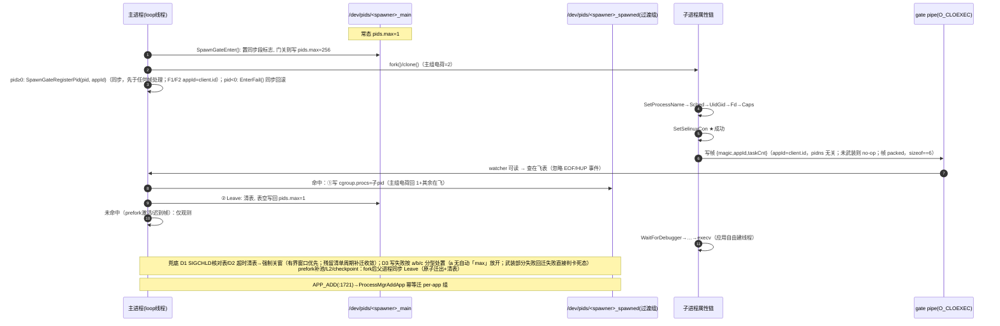

# appspawn 主进程单线程化与 reclaim 异步化 — 整体方案设计

**版本**: v2.0.1（终审定稿版。Round 0 初稿经 10 轮「审核→修订」迭代，逐条处置记录见 revision_log.md；第 10 轮综合回归审核 verdict=**approved**，semantic_ok=true、high=0——**诉求基线全程零漂移（10/10 轮 semantic_ok=true）**。终审遗留 F10-1~4 已全部补全（单存活不变式 / 两 timer 创建失败行为 / 重试表空判据 / 清稿流程修正）；F9-6 定稿清稿已完成（正文零标注残留，规格等价性自查通过，记录见 revision_log.md「定稿清稿记录」）。**P-C1 实现可启动**，P0 设备验证项见 §13 O1/O2）
**日期**: 2026-09-20（Round 0: 2026-09-10；r=10 终审: 2026-09-20）
**素材与历史版本**: `baseline_requirements.md`（IMMUTABLE 诉求基线）；v1.3.1 原始设计（含 12.3 机制原理详解章节）备份于同目录 `legacy_design_v1.3.1.md`（机制原理章节供评审讲解，未并入本文；正文机制依据见 §4.1 与附录 B 条目 51/58）
**源码核实根**: `/home/w00800717/01Claude/08ohosAppspawn/base/startup/appspawn`（本文所有 file:line 均已实测核验；对 v1.3.1 行号偏差见附录 B）

---

## 0. 基线符合性声明

| 基线条款 | 本方案落实方式 |
|---|---|
| B1.1 限主进程线程数=1（全部孵化器，lite 除外） | cgroup v1 `pids.max` 动态门（§4），武装点在 `AppSpawnRun`（standard/appspawn_service.c:1929，LE_RunLoop :1948 之前），5 个孵化器共用此入口（已核实：`AppSpawnRun`/`LE_RunLoop` 仅存在于 standard/appspawn_service.c，各孵化器 main 经 `content->runAppSpawn` 汇入，appspawn_service.c:1987-1991） |
| B1.2 代码机制落地（非检视） | 内核级 `pids.max`（机制选型见 §4.1，依据 B2.1/B2.3） |
| B1.3 fork 后 setcon 成功点恢复限制 | 严格 setcon 点通知 + 先迁出后收紧（§5.1），不改变恢复点语义（帧配对键为 appId 而非 pid——仅实现细节：pid namespace 下 pid 无法配对，恢复点/关窗序列语义不变） |
| B1.4 reclaim 语义保留、不阻塞主路径 | 方案 A 已实施（M1/M2，延迟定时器默认 32s，§7） |
| B2.1 纯 cgroup，不叠加用户态拦截 | 本方案仅 cgroup + 最小通知/兜底代码，无 LD_PRELOAD/拦截器 |
| B2.2 A 主案 / B 备选，>100ms 切换 | §7.3 切换判据与已内置打点 |
| B3.1-B3.3 既成事实 | §8 兼容性分析：零返工，全部保留 |
| B4 不允许项 | 逐项自查：机制不退化（不用检视替代强制）✓；恢复点仍为 setcon ✓；开窗保留（fork 必须成功）✓；reclaim 不回同步阻塞 ✓；覆盖 5 孵化器 ✓；不改 IPC 线格式/STAGE_* ABI/stub JSON（gate 通知为进程内新增 pipe，非既有消息协议变更；SetSelinuxCon 通知点为直接函数调用插入，不新增/不修改 STAGE hook）✓；不动 lite/ ✓（唯一触点：M10'② 修改 common/appspawn_server.c，lite 亦直接编译该文件 lite/BUILD.gn:23 并调用（lite/appspawn_service.c:156）——以 `#ifndef OHOS_LITE` 条件编译隔离 gate 调用，lite 零链接、零行为变化，详见 §9 M10'②；gate 模块的符号导出为 appspawn_common so 自身 versionscript 的构建内变更，不触碰 IPC 线格式/STAGE_* hook 枚举/模块引擎 stub JSON——详见 §9 M9'「构建与符号架构」） |

---

## 1. 方案总览（一页）

**双诉求的统一**：诉求 1（主进程限线程=1）与诉求 2（reclaim 不阻塞）在现状下互相冲突——现状用 `std::thread` 异步执行 reclaim（v1.3.1 §2.1），是主进程线程数>1 的直接来源。统一解法是把两件事都放到「主线程事件循环 + fork 子进程域」的执行模型里：

- **异步任务主线程化**：reclaim 由延迟定时器在主线程低峰期执行（方案 A，已实施 M1/M2）；L3 兜底 mount 主进程路径串行化（已实施 M3）→ 主进程在任意时点仅 1 线程，fork 恒为单线程 fork。
- **约束机制强制化**：主进程启动序列尾声（PRELOAD 完成、进 LE_RunLoop 前）将自身迁入限制组 `/dev/pids/appspawn_main` 并设 `pids.max=1`，此后任何 `pthread_create`/`clone(CLONE_THREAD)` 在 syscall 层被拒（EAGAIN）。
- **孵化开窗/关窗**：`pids.max=1` 同样会拒绝 fork（fork 也计入 pids cgroup task），因此每次主进程 fork 前开窗（写 `pids.max=GATE_MAX`）；**子进程在 SetSelinuxCon 成功点**（appspawn_common.c:775-776）经通知通道告知主进程；主进程先把子 pid 迁入本孵化器过渡组 `/dev/pids/<spawner>_spawned`（主组电荷回 1+其余在飞），再写回 `pids.max=1` 关窗。无 setcon 即时点的 fork（prefork 补池、L2 unlock mount、checkpoint）由父进程在 fork 后立即以 Leave 原子完成迁出+清表并按需关窗；异常场景由 SIGCHLD 死亡核对 / 超时 timer / cgroup 写失败分型降级三路兜底（gate pipe 父进程常驻写端、无 HUP 事件可用，见 §4.7/§4.8）。关窗序列含 **pids.current 电荷自检**（读 `<限制组>/pids.current`，稳态关窗时 ≠1 即 ERROR+HiSysEvent）——把「约束被静默绕过」（如运行时 dlopen 路径开窗期建线程成功后常驻主组）从不可见变为可发现故障，是机制强制（B2.3）的自证手段。开窗/关窗以 **gate 在飞表**配对（§4.4/§4.5；**在飞表为唯一权威状态源，无独立引用计数**）：Enter 开窗（无 pid——子进程 pid 在 fork/clone 返回前不可知，两段式协议）、fork 返回后父进程同步 RegisterPid 登记（表项记录父侧 pid——迁移/D1/D2/ctx 钩子按 pid 消费；F1/F2 孵化项另带 appId 作**帧配对键**：nwebspawn 默认沙箱配置使 clone 子进程生于独立 pid namespace（CLONE_NEWPID），子进程侧 `getpid()` 与父进程登记的 pid 恒不匹配，帧携带 `property->client.id`（appId，appspawn_server.h:66-69）——随孵化消息传递、与 pid namespace 无关），**帧按 appId 配对、父侧路径（迁移/同步 Leave/D1/D2/ctx 钩子）按 pid 消费**，appId 未命中的帧仅观测不消费——prefork 激活（无 fork）等正常路径的通知帧由此天然免疫门状态误配。

```
[限制态 pids.max=1：建线程=EAGAIN]
  spawn 请求 → Enter开窗(max=256,无pid) → fork/clone → 父进程同步登记pid(fork失败:同步回滚关窗) → 子进程链…
    → SetSelinuxCon ★成功 → gate 通知（帧携带appId——pidns无关） → 主进程: 查表命中 → ①迁子pid入<spawner>_spawned ②Leave清表→表空关窗
    → appId未命中的帧（prefork激活等）→ 仅观测打点，不消费表项
  prefork 补池 / L2 / checkpoint → Enter开窗 → fork/ioctl → 父进程同步登记 → Leave(pid)原子[迁出+清表+按需关窗](fork失败:同步回滚)
  兜底：SIGCHLD核对在飞表 / 超时强制关窗(有界窗口优先,残留清单周期补迁;武装时组内残留扫描收敛跨代残留) / 写失败分型降级(开窗失败重试+计失败数,关窗失败周期重试,达限永久降级;卡死态一次性自重启重评,武装部分失败回迁失败直接入卡死态)
[reclaim: preload 只注册 LE_StartTimer(默认32s) → 主线程低峰期同步执行+耗时打点]
```

**与已实施代码的关系**：M1/M2/M3/M4（B3）是本方案的前半部分（执行模型单线程化），已编译通过并保留；本方案新增的后半部分是机制强制（§4-§6，修改点 M8'-M12'）。二者叠加后，"单线程"从代码事实升级为内核保证。

---

## 2. 诉求与既成事实核实

### 2.1 B3 已实施改动核实结论（全部属实，零返工）

| 项 | 核实结果（file:line 实测） |
|---|---|
| M1/M2 reclaim 延迟定时器 | `ReclaimTimerCallback`（ace_adapter.cpp:503-512，steady_clock 耗时打点 + APPSPAWN_LOGI）；`DlopenAppSpawn`（ace_adapter.cpp:530-554）：读 `persist.appspawn.reclaim.delay`（宏 :71，默认 32s，宏 :72），负值回退默认（:541-542）；`LE_CreateTimer` 失败跳过 reclaim + ERROR 后 return 0（:547-548）；`LE_StartTimer` repeat=0 一次性（:550-552）；注册于 `AddPreloadHook(HOOK_PRIO_HIGHEST, DlopenAppSpawn)`（:579）。与 B3.1 描述完全一致 |
| M3 L3 兜底串行化 | `DoSharedMountForUser`（sandbox_unlock_mount.cpp:246-292）：`IsSpawnServer(GetAppSpawnMgr())`（:264，定义 appspawn_manager.h:242-245，`servicePid == getpid()`）分流——主进程串行 `MountQueueWorkerThread(*ctx, 0)`（:267），子进程保留 worker 并行（:270-278）。与 B3.2 一致 |
| M4 规范条款 | AGENTS.md:130 Single-thread rule（禁 pthread_create/std::thread/std::async/FFRT；慢活走 loop timer 或 fork 一次性子进程）。与 B3.3 一致 |

另核实两处与本方案相关的现状细节：
- `ProcessSpawnDlopenMsg`（ace_adapter.cpp:556-564）在 ArkWeb dlopen 消息处理中**主线程同步**调 `OHOS::ArkWeb::DlopenArkWebLib()`（:560，运行时 dlopen libarkweb_engine.so）与 `ReclaimFileCache(getpid())`（:561）。**该路径由 `MSG_LOAD_WEBLIB_IN_APPSPAWN` 在运行时派发**（appspawn_service.c:2445-2448 → STAGE_SERVER_ARKWEB_PRELOAD，hook 注册 ace_adapter.cpp:581），即发生在武装点之后、事件循环期内——浏览器引擎库构造器是否创建线程**未经验证，列为 P0 验证项与运行时风险源**：闭窗期执行 → dlopen 内建线程被 EAGAIN 拒（加载失败/未知错误路径）；开窗期执行 → 线程创建成功且常驻主组（电荷泄漏、B1.1 被静默绕过）——检测与缓解见 §4.5（pids.current 关窗自检）、§9 M13'（周期采样）、§10 风险表、§11.4（审计双时机）。其 reclaim 耗时属观测范围（开放问题 O6）。对应反向路径 `MSG_UNLOAD_WEBLIB_IN_APPSPAWN` → `ProcessSpawnDlcloseMsg` → `DlcloseArkWebLib()`（appspawn_service.c:2440-2443，ace_adapter.cpp:566-573）为运行时电荷减少源，同列入 §11.4 审计范围。
- prefork 开关参数为 `persist.sys.prefork.enable`（appspawn_service.c:1969，默认 true），boot 完成后才走 prefork 路径（`IsBootFinished() && IsSupportPrefork()`，appspawn_service.c:1484）。

### 2.2 主进程全部 fork/clone/进程创建点（实测清单）

| # | 点 | 位置 | 创建方式 | 有无 setcon 即时点 |
|---|---|---|---|---|
| F1 | 常规孵化 fork | common/appspawn_server.c:179（`AppSpawnForkChildProcess`，经 `AppSpawnProcessMsg` :196-216 派发） | fork（**产品在 common 段启用 'pid' ns 且 `PreForkSetPidNamespace` 生效（appspawn_namespace.c:239-249，setns 后 fork）时，子进程同样生于 pid namespace——与 F2 同类失配，由同一 appId 配对修复覆盖**） | 有（子进程属性链） |
| F2 | nwebspawn 孵化 clone | common/appspawn_server.c:161-166（`NwebSpawnCloneChildProcess`，`clone(CLONE_NEWNET\|SIGCHLD)` 或 `sandboxNsFlags\|SIGCHLD`） | clone（无 CLONE_THREAD，同计 pids task）；**默认沙箱配置下非 gpu 子进程 flags ⊇ CLONE_NEWPID——子进程生于独立 pid namespace，子进程侧 `getpid()` ≠ 父进程 clone 返回值（帧配对必须用 appId，§4.4/§4.7）** | 有（同走子进程属性链） |
| F3 | prefork 补池 fork | appspawn_service.c:1148（`ForkAndRegisterFds`，由 `ProcessPreFork` :1246-1257 调用；补池入口 3 个：:1422/:1447/:2469，见 §5.3） | fork | 无（fork 时立即迁移；被激活后才走属性链） |
| F4 | L2 unlock mount fork | appspawn_service.c:2602（`ForkAndDoUnlockMount`，:2593 定义；调用点 :2553） | fork | 无 |
| F5 | prelinker fork（启动期一次） | ace_adapter.cpp:212（`PrelinkLibs`，由 preload hook `PreLinkAppSpawn` :254 调用，注册 :580） | fork + waitpid（:222） | 无；发生在 STAGE_SERVER_PRELOAD 内（武装点之前，天然不需开窗，见 §4.3） |
| F6 | checkpoint 镜像/工作进程 | appspawn_checkpoint.c:181-258（`DoCheckpointProcess` 为 `ioctl(CHECKPOINT_IOCTL_*)`，内核态创建进程；**双 hook** 注册 `STAGE_PARENT_BOOT_IMG` :417-419） | ioctl（非用户态 fork/clone） | 无（开放问题 O2：内核态创建的 task 是否计入调用进程 cgroup 需设备验证；若计入，需在双 hook 公共路径 DoCheckpointProcess 前后开窗） |
| F7 | hnp 客户端 fork | interfaces/innerkits/hnp/src/hnp_api.c:107 | fork（innerkit，供**其他进程**调用，不在孵化器主进程执行） | 范围外（B4：不影响 lite；亦不涉及主进程） |
| F8 | pid_ns init clone | modules/common/appspawn_namespace.c:198（`clone(NsInitFunc, NULL, CLONE_NEWPID, NULL)`，preload hook `PreLoadEnablePidNs` 注册 :266） | clone（无 CLONE_THREAD，同计 pids task；子进程 execve `/system/bin/pid_ns_init`，appspawn_namespace.c:154-155，**长驻**） | 无；发生在 STAGE_SERVER_PRELOAD（appspawn_service.c:2028）内、**武装点之前**（§4.3 不变式），无需开窗。其 cgroup 归属为 `/dev/pids` 根组，不进入任何限制组（记录在案） |

> 清单依据：对仓内 `fork()`/`clone()` 全量 grep（排除 test/lite）+ 逐一读上下文核实。F1-F6/F8 落入 §6 覆盖矩阵，F7 范围外。清单完备性以 grep 时点为准：后续新增 fork/clone 须在 §6 矩阵登记评审；即便遗漏，§4.3 的「武装点晚于全部 preload hook」不变式使 preload 期新增 fork（F5/F8 类）自动安全，不转化为运行时 EAGAIN 故障。

---

## 3. 现状线程与执行体模型（改造后基线）

M1-M4 实施后，主进程线程源已清零（除主线程外）：

| 线程源 | 现状 | 依据 |
|---|---|---|
| reclaim 临时线程 | 已删除，改为延迟定时器 | ace_adapter.cpp:503-554（M1/M2） |
| L3 兜底 mount worker | 主进程路径串行，仅子进程（L1/L2）保留并行 | sandbox_unlock_mount.cpp:264-278（M3） |
| 主线程 LE_RunLoop | 唯一线程：IPC 消息（`OnReceiveRequest`）、fork 派发（`RunAppSpawnProcessMsg` :1480-1490）、SIGCHLD/SIGTERM（`ProcessSignal` :206-215）、timer/watcher | appspawn_service.c:1929-1953 |

执行体选择规则已落入 AGENTS.md:130：轻活走 loop timer/watcher，重活走 fork 一次性子进程（先例 `ForkAndDoUnlockMount`），子进程可自由用线程。

---

## 4. 强制机制设计：cgroup pids 动态门

### 4.1 机制选型（依据 B2.1/B2.3/B2.4，结论不变）

- 主线内核 cgroup pids 控制器 `pids.max` 计数对象为 cgroup 内**全部 task（进程+线程）**，`pthread_create`（`clone(CLONE_THREAD)`）与 `fork()` 同走 `copy_process` 计费，超限返回 EAGAIN（v1.3.1 附录 12.3.1 内核路径分析成立，本方案沿用）。
- OH 定制 `pids.fork_denied`（仓内在用：appspawn_cgroup.c:113-130）只挡 fork 不挡线程，不能作为限线程机制（B5 已确认）。
- 两条关键语义（设计依据）：
  1. **超限只拒新增、不杀存量** → 关窗时若子进程未迁出不会崩溃。遗留电荷的真实影响：① 闭窗态（pids.max=1）与主组实际电荷>1 并存 → **约束失效窗口延长**——但不构成孵化死锁（§4.4 每次 fork 前必有 Enter 重写 GATE_MAX，fork 只受 GATE_MAX 约束，遗留电荷 ≪ GATE_MAX 不阻断）；② 若遗留者为池子进程等长驻子进程，其激活后的属性链若建线程会在闭窗态被 EAGAIN 拒（**激活失败风险**）；③ **若遗留者为已 exec 的应用子进程——尤其 nweb 子进程**（ProcessMgrAddApp 对 nweb 直接 return 0，无 APP_ADD per-app 组自愈通道，appspawn_cgroup.c:375；F1 常规子进程有自愈：APP_ADD :1721 → 写 per-app 组 cgroup.procs :382-385 会将其迁出限制组）→ 该应用进程**常驻 pids.max=1 限制组，应用侧一切新线程创建永久 EAGAIN**（渲染进程功能残废）——影响重于①的「窗口延长」定性，D2 残留清单周期补迁（§4.8）是 nweb 场景**本代内**的唯一收敛通道，跨服务代际残留（补迁未完成即服务退出）由 §4.3 步骤①′武装组内扫描接续收敛——两类通道合盖 nweb 残留的全生命周期；④ 主组电荷口径失真，干扰 §4.5 pids.current 自检的判定基准。因此关窗仍必须**先迁出、后收紧**（顺序本身正确：保电荷口径、保 nweb ffrt 激活、保约束有效；③的存在使「迁移写失败仅观测不收敛」不可接受）；
  2. OH `/dev/pids` 为 cgroup **v1** 挂载（appspawn.cfg:20 `mount cgroup none /dev/pids pids`），v1 语义计线程；未来迁 v2 需重评（开放问题 O5）。
- **层级计费语义**：cgroup pids 为层级控制器，祖先组限额约束其全部后代 task 之和——见 §4.2 叶组约束。
- 基础设施就绪：`/dev/pids` 挂载并 chown root:appspawn、chmod 0755（appspawn.cfg:18-26）。

### 4.2 目录布局与权限

```
/dev/pids/                      # 挂载点，root:appspawn 0755（appspawn.cfg:18-26 已存在）
├── appspawn_main/              # 限制组（本方案新增）：appspawn 主进程，pids.max=1
├── hybridspawn_main/           # 限制组：各孵化器各一（hybridspawn/nativespawn/nwebspawn/cjappspawn 同构）
├── nativespawn_main/
├── nwebspawn_main/             # ⚠ 权限特例，见下
├── cjappspawn_main/
├── appspawn_spawned/           # 过渡组（按孵化器分设）：pids.max="max"（cfg 显式预置，无限制——§4.6）
├── hybridspawn_spawned/        # 过渡组与同名 _main 限制组同权限域
├── nativespawn_spawned/
├── nwebspawn_spawned/          # ⚠ 权限特例（同 nwebspawn_main）
├── cjappspawn_spawned/
├── native/                     # 既有孤目录（appspawn.cfg:19 mkdir，实测），与门无关——M8' cfg 变更不得复用/改名该目录
└── <uid>/<bundle>/app_<pid>/   # per-app 组（既有，ProcessMgrAddApp 写入，appspawn_cgroup.c:76-84/371-388）
```

**叶组约束（目录树形状为门语义的正确性前提）**：cgroup pids 为层级控制器（祖先组限额约束其全部后代 task 之和），现布局中 `<spawner>_main`/`<spawner>_spawned` 均为叶组、per-app 组挂根（appspawn_cgroup.c:76-84），互不隶属——门语义因此成立。**限制组/过渡组必须保持叶节点：禁止在其下创建任何子组**（尤其 per-app 组，其路径固定于根下 `<uid>/<bundle>/`）；若未来有人把 per-app 组（或任何子组）建到 `<spawner>_main` 之下，app 侧 task 将直接计入主组限额——应用建线程在闭窗态被 pids.max=1 误拒，门语义被静默破坏。M13' 周期观测顺带扫描两组目录下的子组存在性并告警（§9）。

**创建方式**：全部目录集中在 **appspawn.cfg 的 init job**（mount 之后同 job 顺序执行，保证 mkdir 晚于 mount；begetctl 同一 job 内 cmds 按序执行）。对每个限制组/过渡组内的 `cgroup.procs`、`tasks`、`pids.max` 逐文件 chown/chmod（模式与既有 /dev/pids 段一致，appspawn.cfg:22-26）；**5 个过渡组各加一行 `write <spawner>_spawned/pids.max max`**——将「无限制」语义显式化（cgroup v1 未设置时默认 "max"，但显式写可防后续运维误为过渡组设数值限额：一旦误设，prefork 池+checkpoint 进程驻留即受上限约束），并在每次 boot 复位任何残留/误配值；cfg 静态预置与「运行时自动路径不写 max」红线不冲突——该红线删除的是运行时降级分支，cfg 为静态配置。appspawn.cfg 的 init job 在 boot 期先于全部孵化器服务启动执行，nwebspawn（`bootevent.boot.completed` 后拉起，nwebspawn.cfg:5）启动时目录已就绪。

**权限设计**（v1.3.1 未覆盖的关键新增点）：
- appspawn/hybridspawn/nativespawn/cjappspawn 均以 uid=root 运行（appspawn.cfg:39、hybridspawn.cfg:24、nativespawn.cfg:9、cjappspawn.cfg:9），目录/文件 root:appspawn 0664 即可（对齐既有 /dev/pids 做法 root:appspawn，appspawn.cfg:21-23）。
- **nwebspawn 以 uid=nwebspawn 运行**（nwebspawn.cfg:24-25，gid=nwebspawn+system，caps=CAP_SYS_ADMIN/SETGID/SETUID/KILL，nwebspawn.cfg:27，**无 CAP_DAC_OVERRIDE**，且 CAP_SYS_ADMIN 不绕过 DAC 文件写检查），对 root:appspawn 0664 的文件无写权限；现状 nwebspawn 也不写 cgroup（`ProcessMgrAddApp` 对 nwebspawn 直接 return 0，appspawn_cgroup.c:375）。因此 **nwebspawn_main 与 nwebspawn_spawned 两组**的 `cgroup.procs`/`tasks`/`pids.max` 必须 **chown root:nwebspawn + chmod 0664**（或属主直接 nwebspawn），由 cfg 预置，代码不自建。
- **过渡组按孵化器分设的理由**：关窗序列要求主进程写过渡组 `cgroup.procs` 迁移子 pid（§4.5/§5.1），若沿用单一全局 `spawned`（root:appspawn），nwebspawn 主进程对该文件无写权限 → 迁移必失败 → nwebspawn 的门退化为长期开窗或彻底降级，B1.1 对 1/5 孵化器落空。分设后各孵化器只写与本进程同权限域的自己的过渡组，同时消除跨孵化器误迁的可能，代价仅 cfg 多建 4 个目录。

若安全评审否决对 nwebspawn 的一切授权方案（chown root:nwebspawn 与属主 nwebspawn 均不可），则本设计无可用落地路径，须按 §13 O1 升级为对基线所有者的语义变更申请（附 nwebspawn 专属等效机制论证），**不存在「退化为规范+审计」的设计内备选**（B4 不允许项 1/5）。

依据：appspawn.cfg:18-26（挂载+chown 先例）、nwebspawn.cfg:24-27（uid/gid/caps 事实）、appspawn_cgroup.c:375（nwebspawn 不写 cgroup 事实）。

### 4.3 限制态（武装点）

**武装动作**（主进程、一次性；步骤以 ①①′②③④ 标识）：
- ① 写 `<限制组>/cgroup.procs` = 自身 pid（自迁移；先迁移）；
- **①′ 组内残留扫描**：读 `<限制组>/cgroup.procs`，**组内非自身 pid 全部并入 D2 残留清单**（§4.8 通道：gate.retry 周期补迁、写成功/ESRCH 即除名），并入前先做一轮**即时补迁**（逐 pid 一次写 `<spawner>_spawned/cgroup.procs`，成功即不入清单）——一次文件读成本，收敛两类此前无通道的跨代残留：**(a) 服务代际更替时补迁未完成即退出**——cjappspawn/nativespawn 空闲自退出（appspawn_service.c:218-222）与 StopAppSpawn（:1585-1590）使 gate timer 随进程消亡，残留子进程（尤其 nweb，无 APP_ADD per-app 自愈，appspawn_cgroup.c:375）将跨代滞留 pids.max=1 组、应用线程永久 EAGAIN，且新代在飞表/D2/残留清单均不含该 pid，仅关窗自检持续超差、可发现不可收敛；**(b) P-C1 dry-run 期 fork 后未迁出的子进程**（该阶段无门包裹，P-C2 升级重启时由本步骤清理，§12）。③设限后至补迁完成前，残留者的**新**线程创建在 ≤gate.retry 周期内被拒（存量线程不受影响——pids 语义「拒新增不杀存量」），窗口有界且关窗自检可见。**单实例前提**：组内非自身 pid 的迁移语义以**单实例运行**为前提——现状由 init 服务生命周期保证（退出后才拉起；空闲自退出 appspawn_service.c:218-222 与 StopAppSpawn 重启均串行，正常不重叠）；多实例并存（手动拉起第二实例、服务管理异常双拉等异常场景）属未定义行为：新实例会把旧实例主进程当残留迁入 `_spawned`（无害），但双方若都在跑事件循环将对同一 `_main`/`pids.max` 交叉写入（门状态互踩、症状随机），M13' 增可选告警（P3 ⑨：组内出现非自身「孵化器主进程特征」进程），运维约束明示禁止手动直接拉起孵化器二进制（如 `appspawn &`）；
- ② **武装自检**：迁移后读 `<限制组>/pids.current`（与 §4.5 关窗自检同一信息源、同一读取工具与口径），>1 时打 ERROR（不阻断武装、不阻断启动；**ERROR 时顺带读 `/proc/self/task/<tid>/comm` 线程名快照并入 HiSysEvent 字段——一次 readdir+read 微秒级，把「有泄漏」从计数事实升级为「泄漏者是谁」的直接定位（O6 ArkWeb 场景若 comm 含渲染/worker 类线程名即可当场定案）；快照判别口径与 §4.5 关窗自检共用**）——把外部库线程审计（§11.4）从一次性人工动作内建为每次启动的动态断言，并为 M13' 观测记录起点基线；
- ③ 写 `<限制组>/pids.max` = 参数值（默认 1；后收紧——顺序不可颠倒，防止迁移前自锁；**写成功判定 = 写后回读值一致**：收窄「写被静默丢弃/格式错写」的假成功面，冷路径零成本；**参数分阶段默认值**：P-C1 dry-run 期出厂默认为大值 10000（非 "max" 字面值，维持 §4.8「运行时自动路径不写 max」红线；效果等同不设限，验证目录/权限/自迁移/回滚全链路），P-C2 起切 1，见 §4.9/§12）；
- ④ **部分失败回滚**：③写 `pids.max` 失败而 ①自迁移已成功时，**不得直接判「武装失败降级」**——先尝试写 `<spawner>_spawned/cgroup.procs` = 自身 pid 回迁（回滚目标为本孵化器过渡组：与 `<限制组>` 同权限域且 ① 已实际证明该域 `cgroup.procs` 可写；**不用根组 `/dev/pids/cgroup.procs`——该文件 root:appspawn 0755（appspawn.cfg:21/:23-26），仅 root 可写，nwebspawn（uid=nwebspawn）回迁必被 DAC 拒，而过渡组对 5 孵化器统一可写**；过渡组 pids.max 显式 "max"（§4.6）保证回迁后确实不受限）。回迁成功 → 按「武装失败降级」处理（进程已不在限制组，降级分类与实际一致）；**回迁亦失败 → 直接判「卡死态」并入 §4.8 D3-c 一次性自重启重评**（此时进程在 pids.max=1 组内且两条写路径均失败，状态确定已知，不依赖 fail.limit 累计）。①本身失败（未入组）则无需回滚，直接降级——首次启动场景组内从未设限，降级分类天然正确。**组名前缀派生（M9' 配套规格）**：`<spawner>` = 由 `content->content.mode` 经内置 5 项映射表派生的孵化器名（与 M8' cfg 目录名一一对应；映射关系同 `GetSpawnNameByRunMode` 先例，standard/appspawn_service.c:598——该函数为文件内 static，gate 模块内置同构表、不依赖跨文件导出）；武装时校验目录存在性（不存在即走既有降级路径）——消除组名错配面（如 hybridspawn 误写 appspawn_main：4 个 root 孵化器对 root:appspawn 0664 文件**都能写成功**、DAC 不拦错配，自迁移进他人限制组后，真正的主人在下次武装 ①′ 会把它当残留迁走——跨孵化器互迁、约束互相破坏且现象极难定位；nwebspawn 因权限域不同会写失败、症状反而更早暴露）。

**武装时点**：`AppSpawnRun` 开头（standard/appspawn_service.c:1929，位于 signal task :1936 与 LE_RunLoop :1948 之前）。理由（依据）：
- 必须晚于 STAGE_SERVER_PRELOAD（appspawn_service.c:2028，`StartSpawnService` 内执行、返回后才经 `runAppSpawn` 进入 AppSpawnRun）：preload 内有 prelinker fork（F5，ace_adapter.cpp:212）、pid_ns clone（F8，appspawn_namespace.c:198），且 dlopen 的系统库（含 ArkWeb 预热，ace_adapter.cpp:535-539）可能起线程，武装过早会把上述 fork/clone/库初始化线程 EAGAIN 拒绝；
- 必须早于 LE_RunLoop：事件循环启动后随时可能有首个孵化请求（含 prefork 补池 fork F3）；
- 该位置 5 个孵化器共用（§0 已核实），冷跑子进程不走**武装**路径（`IsColdRunMode` 分支绑定 `AppSpawnColdRun`，appspawn_service.c:1987-1988，不调 `SpawnGateArm`）；但注意冷跑子进程**会执行属性链**（AppSpawnColdRun → `AppSpawnExecuteSpawningHook`，appspawn_service.c:1907 → SpawnSetProperties），即会触达 M11' 插入的 `SpawnGateNotify` 调用点——由该函数自身的「未武装即 no-op」前置判定保证无副作用（§4.7/M11'）。lite 不受影响（B4）。

**武装点不变式**：「武装必须晚于全部 STAGE_SERVER_PRELOAD hook、早于首个 spawn 消息消费」。实现上 `SpawnGateArm` 首行校验「preload 已完成」标记（由 `StartSpawnService` 返回路径设置；断言失败则 ERROR 并跳过武装，交人工排查），而非仅依赖代码位置——使 preload 内未来新增 fork/clone（pid_ns、prelinker 的后继者）自动安全，F 清单类遗漏不再转化为运行时 EAGAIN 故障。

**武装失败降级**：cgroup 不可写/不存在（非标内核裁剪、权限异常）→ 打 ERROR，**不限制继续运行**（不阻断孵化服务启动；此时约束退回 M4 规范+检视软约束，并在日志/观测上明示「gate 未武装」）。依据：v1.3.1 风险矩阵「/dev/pids 挂载或权限异常」缓解项。**降级分类的正确性前提**：进程必须不在任何 pids.max=1 的组内，「不限制继续运行」才成立——cgroup 文件跨服务代际持久存在（挂载点 /dev/pids 常驻，cfg 一次性创建），cjappspawn/nativespawn 空闲自退出（appspawn_service.c:218-222，**常规运行态行为**）与 StopAppSpawn 自重启（:1585-1590）后重新拉起时，限制组内残留前一代写入的 `pids.max=1`；若重启后武装部分失败（①成功③失败，如仅 pids.max 被收写权限、cgroup.procs 仍可写，或两写之间 fs 转只读）而不回滚：新主进程已位于 pids.max=1 组内，后续每次 Enter 写 GATE_MAX 同源失败 → 紧随 fork 计费 1+1>1 必 EAGAIN → **该孵化器全部孵化失败**，而状态被误分类为「降级、孵化不受限」——与实际相反。步骤④回滚正是消除该误分类（回迁成功 = 真降级；回迁失败 = 卡死态一次性自重启重评，见 §4.8 D3-c）。

### 4.4 开窗

- 动作：写 `<限制组>/pids.max = GATE_MAX`（**默认 256，可参数化**）。**GATE_MAX 余量不等式**：开窗期主组最大电荷 = 1（主进程）+ Σ**全部在飞 fork 体** ×（1 + 各自在飞期间已建线程数），必须恒 ≪ GATE_MAX——在飞 fork 体含孵化在飞子进程（并发 C × (1+T)）**并叠加 L2 unlock 子进程（每子 ≤`hardware_concurrency()` 个 mount worker，sandbox_unlock_mount.cpp:204-207，记 W）与 checkpoint resultPid（O2 证实计入 pids 时）的瞬时在飞分量（原式只计孵化分量，256 余量下无实际风险，但作为定值校准依据必须完整——大核数设备多用户并发解锁的 L2 回填场景可能误导定值）**——**触顶后果不是观测问题而是孵化失败**：pids.max 限制下组内任何 task 的新线程创建（含子进程 `ffrt_child_init()` 的线程池）返回 EAGAIN → 子进程初始化失败。线程上界来源——nwebspawn 子进程属性链前 `ffrt_child_init()`（common/appspawn_server.c:141，线程数未实测，待 §11.4 审计确认）、L2 unlock 子进程 mount worker ≤ `hardware_concurrency()`（sandbox_unlock_mount.cpp:204-207）。**并发在飞数无小值上界**：spawn 消息主循环串行 fork，但每个子进程「fork→setcon」段含 ffrt_child_init + 属性链，高负载/低优先级下可达秒级（§4.8 D2 论证），web 应用启动连发浏览器/渲染/GPU 多进程请求时同时在飞可达 4~10——若 ffrt 为 8 核双倍 16 线程，4 并发即 1+4×(1+16)=69>64，原 64 余量对该场景不保守；256 将触顶并发提至约 15（1+15×17=256），且为零成本（pids.max 写入成本与数值无关、无资源预占）。**最终取值以 §11.3 P0 实测回填校准**（web 冷启动风暴期最大并发在飞数 C 与 ffrt 实测线程数 T 代入 1+C×(1+T)+L2/checkpoint 分量并留安全余量，P-C2 上线前定值——P-C1 dry-run 期无开窗写、不消费该值）；M13' 在开窗期打点主组 tasks 条数、峰值持续 >gate.max/2 时告警（P3 档）。
- 时机：主进程**每次 fork/clone 前**（F1/F2 在其唯一 fork/clone 汇入点 `AppSpawnProcessMsg` 包裹——该函数全仓唯一调用者 `NormalSpawnChild`，appspawn_service.c:1265；F3/F4/F6 在各自调用点包裹，F6=DoCheckpointProcess 公共路径，见 §5.3/§6）。
- 实现：**两段式协议（子进程 pid 在 fork/clone 返回前不可知：common/appspawn_server.c:179 fork 返回后才得到 pid，appspawn_service.c:1148/:2602 同理，F6 ioctl 的 resultPid 亦在返回后才有，appspawn_checkpoint.c:219）**：
  - ① `SpawnGateEnter()`：置「fork 同步段」标志；若门此前关闭（在飞表空且无同步段标志）→ 写 GATE_MAX（**无 pid 参数**）。**单一状态源**：开窗判定 = 在飞表非空 ∨ 处于同步段——静息点（事件循环迭代边界）恒有「门开 ⇔ 表非空」，fork 同步段内门必开（该段内无任何回调可执行）；并发孵化（多个子进程同时在飞、多属性链并发 setcon）不提前关窗由表项保证；同步段标志不嵌套（Enter 与 RegisterPid/EnterFail 同一消息处理调用栈，主循环单线程串行模型）；**Enter 自身开窗写失败的自撤销**：Enter 写 GATE_MAX（含 D3-a 的 1 次重试）最终失败 → **自撤销同步段标志（不走关窗写——门此前为关、本次未开成，pids.max 仍为 1）并返回失败**；调用方收到 Enter 失败 → **不执行 fork/clone/ioctl**、本次孵化/操作按 EAGAIN 失败返回（`SpawnGateEnterFail()` 仅用于「已执行 fork/clone/ioctl 且返回 <0」的同步回滚，见 ③）。不做自撤销的后果：标志泄漏使开窗判定（表非空 ∨ 同步段标志）恒真 → 门永不物理关窗；且若误走 EnterFail 的关窗分支，会对同源刚失败两次的文件再发起注定失败的第三次写、同一次孵化尝试重复累计 fail.limit——本规格下该路径 fail.limit 恰计 1 次（原写+重试合并为单一失败事件，§4.8 D3-a）；
  - ② fork/clone（F6 为 ioctl）；
  - ③ 返回值 ≥0：父进程**在同一同步流程内**调 `SpawnGateRegisterPid(pid, appId)` 登记在飞表并撤销同步段标志（**F1/F2：appId = `client->id`（`AppSpawnProcessMsg` 的 client 参数直取，appspawn_server.c:196）——可帧配对；F3/F4/F6：appId = NONE——不可帧配对，仅按 pid 同步消费**）；返回值 <0（fork 失败——现状失败路径仅清理+ERROR 即返回：appspawn_server.c:213、appspawn_service.c:1161-1168、:2603-2606）：调 `SpawnGateEnterFail()` **同步回滚**（撤销同步段标志，无表项操作；表空且无标志则关窗），**不依赖 D2 超时**——否则每次 fork 失败泄漏 2s 开窗窗口；
  - ④ 返回事件循环。
- **时序不变式（实现前提 + §11.1 单测断言）**：「pid 登记必须先于任何 gate 帧处理」。正确性依赖主循环单线程执行模型：登记发生在同步 fork 流程内（同一消息处理调用栈），gate 帧由 pipe watcher 只能在其后的 LE_RunLoop 迭代处理，watcher 回调不会中断同步 fork 流程。**实现者不得将 RegisterPid 挪到异步回调（watcher/timer）**——否则「帧先于登记到达→查表未命中→仅观测→该子进程永不迁出→关窗后主组电荷残留→约束失效窗口无限延长（该 pid 迁出机制全部失配；影响定性见 §4.1 语义 1）」。
- **gate 在飞表**（协议核心；**唯一权威状态源**；**双键配对**）：`SpawnGateRegisterPid(pid, appId)` 登记——表项 = `{ 父侧 pid, appId, 可帧配对标志 }`：**pid 为父侧权威键**（父进程 fork/clone/ioctl 返回值，对迁移写/D1/D2/ctx 钩子/同步 Leave 全部有效），**appId 仅为帧配对键**（F1/F2 孵化项携带 `client->id`——随孵化消息传递、与 pid namespace 无关、子进程从 `property->client.id` 直取；**F3/F4/F6 无 client 上下文，登记 appId=NONE 且不可帧配对**——其子进程被激活后写的帧携带**新请求**的 appId，与补池时刻的登记无关，天然不可误配）。消费规则：gate 帧**按 appId 在可帧配对项中查表**（命中 → 取该项 pid 走 Leave），**父进程同步 Leave（F3/F4/F6 路径——与帧路径共用同一 Leave，仅消费时机不同）/ ctx 删除钩子 / D1 / D2 按 pid 查表消费**并清除（**每 pid 恰一次 Leave**，幂等）；帧到达而 appId **未命中** → 仅观测打点（INFO，计数入 M13' ⑧ 帧未命中率），**不迁移、不消费表项**。**appId 配对的必要性（nwebspawn 默认配置即触发）**：nweb 非 gpu 子进程 `clone(flags = content->sandboxNsFlags | SIGCHLD)`（common/appspawn_server.c:163），默认沙箱配置 `sandbox-ns-flags` 含 'pid'（appdata-sandbox64.json:41/:63 individual/render·gpu 段 → sandbox_def.h:52-54 `g_ohosRender`/`g_privatePrefix` → sandbox_common.cpp:50-107 `GetSandboxNsFlags(isNweb=true)` OR 出 CLONE_NEWPID，:172-176 写入且 `pidns.support` 参数只对非 nweb 生效——nweb 无开关可关）→ 子进程生于独立 pid namespace，`clone` 返回父进程全局 pid、子进程 `getpid()` 得 namespace 内局部 pid（首进程恒为 1）——**若帧携带 pid 则查表恒未命中**，setcon 点恢复（B1.3）对 nwebspawn 系统性退化为 D2 2s 兜底（D2 常态化 = 门抖动、GATE_MAX 校准前提失效、关窗自检被残留电荷持续污染）。appId 配对对该场景免疫，同时消除 pid 复用窗口的误配面。**appId 唯一性假设**：并发在飞的孵化请求 client.id 互异（由请求方按请求分配）；若出现重复 id，首帧命中先消费、次帧未命中仅观测，D2 末位兜底收敛——不失配、不泄漏。该配对规则覆盖三类「有帧无命中」的正常/异常路径：
  1. **prefork 激活**（默认主路径，每次常规孵化都发生）：boot 完成后孵化走 prefork 分支（appspawn_service.c:1484），激活既有 reservedPid **不发生 fork**（`*childPid = content->reservedPid`，:1433）→ 无 Enter 无登记；但被激活子进程经 `HandlePreforkForkMsg`（:1064）→ `AppSpawnChild`（:1104，`property->client.id = preforkMsg->id`，:1076）→ STAGE_CHILD_EXECUTE 属性链（hook 注册 appspawn_common.c:928）→ setcon → `SpawnGateNotify` 照常写帧（携带该请求 appId）。该请求的应用子进程要么经激活要么经 F1 回退 fork（二者互斥，AppSpawnProcessMsgForPrefork :1412-1448），激活路径下无本请求的可配对项 → 帧未命中 → 仅观测，门状态无下溢；
  2. **D2 强制关窗后的迟到帧**（原 O8）：pid/appId 已被 D2 消费清除 → 帧忽略；
  3. **D1 与帧竞争**（原 L-3）：SIGCHLD 先按 pid 消费清除，后续帧的 appId 未命中 → 忽略。
- **表项清理权威次序**：表项生命周期与既有 `AppSpawningCtx`/`DeleteAppSpawningCtx` 联动（实现可挂 ctx 扩展字段或独立小表+显式清除）。**第一权威 = ctx 删除钩子**：多条 abort 路径会在 gate 帧到达前删除 ctx（`AddChildWatcher` 失败 → kill+`AbortSpawnAndCleanup`，appspawn_service.c:1550-1553；子进程崩溃 `WaitChildDied` → `DeleteAppSpawningCtx`，:1560-1593），ctx 删除钩子必须执行「查表命中 → 消费+清除（Leave）」，防止该 pid 表项滞留只能等 D2 兜底；D1/D2 仅兜底；多来源共用「查表命中才消费并清除」幂等规则。D2 超时遍历清表为最末兜底，表项不会无限增长。

### 4.5 关窗（先迁出后收紧）

- 动作：① 写 `<spawner>_spawned/cgroup.procs` = 子 pid（迁出，主组电荷回到「1（主进程）+ 其余在飞子进程」）；② 写回 `pids.max = 1`。
- **关窗电荷自检（M9' 必选）**：每次物理关窗（在飞表清空、门由开转关，写回 pids.max=1 之前）读 `<限制组>/pids.current`（cgroup v1 pids 控制器原生文件），稳态关窗时预期值=1；超出预期 → **仍执行写回**（pids 语义「拒新增不杀存量」，写回保留对新线程的约束效力，下次 Enter 重写 GATE_MAX 不影响孵化）**+ ERROR + HiSysEvent + 记录超差值**（差值即泄漏电荷数，如运行时 dlopen 在开窗期创建并常驻的线程，§2.1/§10；**上报时顺带读 `/proc/self/task/<tid>/comm` 线程名快照并入 HiSysEvent 字段（与 §4.3 武装自检同一工具与口径）——判别：主进程自身线程数（/proc/self/task 条数）≥ 超差值 → 泄漏全部为主进程自身线程（O6 ArkWeb 场景可当场定案）；自身线程数 < 超差值 → 差额为限制组内残留子进程电荷（§4.1 语义 1 ③/D2 残留清单口径），两类根因一次上报即分流**；**上报频控**：同一超差值首次上报 + 超差值变化时上报 + 60s 周期复报，与 M13' 周期采样共用去抖——防残留电荷存续期内每次孵化关窗都重复上报、孵化风暴期形成 HiSysEvent 事件洪水；**上报错峰（实测条件项）**：pids.current 读与线程名快照在关窗序列内同步完成（微秒级）；HiSysEvent 写入**默认同步执行**，仅当 §11.3 实测单次 HiSysEvent 写入 >1ms 时才启用错峰——写入手挂一次性 loop 任务于下一迭代执行（该一次性任务若以 timer 实现须 create-per-use 一次性 timer——触发后句柄即失效，不与 gate 双 timer 共用句柄），使首次超差恰逢孵化风暴期时写事件时延不出现在该次孵化关窗热路径上（TEXT ERROR 始终同步落盘，保留「自重启前现场可回溯」口径，与是否启用错峰无关））——把「约束被静默绕过且无自愈、无检测」转为**可发现故障**，成本为主线程一次 read（微秒级）。**持续超差触发的运行时组内扫描**：稳态关窗自检同一超差值连续出现 ≥3 次（按 60s 频控复报口径，即超差持续跨 ≥2 个复报周期）时，触发一次 §4.3 ①′ 式组内扫描（读 `<限制组>/cgroup.procs`，非自身 pid 并入 D2 残留清单，走既有周期补迁/ESRCH 除名通道）——覆盖「可发现不可收敛」的常驻电荷来源（运行时 dlopen 库误 fork 的辅助进程：无在飞表项、无 gate 帧、非孵化产物无 APP_ADD per-app 自愈，①′ 仅武装时一次，见 §10/§13 O6），把此类电荷从「仅关窗自检/M13' 采样可见」变本代内可收敛；同一持续超差期内至多触发一次（防扫描风暴），超差清零后计数复位；收敛通道全部复用既有设施，增量仅此触发条件。开窗期（存在其余在飞子进程）的预期值=1+Σ在飞（粗略上界，精确值含在飞子进程线程数不可知），故自检以稳态关窗（表空）为判定点，开窗期趋势交 M13' 周期采样。gate 相关 ERROR 统一挂 HiSysEvent 事件（保证 MAX_CRASH_TIME 自重启等放大场景发生前现场可回溯，现仅 TEXT LOG）。
- **迁移文件红线（实现约束）**：迁移一律写 **`cgroup.procs`**（cgroup v1 语义：按**线程组整体迁移**，且内核 threadgroup 锁使迁移与子进程新建线程互斥——这是「先迁出后收紧」成立的关键前提）；**禁止写 `tasks`**——`tasks` 逐线程迁移且常见用法只迁 leader，子进程在主组内已建的线程（nwebspawn 子进程属性链前 `ffrt_child_init()`，common/appspawn_server.c:141；L2 unlock 子进程 ≤hardware_concurrency 个 mount worker，sandbox_unlock_mount.cpp:204-207）会滞留主组 → 关窗后主组电荷>1：约束失效窗口延长 + 遗留线程所属子进程（池子进程激活场景）后续建线程被拒 + 电荷逐次累积侵蚀 GATE_MAX 余量（Enter 重开语义下不构成「孵化死锁」，真实影响见 §4.1 语义 1；§10 风险行同步）。
- 时机：收到该子进程 gate 通知且**在飞表命中**（帧按 appId 命中可帧配对项、迁移动作用该项父侧 pid；setcon 成功，§5.1）；或无 setcon 点路径的父进程同步 Leave（§5.3）；或兜底触发（§4.8）。
- 实现：`SpawnGateLeave(pid)`（按 pid 查在飞表：命中→迁出+清表项，表空且无同步段标志→关窗；未命中→no-op 返回。**迁移与销表由 Leave 原子完成，严禁在 Leave 之外单独执行「写过渡组+销表」序列——F3/F4/F6 同步路径与帧路径共用本函数，仅消费时机不同**）。**顺序强制**：迁移成功才允许写回 pids.max（**唯一显式豁免 = D2 末位兜底：迁移写失败的活 pid 记入残留清单后仍强制关窗——有界窗口优先于先迁出后收紧（见 §4.8 D2；残留清单有生命周期定义与周期补迁收敛通道，不再是仅观测的孤儿状态）**）。**判死口径**：迁移写 `cgroup.procs` 返回 **ESRCH ⇒ 该 task 已退出且已被内核从 cgroup 摘除（v1 自动 uncharge，O3 结论）⇒ 判死并允许关窗**——ESRCH 即权威判死信号；`/proc/<pid>` 存在性检查仅作辅助且必须校验 `state == 'Z'`（子进程死亡未被收尸时处于 Z 态、/proc 条目仍在，「条目存在=活」是误判源）。仍失败则保持开窗 + ERROR + 兜底超时路径接管（宁开窗不失联——依据 pids 语义 1：带遗留电荷强行关窗的代价是约束失效+遗留子进程线程被拒（池子进程激活风险），且先迁出后收紧顺序被破坏；保持开窗则孵化/激活路径均不误伤，交 D2/D3-b 收敛）。
- 后续二次迁移：per-app 组写入由既有 `ProcessMgrAddApp`（STAGE_SERVER_APP_ADD，appspawn_service.c:1721 → appspawn_cgroup.c:371-388）完成，时机本就晚于 setcon，与过渡组幂等兼容（同一 pid 二次写 cgroup.procs 无害）。nwebspawn 子进程不迁 per-app 组（appspawn_cgroup.c:375），留在过渡组直至退出——**退出即由 cgroup v1 内核语义自动摘除**（task 退出自动从所属 cgroup 的 tasks/cgroup.procs 移除，无 pid 残留；O3 已关闭，不再设计 SIGCHLD 补写清理）。

### 4.6 过渡组 `/dev/pids/<spawner>_spawned`（每孵化器一个）

- `pids.max` 由 cfg 显式预置 **"max"**（无限制）：cgroup v1 未设置时默认即 "max"，显式写的价值——①语义显式化，防后续运维误为过渡组设数值限额（一旦误设，prefork 池+checkpoint 进程驻留即受上限约束）；②每次 boot 复位任何残留/误配值；③保证 §4.3 步骤④武装回滚迁入过渡组后确实不受限（回滚目标成立性前提）。与「运行时自动路径不写 max」红线不冲突：cfg 为静态预置，非运行时降级路径。子进程 exec 前如需建线程不受阻（如 WaitForDebugger 阶段某些库初始化）。
- 语义：从「fork 完成（无 setcon 点路径）/ setcon 完成（常规路径）」到「APP_ADD 迁 per-app 组 / 进程退出」之间的停放区，保证物理关窗（写回 pids.max=1）时刻主组电荷=1——在飞表清空才关窗（§4.5；单一状态源：开窗判定=表非空∨同步段标志），即已 fork 子进程均已迁出（该等式以无泄漏电荷为前提，由 §4.5 关窗电荷自检验证）。prefork 补池子进程在被激活前即驻留于此（§5.1），其激活后的属性链/建线程均不占用主组配额。
- 权限与命名见 §4.2（与各自 `_main` 限制组同权限域；nwebspawn_spawned 特例 chown root:nwebspawn）。

### 4.7 gate 通知通道（对 v1.3.1「复用 forkCtx pipe」的修正）

**核实事实**：forkCtx pipe 现有协议是「子进程单次写 4 字节 int result 后 close fd」（`NotifyResToParent`，appspawn_service.c:1736-1747）；父端 watcher（`AddChildWatcher`，:773 起，watchInfo.fd=forkCtx.fd[0]）回调 `ProcessChildResponse`（:1682）→ `ProcessChildFdCheck` **单次 `read(fd,&result,4)` 并直接判定孵化成败、删除 watcher**。若在同一 pipe 先写 1 字节 gate 通知，父端会把 gate 字节误读入 result 低字节 → **破坏既有结果协议**。

**设计修正**（B4 允许调整「通知通道复用方式」）：新建**全局专用 gate pipe**（服务武装时创建一次）：
- **创建规格：`pipe2(fd, O_NONBLOCK | O_CLOEXEC)` 一次创建**——两端同时置非阻塞与 CLOEXEC，消除「仅读端 O_NONBLOCK、写端阻塞」的口径分裂（对照既有 `InitForkContext` 仅读端设 O_NONBLOCK 的模式，appspawn_service.c:683-686，实现者易漏写端），且免去 `SetFdCtrl`（:82-90）第二使用点的讨论（gate pipe 不再依赖该工具，O_CLOEXEC 由 pipe2 flag 直接施加）。**写端非阻塞为强制**：若写端阻塞且 pipe 满（理论场景 >10000 帧积压），子进程将阻塞在 setcon 点（孵化关键路径）；非阻塞下 EAGAIN 丢帧走 D2 兜底（可接受，超时本身安全）；
- 父端（读端）O_NONBLOCK + 常驻 LE watcher（模式与 `AddChildWatcher`/`AddUnlockChildWatcher` 一致，:773 起 / :946 定义 先例）；watcher 回调**循环 read 至 EAGAIN**，一次排空 pipe 内积压的多帧（实现口径；§11.1 多帧拼接用例按此断言）；
- **帧解析错误规格**：排空循环按 **6 字节定长切分**缓冲；magic 不匹配 → **丢弃该 6 字节 + 独立坏帧计数（不进 M13' ⑧ 的分子分母——⑧ 度量 appId 配对失配、坏帧度量通道质量，两者分流）+ 打点**；缓冲尾部不足 6 字节（理论不可达——帧写 ≤PIPE_BUF 原子且 6 字节对齐，残包仅来自对端协议版本错配；防御性保留）→ 残段保留至下次回调拼接。坏帧不中断排空循环、后续帧解帧不受污染——一旦坏帧进入而不设防，每次 read 6 字节切分错位 → 后续帧全错 → 大量假「未命中」污染 ⑧（正因罕见，实现者更可能不设防，故正文显式规定）；
- 子端（写端）fork 继承 + O_CLOEXEC（exec 后自动关闭，不泄漏给应用）。**O_CLOEXEC 为本方案新设要求，forkCtx 写端并无此先例**：`InitForkContext` 仅对读端设 O_NONBLOCK（appspawn_service.c:677-687），写端靠子进程 `NotifyResToParent` 写后显式 close（:1740-1745）——该模式不适用于 prefork 池子进程「补池 fork 到被激活 exec 之间（分钟~小时级）长驻持有写端」的场景，故 gate pipe 必须用 CLOEXEC；
- **帧格式 `{ u8 magic; u32 appId; u8 taskCnt; }`（appId 为配对字段）**（**6 字节定长（packed）**，非阻塞写一次；**6 字节 < PIPE_BUF(4096)，POSIX 保证单次 write 原子性，多子进程并发写不交错**；可承载并发孵化多个在飞子进程的通知，主循环串行处理）。**appId 字段 = `property->client.id`**（AppSpawnClient 首成员，appspawn_server.h:66-69）：随孵化消息进入子进程（fork/clone 内存副本；prefork 激活子进程经 preforkMsg->id，appspawn_service.c:1076）——**与 pid namespace 无关**（nweb 子进程生于 CLONE_NEWPID namespace 时 `getpid()` 与父进程登记 pid 恒不匹配，pid 字段对该场景系统性失效，证据链见 §4.4/附录 A）；同时消除 pid 复用窗口的帧误配面（陈旧迟到帧不可能命中复用 pid 的新表项）。**taskCnt 字段**=子进程写帧时读一次 `/proc/self/task` 条数（setcon 时刻子进程线程数，>255 封顶 255；**读失败/SELinux 拒绝（setcon 后已处 app 域，个别域可能限制 proc 读取）填 0=未知，不阻塞帧发送——帧发送本身是不可妥协路径**）——为 §4.4 GATE_MAX 校准式 1+C×(1+T) 的 T 提供每次孵化的免费持续采样（M13' 汇总观测，P3 档）；注意其数据在 P-C2 部署后才产生，是 P0 实测脚本的**持续校准补充而非替代**（gate.max 的 P-C2 上线前定值仍靠 §11.3 P0 实测））。**帧写的 MAC 前提**：帧写发生在 setcon 之后（子进程已处应用 SELinux 域），pipe 对象标签为孵化器域（创建时定标签）——应用域对孵化器域 fifo 的 write 权限为部署前提，核对项入 O1 ② 与 §11.2（nweb clone 用例后 `ausearch -m avc`）；既有先例：非 appspawn 模式子进程在成功路径即以 app 域写 forkCtx pipe（`NotifyResToParent(0)`，common/appspawn_server.c:117-119，APPSPAWN_CHECK_ONLY_EXPER 宏 appspawn_utils.h:267-270 在条件为假（非 appspawn 模式）时执行），该权限在现网策略下已放行，gate pipe 为同类对象/同域对，验证属低成本确认；
- **EOF/HUP 语义与帧序列化**：
  1. 父进程**常驻持有写端**（创建 pipe 后不关闭自身写端 fd）。gate pipe 写端持有者是「父进程 + 全部在飞子进程」；若父进程关闭自身写端，则在无任何在飞子进程的稳态（绝大多数时间）读端持续 EOF/EPOLLHUP，level-triggered 常驻 watcher 每轮 epoll 触发空转。父进程常驻写端 ⇒ 读端永无 EOF/HUP ⇒ 子进程死亡信号必须取自 SIGCHLD——这正是 D1 采用 SIGCHLD 核对而非 pipe HUP 的因果依据（§4.8 两者口径一致）；
  2. watcher 回调**显式忽略** EPOLLHUP/EPOLLERR 与 `read()==0` 事件（防御性处理+打点，不退出常驻 watcher、不空转；对照既有 `AddChildWatcher` 为 WATCHER_ONCE 单发先例 appspawn_service.c:780-783，gate watcher 为常驻，行为要求不同）；
  3. 帧结构自然对齐下 `sizeof == 12` 而非 6：定义必须 `__attribute__((packed))` 或手工序列化（u8+u32+u8 移位拼接——字段为 appId(u32)，对齐陷阱同），加编译期 `static_assert(sizeof(Frame) == 6)` 并注释 sizeof 陷阱；
  4. 附注（观测面，与 §5.3 F3/F6 关联）：gate pipe 写端长期持有者有两类，均因第 1 条父进程常驻写端而不影响 EOF 判定，仅属 fd 占用与审计面（列入 §11.4 审计清单）：① checkpoint ioctl 内核态创建的进程不经 exec，O_CLOEXEC 不生效，长期持有继承的写端 fd；② **prefork 池子进程**自补池 fork 到被激活 exec 之间（分钟~小时级）持有写端——这是 gate 写端选择 CLOEXEC 而非「写后 close」模式的直接原因（见上）。**叠加项：跨服务代际的孤儿池子进程**——孵化器空闲自退出（appspawn_service.c:218-222）/StopAppSpawn 后未随父退出的 reservedPid 子进程仍持写端（未 exec，CLOEXEC 不生效）且常驻过渡组；其是否及时退出取决于对 parentToChildFd 读端 EOF 的处理（未验证，列入 §11.4 审计附注与 §11.2 重启用例断言）。**读写两端口径**：fork 继承 pipe 读写**两端**——上述全部写端持有者（池子进程/checkpoint 内核态进程/跨代孤儿）同样继承**读端**；读端多余持有不影响 EOF 判定（父进程常驻写端，第 1 条）与功能，仅 fd 资源占用——故审计清单与 §11.2 的 /proc/<pid>/fd 扫描断言统一覆盖**读写两端**（仅扫写端时「写端无旧代际持有者」通过仍可能残留读端泄漏，观测口径不完整）。
- **`SpawnGateNotify` 前置判定**：函数首行判定「gate 未武装（pipe 未创建/fd 无效）或当前进程非孵化域」→ 直接 return（no-op，不触碰任何 fd）。语义必要性：冷跑子进程（ASAN/TSAN/cold-start，外部直接拉起 appspawn 二进制）经 `AppSpawnColdRun`（appspawn_service.c:1894）→ `AppSpawnExecuteSpawningHook`（:1907）走同一属性链，setcon 后同样调到本函数，此时 gate pipe 根本不存在——no-op 判定杜绝向无效 fd 写入。**帧字段来源**：`SpawnGateNotify(client)` 从入参 client 取 `client->id` 填 appId（不调用 getpid()——其值在 pidns 下与父侧登记失配）；
- 不改任何 IPC 线格式/STAGE_* ABI/stub JSON（B4 边界）。

备选（forkCtx 帧化复用）：将子端改为帧化双写（gate 帧 + result 帧）并重写父端读取状态机（`ProcessChildResponse` 单次 4 字节读，appspawn_service.c:1736-1747/:1682 起）——侵入现有孵化结果链路，与 B4「不改 IPC 线格式」的保守精神相悖，风险/收益比差。**O4 已关闭：结论 = 专用全局 gate pipe**——全部实现规格（帧格式/watcher/CLOEXEC/EOF 语义）均按专用 pipe 编写，无任何新论据支持复用方案，继续开放只给实现阶段留无依据的反复空间（§13 O4）。

### 4.8 兜底（三路：D1/D2 触发即执行 §4.5 关窗序列——D2 对「迁移成功才允许写回」红线有 §4.5 定义的唯一显式豁免，D3 按失败发生点分型处置；全部经在飞表按 pid 配对消费——D3-a 例外：表空无 pid 可配对）

| 兜底 | 触发 | 依据/先例 |
|---|---|---|
| D1 子进程死亡核对 | 子进程 setcon 前崩溃/异常退出 → 以「子进程死亡 SIGCHLD（`ProcessSignal` :206-215 waitpid 循环）核对该 pid 是否仍在飞表：命中→清表项（已死 task 无需迁移，内核自动 uncharge；表空且无同步段标志→关窗）；未命中→无动作」实现。**死亡信号取 SIGCHLD 而非 pipe HUP 的因果（与 §4.7 一致）**：父进程常驻持有 gate pipe 写端 ⇒ 读端永无 EOF/EPOLLHUP 可用作死亡事件；每子进程独立 forkCtx 的 HUP watcher（`ProcessChildProcessFd` :702-710）仅为 watcher 模式先例参考 | 既有 SIGCHLD 收尸设施 |
| D2 超时 timer | 开窗后 N 秒（建议 2s；**门开启沿起算，门已开期间新 Enter 不推迟——见本行末尾双 timer 载体规格**）未收齐通知 → 遍历在飞表逐 pid 处理（活→尝试迁移，死→跳过），清空全表、强制关窗（D2 由事件循环 timer 触发、必在 fork 同步段外——表清空即关，无独立计数可归零）。**与 §4.5「迁移成功才允许写回」红线的交互定序**：迁移写失败的活 pid 记入残留清单（该次关窗自检将捕获超差并按 §4.5 频控口径上报），D2 仍执行强制关窗——**有界窗口优先于先迁出后收紧**（§4.5 红线的唯一显式豁免点）；残留电荷影响定性见 §4.1 语义 1。**残留清单生命周期**：清单非空即启动周期补迁——复用与 D3-b 相同的重试 LE timer（`gate.retry` 周期默认 5s，主线程零线程成本），每周期对清单内 pid 补写 `<spawner>_spawned/cgroup.procs`：**写成功即除名；写返回 ESRCH 即判死除名**（§4.5 权威判死口径）；清单空且无 D3-b 降级标志即撤 timer。**清单的第三类入列来源 = §4.3 步骤①′武装组内扫描**——清单原有两个来源（本代 D2 迁移写失败的活 pid、D3-b 关窗序列迁移失败）均随进程消亡而失管，跨代残留由此获得收敛入口。必要性（影响分层）：F1 常规子进程本就有 APP_ADD per-app 组自愈（appspawn_service.c:1721 → appspawn_cgroup.c:382-385）迁出限制组；**nweb 子进程无此自愈（ProcessMgrAddApp 对 nweb 直接 return 0，appspawn_cgroup.c:375），若 D2 迁移写瞬态失败，其 exec 后将终身驻留 pids.max=1 限制组、应用线程永久 EAGAIN（§4.1 语义 1 ③）——周期补迁是 nweb 场景**本代内**的唯一收敛通道（跨代残留由 §4.3 步骤①′武装扫描接续）**（nwebspawn 对自身过渡组有写权限，§4.2 特例 chown，补迁可行）；ESRCH 即除名的口径下 pid 复用误迁窗口（≤5s ≪ pid_max 轮回周期）可忽略。**gate 双 timer 载体（双 timer 拆分后 D2/D3-b/补迁语义、gate.timeout/gate.retry 参数、开启沿计时语义保持不变）**：**开窗监视 timer（一次性 create-per-use）**：门由关转开瞬间（Enter 判定门关、写 GATE_MAX 成功后）**先按单存活不变式处置旧句柄再** `LE_CreateTimer + LE_StartTimer(gate.timeout, repeat=0)`；门由开转关（Leave/EnterFail 的物理关窗**写回成功**）时 `LE_StopTimer + 句柄置 NULL`（此刻节点在 timerList 等待、非 PROCESSING 态——CancelTimer 摘链+free 安全，le_timer.c:171-185）；自然触发即 D2，触发后由 loop_event 自动 free，回调内句柄即失效置 NULL。**单存活不变式（至多一个存活 monitor）**：① 撤销唯一绑定「物理关窗写回成功」——D3-b 关窗写失败窗口内旧 monitor **不撤销**（继续监督该降级期，且撤销动作绝不绑定逻辑关门/降级标志）；② 该窗口内新 Enter 到来时，创建新 monitor 前若旧句柄非空，**先 `LE_StopTimer` 销毁旧句柄并置 NULL** 再全新创建（旧句柄此刻在 timerList 等待、非 PROCESSING，销毁安全）——由此任意时点至多一个存活 monitor，杜绝「旧 monitor 未撤销 + 新 Enter 再建」双 monitor 并存导致旧开启沿提前触发 D2、抢占在飞子进程 setcon 点恢复（§11.1 对应断言）；③ 该销毁重建发生在主循环上下文（Enter 内），非 timer 回调内，无回调重入约束。语义即「开启沿固定计时」——门已开期间的 Enter/表项增删一律不触碰该 timer（零 deadline 计算、零例外规则、零 rearm；门再开重置新开启沿 = 新建句柄）；**降级重试/残留补迁 timer（repeat=INT64_MAX 周期 timer——M13'① 同款先例 hisysevent_adapter.cpp:140-144，从不 rearm）**：残留清单非空 ∨ D3-b 降级标志置位时**幂等创建**（已存在则不动，周期 gate.retry）；回调内复合执行「降级标志置位→**（在飞表为空时）**重试完整关窗序列（表非空跳过本次，见 D3-b 行）；残留清单非空→逐 pid 补写 `<spawner>_spawned/cgroup.procs`（成功/ESRCH 即除名）」；两者皆清且门稳态关窗 → 回调内对自身句柄 `LE_StopTimer + 句柄置 NULL`（安全依据：PROCESSING 态 CancelTimer 仅标记 CANCELED（le_timer.c:177）、回调返回后统一 free（:93-99））——撤销仅发生于自身回调内，外部路径不撤销；两 timer 生命周期各自局部化；唯一交互规则 = 任何使清单非空或降级标志置位的路径（D2 迁移失败入清单、Leave 关窗序列失败置 D3-b 标志、①′ 武装扫描入列）执行对补迁 timer 的幂等创建判断；句柄失效红线（销毁/触发后立即置 NULL、禁止再引用）对两者适用。创建/销毁频度低于合一版（每开窗周期至多 1 次创建+撤销、每降级/清单周期 1 次创建），malloc/free 微秒级可忽略。**风暴期语义说明**：持续 >gate.timeout 的孵化风暴下，D2 按开启沿周期性触发（≈每 gate.timeout 一次）属 (a) 语义下的正常形态——每次触发把在飞项批量迁过渡组并关窗，下个 Enter 重开（遗留通知的兜底回收不再被风暴无限推迟，窗口上界 = 风暴内最后丢失通知者的 fork 时刻 + gate.timeout，消除静默期语义的无上界推迟）；风暴形态（帧未命中率≈0）与协议失配形态（未命中率骤升）由 M13' ⑧ 区分，② D2 触发频次不再是独立的门健康度信号。**载体安全依据（实测确立；stop+start 复用表述在 loop_event 实际实现下为 use-after-free，已废弃；对本双 timer 同样构成操作约束，init 仓 services/loopevent/timer/le_timer.c + services/utils/list.c）**：① `LE_StopTimer → CancelTimer` 在非 PROCESSING 态直接 `OH_ListRemove + free(timer)`（le_timer.c:171-185）——stop 后句柄悬空，对已释放句柄再 `LE_StartTimer`（写 timeout/repeat 并入链，:133-145）= use-after-free + 悬空节点入链，故开窗监视 timer 撤销后若门再开必须全新创建（本规格即如此）；② 一次性 timer（repeat=0 在 :141 映射为 1、InsertTimerNode :57 递减）到期回调后 `free(timer)`（:93-94）——「fire 后复用句柄」同为 UAF，故 D2 触发后句柄一律失效置 NULL；③ 对仍在 timerList 的已链接节点重入 `LE_StartTimer`：`InsertTimerNode → OH_ListAddWithOrder` 不先摘链、直接改写 `item->next/prev`（list.c:83-107）——双向链表断裂/成环，轻则 deadline 失效（D2 兜底静默失效、丢帧窗口无上界）、重则 loop 遍历异常，故本双 timer 规格不含任何 rearm/重入形态（补迁 timer 靠 repeat=INT64_MAX 到期自动重新入链 :99，无需 rearm）；④ **回调内对自身句柄重入 `LE_StartTimer` 亦不安全**（「回调内重入零 alloc」路径经设计侧实测否决）：`CheckTimeoutOfTimer` 在回调返回后仍执行「repeat==0 → free / 否则重新入链」收尾（le_timer.c:93-99）——回调内重入使节点已入 timerList 且 repeat 归 0（repeat 传 0/1）时，外层收尾 free 已在链节点（UAF）；repeat≥2 时外层再次入链（双重插入，链表腐蚀）——回调内对自身句柄**仅允许 `LE_StopTimer`**（补迁 timer 的自撤销路径：PROCESSING 态仅标记 CANCELED、回调返回后外层统一 free，安全）。**「P0 实测确认重入语义为刷新到期点可简化为直接重入」的设想维持关闭**：源码语义已确定（重入 = repeat 重置+再次插入，非刷新语义），无实测空间。仓内 `LE_StartTimer` 全部先例为 create-per-use（appspawn_service.c:382-384/:787-789/:961-963），唯一长驻 timer 为 repeat=INT64_MAX 周期 timer 且从不 rearm（hisysevent_adapter.cpp:140-144）——本双 timer 与仓内既有模式一致。**句柄失效红线**：销毁/触发后立即将模块内保存的句柄置 NULL，禁止再引用；§11.1 句柄失效与 timer 链表完整性断言对两 timer 分别适用。**两 timer 创建失败行为（`LE_CreateTimer` malloc 失败）**：开窗监视 timer 创建失败——打 ERROR + M13' 计数，**不阻断本次孵化**（门已开、fork 正常；代价仅为本开窗期 D2 监督缺位，兜底退化为 D1 SIGCHLD 死亡核对 + 补迁周期 timer 的周期收敛通道），下个门开沿按单存活不变式重试创建；补迁 timer 创建失败——残留清单/降级标志的触发条件不因创建失败而消失（幂等创建判断在每次状态变化点重估），下个使清单非空或标志置位的路径重试创建，期间残留收敛延迟由「清单非空」状态本身保证不丢失；两类创建失败均计入 M13' 观测口径（连续失败即 cgroup/timer 子系统资源异常信号，与 fail.limit 的 cgroup 写失败口径分立）。此后到达的迟到帧因表已清空而自动忽略（O8 关闭）。**2s 取值依据**：窗口只覆盖「fork→setcon」段——setcon 先于 WaitForDebugger（appspawn_common.c:776→:780），调试器挂起与 setcon 之后的属性链不占门窗口；cold child 的 `COLD_CHILD_RESPONSE_TIMEOUT`（60s，appspawn_service.h:37，AddChildWatcher 选用 :775）远大于 2s，但该等待同样发生在 setcon 之后，与 D2 无冲突。**nweb clone 子进程在属性链前执行 `ffrt_child_init()`（common/appspawn_server.c:136-141，FFRT 运行时初始化——线程池/CPU 拓扑解析）叠加 clone 后调度延迟，高负载/低优先级下该段可能逼近 2s——P0 增测 nweb 路径 fork→setcon 段 P99（§11.3），逼近即调大 gate.timeout 或按孵化器分参；超时本身安全（D2 迁活+清表+迟到帧忽略），但 D2 频发须判别形态：**以 M13' ⑧ 帧未命中率区分风暴型（≈0，开启沿语义下正常）与协议失配型（骤升，如 appId 配对类缺陷）——② 触发频次需结合 ⑧ 判读**** | 孵化链超时先例：`WaitChildTimeout`（AddChildWatcher 内 timer）、`UnlockChildTimeout`（appspawn_service.c:1007 定义，:961 创建） |
| D3 cgroup 写失败 | **按失败发生点分型处置**（分型规格见表后段落）：**D3-a 开窗写失败**（Enter 写 GATE_MAX 失败——注意此时 pids.max 仍为 1，紧随的 fork 计费 1+1>1 **必 EAGAIN、本次孵化失败**（F1 返回 APPSPAWN_FORK_FAIL））→ 立即重试写 GATE_MAX（1 次；重试成功判定 = 写后回读值一致），仍失败 → **撤销 fork 同步段标志（由 Enter 失败路径自撤销、不走关窗写——门此前为关、本次未开成，避免对同源刚失败两次的文件发起第三次注定失败的写）→ 计入连续失败（fail.limit，本次孵化尝试恰计 1 次——原写+重试合并为单一失败事件，不因标志撤销路径重复计数）→ 本次孵化按 EAGAIN 失败返回（不执行 fork，故不触发 §4.4 ③ 的 EnterFail；完整规格见 §4.4 ① 自撤销段）**。**不设自动写 pids.max="max" 放开路径**："max" 与数值是同一 pids.max 文件的同一条 write 路径，写失败与否与写值无关（失败模式：fs 只读/目录删除/权限收回，全部值无关）——文件可写则第一次重试 GATE_MAX 即已成功，不可写则写 "max" 同样失败，「放开成功=孵化恢复」分支不可达；唯一可达差异场景（重试 GATE_MAX 瞬态失败、写 "max" 瞬态成功——两次写之间故障恢复）下，把第二次写改为 GATE_MAX 即同等恢复孵化且保留约束，自动 "max" 只会以相同的写操作换取更差结果（永久弃约束）。运行时自动路径一律不使用 "max" 写；"max" 仅保留于 §4.9 人工止血（thread.limit 参数）、cfg 过渡组静态预置（§4.6）与武装失败降级（**首次启动该处 cgroup 从未设限；服务重启场景组内可能残留前代 pids.max=1——武装失败/部分失败必须先经 §4.3 步骤④回迁出限制组再降级，降级分类「孵化不受限」方与实际一致**）；**D3-b 关窗/迁移写失败**（关窗序列任一写失败）→ 维持周期重试 timer（复用 LE_CreateTimer，主线程零线程成本）：每周期**仅在在飞表为空时**重试完整关窗序列（迁表内 pid→写回 pids.max=1——表空时迁移步骤自然退化为空操作），成功即撤 timer 并清降级标志；**表非空（降级标志存续期间有新孵化在飞）时跳过本次关窗重试**（只执行残留清单补迁），避免把未到 setcon 的在飞子进程提前迁出限制组（迁活安全但抢占 setcon 点恢复 + 门抖动噪声），待表清空后的常规 Leave 关窗或下轮重试收敛；**与 D2 残留清单补迁共用同一周期补迁 timer 与 gate.retry 周期（载体规格见 D2 行——repeat=INT64_MAX 周期 timer：回调按「降级标志置位→重试关窗序列；残留清单非空→逐 pid 补迁」复合执行，两者皆清且门稳态关窗即回调内自撤销）**；**D3-c 终态出口**：任一型连续失败 M 次（默认 5，`startup.appspawn.thread.gate.fail.limit`；**计数口径**：任一 gate cgroup 写成功即清零失败计数——「连续」以两次失败之间无任何成功写为前提（防数小时内零星分布的 5 次瞬时失败被误放大为永久降级/卡死态自重启）；D3-a 与 D3-b 合并计数（同一文件系统故障源，分型仅为处置路径不同；a 型失败重试成功同属成功写、清零）**）→ 永久降级（Enter/Leave/Notify 全 no-op）+ ERROR/HiSysEvent；**卡死态判型的第二入口 = §4.3 步骤④武装部分失败且回迁失败——重启后即处于 pids.max=1 组内且两条写路径均失败，状态确定已知，直接判卡死态走一次性自重启重评，不依赖 fail.limit 累计**；**按门滞留形态分流**：滞留开窗（pids.max=GATE_MAX，多由 D3-b 累计）→ 等价武装失败态降级运行（孵化正常、约束失效至 GATE_MAX 上界、观测明示）；滞留关窗（pids.max=1 且开窗写持续失败，多由 D3-a 累计——**门「开不了也关不了」，§4.9 止血通道同为 cgroup 写、同源失效**）→ 唯一出口 = 一次性 StopAppSpawn 自重启重评（以系统参数记录重评次数、上限 1 次，防与 appspawn.cfg:38 critical [1,4,240] 预算交互形成重启循环；重启后 SpawnGateArm 重评：武装成功恢复约束；武装失败/部分失败按 §4.3 步骤④处理——①失败未入组或回迁成功 → 不受限降级运行，回迁失败 → 复判卡死态；重评预算（1 次）耗尽后仍卡死则 HiSysEvent 明示并停摆待人工介入，不再静默循环）。重试期间观测输出区分「gate 开窗态/降级态/卡死态」（M13'） | 既有降级语义 + 周期重试自愈 + 分型/终态出口 |

> **D3 分型规格**——将「开窗写失败」与「关窗/迁移写失败」分型处理，针对三处缺陷（①「不阻断主流程」对开窗失败不成立——fork 紧随 Enter（§4.4/§5.1），开窗失败后 fork 必 EAGAIN；②周期重试固定为关窗序列，对「表空、fork 已失败」的开窗失败分支只会反复写 1（本来就是 1），无法自愈该分支；③持久写失败（策略更新/目录被删/fs 异常）时止血通道同源失效，无终态出口，失败窗口无界且期间每次孵化都失败）。分型后：开窗失败立即重试 GATE_MAX、仍失败计入 fail.limit（孵化按 EAGAIN 失败返回；自动 "max" 放开已删除）；关窗失败维持周期重试（兼作 D2 残留清单补迁通道）；连续 M 次失败永久降级、按门滞留形态分流终态，武装部分失败且回迁失败直接判卡死态——把无界失败窗口变为有限、可远程观测的状态。D3-a 的「fork 必失败」为低频但真实的系统影响，M13'/HiSysEvent 记录其发生。

### 4.9 参数与回退

| 参数 | 默认 | 说明 |
|---|---|---|
| `startup.appspawn.thread.limit` | 1（P-C2 起） | 限制组 pids.max（**分阶段默认值，见表后说明**）；异常止血可写 "max"/大值后重启服务（灰度回退；**"max" 仅用于人工止血——运行时自动路径不使用 "max" 写：与 GATE_MAX 写同源、无额外恢复能力且牺牲约束**） |
| `startup.appspawn.thread.gate.max` | 256 | 开窗值（**64→256**——web 孵化风暴并发在飞 4~10+ 时 64 余量不足（触顶即子进程线程创建 EAGAIN→孵化失败），256 触顶并发约 15；P0 按 §11.3 实测并发在飞峰值/ffrt 线程数校准，P-C2 上线前定值——P-C1 dry-run 期无开窗写，不消费该值） |
| `startup.appspawn.thread.gate.timeout` | 2（秒） | D2 超时（**门开启沿起算，门持续开启期间不被新 Enter 推迟**） |
| `startup.appspawn.thread.gate.retry` | 5（秒） | D3-b 降级后关窗重试周期（成功即撤 timer）；兼作 D2 残留清单周期补迁周期（清单空且无降级标志即撤 timer）；开窗监视由一次性开启沿 timer（gate.timeout）、降级重试/残留补迁由 repeat=INT64_MAX 周期 timer（gate.retry）两个生命周期自洽的 timer 分别承载（§4.8 D2 行；句柄失效红线对两者适用） |
| `startup.appspawn.thread.gate.fail.limit` | 5（次） | D3 任一型连续失败次数阈值 M，达到即永久降级（Enter/Leave/Notify 全 no-op）+ ERROR/HiSysEvent；「连续」= 两次失败间无任何 gate cgroup 写成功（**成功即清零；a/b 合并计数**）；**间歇性失败（两次失败间夹任何成功写）永不凑满 M 次、不进终态——属设计取舍而非缺陷（防误放大），失败的孵化逐次以 EAGAIN 返回并 ERROR/HiSysEvent 暴露，依赖失败事件观测告警人工介入**；卡死态触发一次性自重启重评（重评次数经系统参数持久化、上限 1 次） |
| `persist.appspawn.reclaim.delay` | 32（秒） | 已实施（M1/M2，ace_adapter.cpp:71-72），负值回退 |

**分阶段默认值**：`thread.limit` 出厂默认按部署阶段取值——**P-C1（dry-run 武装）= 10000（大值，非 "max" 字面值——维持「运行时自动路径不写 max」红线）**：实质不设限，验证 cfg 目录/权限（含 O1 的生产面）/自迁移/武装自检/回滚链路，不产生任何孵化约束；**P-C2 起 = 1**（约束正式生效，与 Enter/Leave 门包裹（M10'②③④）、M12' 同版本上线；**M11' 通知点已随 P-C1 部署（dry-run 期帧无消费者仅观测）**）。**P-C1 形态在 thread.limit=1 下禁止独立部署**——武装写 1 而孵化门未上 → 主进程每次 fork 计费 1+1>1 全部 EAGAIN、孵化瘫痪（appspawn 为 critical 服务，系统级孵化能力不可用）；若评审否决分阶段参数策略，备选 = P-C1/P-C2 合并为同一部署单元（代码可分两个 PR，但合入同一版本、PR-C1 不可单独灰度）。P-C1→P-C2 升级 = 服务重启时点原子切换（新代码 + 新出厂默认），P-C1 期驻留 `_main` 组的子进程由 §4.3 步骤①′武装扫描收敛（§11.2 升级路径用例）。

回退语义：`thread.limit` 放开后等价于「机制强制关闭」，约束回到 M4 规范层（B4 不视为退化：回退参数本身是 B2.3/F-R9 要求的灰度通道；正式态仍为 1）。**止血通道边界**：止血动作（写 thread.limit/max 放开）本身是 cgroup 写，**依赖 cgroup fs 可写**——持久写失败时止血同源失效，此时终态出口为 D3-c 永久降级 + 一次性自重启重评（§4.8），不依赖远程写 cgroup。

---

## 5. 孵化门时序（严格 setcon 点通知，B1.3）

### 5.1 常规孵化（F1 fork / F2 nwebspawn clone）

```
[限制态 pids.max=1]
spawn IPC → ProcessSpawnReqMsg（appspawn_service.c:1500）
→ STAGE_PARENT_MSG_DECODE / STAGE_PARENT_PRE_FORK hooks（:1529/:1538）
→ RunAppSpawnProcessMsg（:1545）
    ├─ prefork 可用（boot 后默认主路径，:1484）：AppSpawnProcessMsgForPrefork（:1412-1448）
    │    ①激活既有 reservedPid 子进程（:1433，无 fork → 无 Enter/无登记）
    │    ②ProcessPreFork（:1447）→ SpawnGateEnter()+fork 补池（:1148）
    │      → fork≥0: RegisterPid→Leave(pid)（原子迁出+清表）；fork<0: EnterFail() 同步回滚
    │      （§5.3，F3 统一包裹于 ProcessPreFork 内）
    │    ①'被激活子进程（独立进程域并发执行）：HandlePreforkForkMsg（:1064）
    │      → AppSpawnChild（:1104）→ 属性链 → setcon ★ → SpawnGateNotify 写帧
    └─ 否则：NormalSpawnChild（:1260）→ InitForkContext（:1263）
         → AppSpawnProcessMsg（appspawn_server.c:196，F1/F2 统一包裹点）
           → SpawnGateEnter() → fork（:179）/ clone（nwebspawn，:161-166）
           → pid≥0: SpawnGateRegisterPid(pid, client->id)；pid<0: SpawnGateEnterFail() 同步回滚（§4.4 两段式）
→ 子进程属性链 SpawnSetProperties（appspawn_common.c:750-790，注册 :928）：
   SetProcessName(:760)→SetSchedPriority(:763)→SetUidGid(:766)
   →SetFileDescriptors(:769)→SetCapabilities(:772)→SetSelinuxCon(:775-776)★
   ★ setcon 成功点：SpawnGateNotify()   # 子进程写 gate 帧 {magic,appId,taskCnt}（appId=property->client.id，未武装则 no-op）
   →WaitForDebugger(:780)→…→NotifyResToParent(:1736 写 result 帧)→execv
→ 主进程 gate watcher 收帧 → 查在飞表（§4.4）：
   命中：①迁子 pid 入 <spawner>_spawned（主组电荷回 1+其余在飞）②Leave 清表 → 表空则写回 pids.max=1
   未命中（prefork 激活帧/迟到帧）：仅观测打点，无动作
→ AddChildWatcher 等结果（:1550）→ ProcessChildResponse（:1682）→
   STAGE_SERVER_APP_ADD（:1721）→ ProcessMgrAddApp 迁 per-app 组（幂等二次迁移）
```

要点：
- **通知点严格在 SetSelinuxCon 成功之后**（B1.3）：`SpawnGateNotify(client)` 以直接函数调用插在 appspawn_common.c:776 `SetSelinuxCon` 返回成功、:778 错误检查之后（不新增 STAGE hook，规避 B4 的 STAGE_* ABI 边界；帧 appId 取 client->id）。SetSelinuxCon 失败时子进程走失败退出，由 D1（SIGCHLD 死亡核对）兜底关窗。
- nwebspawn 的 clone（F2）与 fork 同计 pids task，同路径包裹（`AppSpawnProcessMsg` 统一入口，appspawn_server.c:196-216），子进程同走属性链含 setcon——B1.1「覆盖全部孵化器」在此闭环。**pidns 配对**：默认沙箱配置下非 gpu 的 nweb 子进程 clone flags ⊇ CLONE_NEWPID（:163，证据链 §4.4/附录 A），子进程侧 `getpid()` 与父进程登记 pid 恒不匹配——帧携带 appId（`property->client.id`）配对，setcon 点通知对 nwebspawn 按设计兑现（否则退化为 D2 2s 兜底、B1.3 恢复点对 1/5 孵化器失效）；appspawn 模式产品启用 common 段 'pid' ns 时（PreForkSetPidNamespace，appspawn_namespace.c:239-249）同类失配、同修复覆盖。
- **prefork 双事件各自配对**：**补池 fork**（F3）按「Enter 开窗→fork→RegisterPid→Leave(pid)（原子迁出+清表，迁移与销表由 Leave 原子完成，不得拆写）→（fork 失败→EnterFail 同步回滚）」处理（§4.4/§5.3）；**激活既有 reservedPid** 不发生新 fork（:1433）、无 Enter 无登记——该子进程自补池时起就已在过渡组内（主组之外），其激活后属性链的 setcon 通知帧到达时查表未命中，**仅观测打点**（该帧同时可用于核对「激活子进程确经 setcon」的观测点），不消费表项。两事件独立，互不产生门状态压力。
- **fork 失败同步回滚**：F1/F2 的 fork 失败（appspawn_server.c:213 返回 APPSPAWN_FORK_FAIL）与 F3/F4 的失败路径（appspawn_service.c:1161-1168 / :2603-2606）均在同步流程内 `SpawnGateEnterFail()` 撤销同步段标志并按需关窗（表空即关），不依赖 D2，不泄漏 2s 开窗窗口。

### 5.2 并发孵化窗口与配对规则

spawn 请求在主循环串行分发，但多个子进程可同时在飞（APP_STATE_SPAWNING，`WaitChildDied` :1563 上下文）。门以**在飞表为唯一状态源**（开窗判定 = 表非空 ∨ fork 同步段标志，无独立引用计数；§4.4）：

- **配对不变式**：每次成功 fork 的「`SpawnGateEnter()` 开窗 + `SpawnGateRegisterPid(pid, appId)` 同步登记」对应**恰一次**按 pid 的消费；fork 失败的 `SpawnGateEnterFail()` 只撤销同步段标志、不产生表项。消费来源按权威次序：⓪ctx 删除钩子（第一权威——abort 路径会先于帧删除 ctx，appspawn_service.c:1550-1553 / :1560-1593）、①gate 帧到达（常规路径，**按 appId 命中后以该项 pid 走 Leave**）、②父进程同步 Leave（F3/F4/F6 路径——迁移+清表由 Leave 原子完成）、③D1 SIGCHLD 核对、④D2 超时遍历（末位兜底）。多来源对同一 pid 可能相继发生（如 D2 先清表、帧后到），**以「查表命中才消费并清除」保证幂等**：首次来源消费后表项即除，后续来源一律 no-op。
- 表空（且不在 fork 同步段）才物理写回 pids.max=1，避免 A 子进程通知到达即关窗、B 子进程尚在 fork 后未迁出被拒。
- **appId 未命中的帧一律仅观测**（正常来源：prefork 激活路径每次常规孵化都会产生，§5.1；异常来源：D2 清表后的迟到帧），不迁移、不消费表项——这是默认配置（prefork 开启）下门不失效的前提；未命中帧计数入 M13' ⑧（帧未命中率）。

### 5.3 无 setcon 即时点的 fork（F3 补池 / F4 L2 / F6 checkpoint）

统一模式（两段式；**RegisterPid 增 appId 实参，F3/F4/F6 无 client 上下文 → appId=NONE（不可帧配对，仅按 pid 同步消费）**）：`SpawnGateEnter() → fork/ioctl → 返回≥0: SpawnGateRegisterPid(pid, GATE_APPID_NONE) → SpawnGateLeave(pid)`——**迁移（写过渡组 cgroup.procs）与销表由 Leave(pid) 原子完成（§4.5 定义），严禁在 Leave 之外单独执行「迁移+销表」序列**（旧版「RegisterPid→立即迁移→销表→Leave」按字面实现会使随后的 Leave 查表未命中 no-op、表项消费失配——prefork 默认开启时每次孵化末尾无条件补池（appspawn_service.c:1447），该失配逐次累积将致门滞留开窗、只能靠 D2 兜底且持续误报门抖动）；返回<0（fork 失败 appspawn_service.c:1161-1168 / :2603-2606，ioctl 失败 appspawn_checkpoint.c:212-216）走 `SpawnGateEnterFail()` 同步回滚（无表项、撤同步段标志、表空即关窗），不依赖 D2；**Enter 自身开窗写失败（D3-a）则不执行 fork/ioctl、调用方直接按失败返回（§4.4 ① 自撤销段）**。子进程后续若被激活为应用（prefork 场景），其属性链 setcon 已在主 cgroup 之外，不产生门状态压力。
- **F3：包裹在 `ProcessPreFork`（或其内 `ForkAndRegisterFds` 的 fork 处，:1246-1257/:1148）内部**。理由：`ProcessPreFork` 全仓共 **3 个调用入口**——孵化路径补池两个（`AppSpawnProcessMsgForPrefork` 内 reservedPid 不足回退后的补池 :1422、每次孵化末尾无条件补池 :1447）+ **unlock 路径补池**（`HandleUnlockEvent` 末尾无条件 `ReforkPreforkIfNeeded`，:2562 → :2462-2472 → :2469）。若在 `RunAppSpawnProcessMsg` 层包裹，unlock L1 触发的补池 fork 不在包裹内 → 限制态下 EAGAIN → prefork 池静默耗尽（fork 失败仅 ERROR，:1168），prefork 增益全失。包裹在 ProcessPreFork 内部则三入口自动全覆盖，且未来新增入口亦覆盖；
- **F1/F2 的 Enter/RegisterPid/EnterFail 同理包裹在 fork/clone 发生处**：`AppSpawnProcessMsg`（common/appspawn_server.c:196-216）为全仓唯一 fork/clone 汇入点（唯一调用者 `NormalSpawnChild`，appspawn_service.c:1260-1265；其两个上游：RunAppSpawnProcessMsg :1487 与 AppSpawnProcessMsgForPrefork 回退 :1422 均覆盖）。Enter 在 fork/clone 前（无 pid）；fork/clone 返回后同步 RegisterPid（≥0，**appId = `client->id`——`AppSpawnProcessMsg` 的 client 参数直取，可帧配对**）/EnterFail（<0，失败返回 :213）；Leave 由 gate 帧驱动（§5.1）；common 文件的 lite 构建隔离见 §9 M10'②；
- F4：`ForkAndDoUnlockMount`（:2593-2641）内包裹（其 pipe 回传+watcher 收尸先例 :2626 起已具备）；
- F6（覆盖双 hook）：STAGE_PARENT_BOOT_IMG 注册了**两个**创建进程的 hook（appspawn_checkpoint.c:417-419）——`CreateImageProcessHook`（:300-315 → `CreateImageProcess` :245-249，ioctl `CHECKPOINT_IOCTL_CHECKPOINT_ALL`）与 `CreateWorkerProcessHook`（:320-341 → `CreateWorkerProcess` :255-259，ioctl `CHECKPOINT_IOCTL_RESTORE_ALL`），二者共用公共路径 `DoCheckpointProcess`（:181-239，ioctl :211、resultPid :219）。**包裹点下沉到 `DoCheckpointProcess`**：Enter() → ioctl → err<0: EnterFail()；err≥0: RegisterPid(resultPid) → Leave(pid)（原子迁出+清表）——镜像/工作两条路径自动全覆盖；执行点在 `ProcessCheckpointReqMsg`（appspawn_service.c:2163，MSG_SPAWN_IMAGE_PROCESS/MSG_SPAWN_WORKER_PROCESS 派发 :2450-2453）。ioctl 是否在 cgroup 计费待设备验证（O2），验证前维持「计入」保守开窗。

### 5.4 启动期 fork（F5 prelinker）

发生在 STAGE_SERVER_PRELOAD（appspawn_service.c:2028 → ace_adapter.cpp:212），**早于武装点**（§4.3），无需开窗；武装点选在 AppSpawnRun 而非更早，正是为容纳它（依据见 §4.3）。

### 5.5 时序图



---

## 6. 全部 fork 点覆盖清单（F1-F8 与门动作映射）

| 点 | 路径 | 门动作 | 迁移执行者 | 依据 |
|---|---|---|---|---|
| F1 常规孵化 | AppSpawnProcessMsg → fork（appspawn_server.c:179） | Enter()→fork→pid≥0: RegisterPid(pid, client->id)（帧按 appId 配对）/ pid<0: EnterFail→(等gate帧,按appId查表)→Leave | 主进程（gate watcher） | §5.1 |
| F2 nwebspawn clone | NwebSpawnCloneChildProcess（:161-166） | 同 F1（同入口包裹；**默认 CLONE_NEWPID 下帧 pid 失效，appId 配对为唯一正确配对键**） | 主进程 | §5.1 |
| F3 prefork 补池（**3 入口**：孵化回退补池 :1422 / 孵化末尾补池 :1447 / unlock 补池 :2469 经 :2562） | ProcessPreFork→ForkAndRegisterFds→fork（appspawn_service.c:1148） | Enter()→fork→RegisterPid→Leave(pid)（原子迁出+清表）；fork<0: EnterFail 同步回滚（包裹在 ProcessPreFork 内部，3 入口自动全覆盖） | 父进程主动 | §5.3 |
| F4 L2 unlock mount | ForkAndDoUnlockMount（:2602） | 同 F3 | 父进程主动 | §5.3 |
| F5 prelinker | PrelinkLibs（ace_adapter.cpp:212） | 无需（武装点之前） | —（waitpid 同步回收 :222） | §5.4 |
| F6 checkpoint ioctl | DoCheckpointProcess（appspawn_checkpoint.c:181-258） | Enter()→ioctl→RegisterPid(resultPid)→Leave(pid)（原子迁出+清表）；ioctl<0: EnterFail（包裹下沉至 DoCheckpointProcess 公共路径，镜像/工作双 hook 全覆盖） | 父进程主动 | §5.3/O2 |
| F7 hnp 客户端 | hnp_api.c:107 | 范围外（非主进程） | — | §2.2 |
| F8 pid_ns init clone | PreLoadEnablePidNs→clone（appspawn_namespace.c:198） | 无需（武装点之前，§4.3 不变式） | —（长驻 pid_ns_init，根组） | §2.2 |
| unlock L1（非 fork） | HandleUnlockEvent L1 复用 prefork 子进程（TryLevel1PreforkUnlock，appspawn_service.c:2547，消耗 reservedPid :2505） | **无门动作**：L1 不产生新 fork，被复用子进程自补池时已在过渡组；其在 prefork 进程域处理 MSG_LOCK_STATUS 后 ProcessExit（:1038/:1048），**不走属性链、无 setcon、不写 gate 帧**，对在飞表零影响。但 L1 消耗 reservedPid 会触发 F3-unlock 补池 fork（:2562→:2469），该 fork 由 F3 的 ProcessPreFork 内包裹覆盖 | —（无迁移需求） | §5.3 |

覆盖完整性声明：除 F5/F7/F8（武装点之前或范围外）外，主进程所有创建 task 的路径均有对应门动作；unlock 三级路径（L1 复用/L2 fork/L3 串行）中仅 L2 产生新 fork（F4），L1/L3 均无门动作需求（L3 为主进程串行执行、无 fork，M3）。清单以全量 grep 为准（§2.2 脚注），新增 fork/clone 须经本矩阵登记，§4.3 武装点不变式提供兜底。

---

## 7. reclaim 方案（B1.4 / B2.2）

### 7.1 方案 A（主案，已实施 M1/M2）

- preload 阶段（`DlopenAppSpawn`，ace_adapter.cpp:530-554）只注册 `LE_StartTimer` 一次性定时器（默认 32s，`persist.appspawn.reclaim.delay` 参数化，负值回退），主线程低峰期同步执行 `ReclaimFileCache(getpid())` 并打点耗时（:503-512）。
- timer 创建/启动失败降级为跳过 reclaim + ERROR（:547-552），不影响孵化服务。
- 全孵化器统一路径（appspawn/hybridspawn 走 DlopenAppSpawn :532；其余模式 preload 本就不含该分支，nwebspawn 在 `PreLoadAppSpawn` :448-450 直接返回——覆盖口径以「各孵化器主进程均无 reclaim 线程」为准，已由 M1/M2 消除 std::thread 实现）。

### 7.2 方案 B（备选：fork 一次性子进程代执行）

- 形态：preload 末尾（单线程状态、武装点之前）fork 一次性子进程，子进程执行 `ReclaimFileCache(父pid)` 后 `_exit(0)`，父进程 SIGCHLD 收尸（`ProcessSignal` :206-215 既有设施；pid 登记仿 reservedPid 防unknown 收尸噪音）。
- 前置依赖：确认 ACE `ReclaimFileCache(pid)` 支持操作非自身 pid（接口签名本身接收 pid，跨进程语义需与 ACE 确认——开放问题 O7）。

### 7.3 切换判据（B2.2）

设备实测 `ReclaimTimerCallback` 耗时打点（ace_adapter.cpp:511 已内置，日志关键字 `reclaim file cache done, cost`）：
- P99 ≤ 100ms：维持方案 A（阻塞窗口可接受，孵化请求排队增量≈剩余耗时）；
- P99 > 100ms：切换方案 B（占用主线程不可接受）。
判据数据由 §11 性能测试采集，P0 阶段产出实测报告后裁定。

---

## 8. 与已实施 M1-M4 的关系

| 已实施项 | 关系 | 说明 |
|---|---|---|
| M1/M2（reclaim 延迟定时器） | **直接复用，零返工** | 方案 A 主案即其实现；耗时打点（ace_adapter.cpp:507-511）同时是 §7.3 A/B 切换判据的数据源 |
| M3（L3 兜底串行化） | 直接复用 | 消除主进程最后一个可复现线程源；与门的兼容性：L3 在主进程执行时不开窗（无 fork），串行 mount 期间不建线程，不冲突 |
| M4（AGENTS.md Single-thread rule） | 保留为文档辅助层 | 机制强制（门）为主，规范承担「新代码不得依赖先放宽再建线程的错误模式」的教育职能；gate 降级（D3/参数放开）时规范是唯一约束层 |
| M1/M2 的 timer 与门交互 | 无冲突 | reclaim timer 到期回调在主线程执行，若恰逢开窗期（有在飞子进程）也无妨——回调本身不建线程不 fork |

对 B3 的返工建议：**无**。既成实现与本方案 §4-§6 增量正交且兼容。

---

## 9. 修改点清单（文件级；M1-M4 已实施，下列为新增）

| # | 文件 | 修改内容 | 依据 |
|---|---|---|---|
| M8' | `appspawn.cfg` | init job 增：mkdir 5 个 `<spawner>_main` + 5 个 `<spawner>_spawned`；**5 个过渡组各加 `write <spawner>_spawned/pids.max max`（显式无限制）**；逐文件 chown/chmod（nwebspawn_main 与 nwebspawn_spawned 特例 chown root:nwebspawn 0664，其余 root:appspawn 0664；对齐既有段 :18-26 模式）；**cfg 评审注意：既有 `/dev/pids/native` 目录（:19 mkdir）为存量孤目录、与门无关，不得复用/改名** | §4.2；appspawn.cfg:18-26、nwebspawn.cfg:24-27 |
| M9' | 新文件 `modules/common/appspawn_thread_gate.c(.h)` | 门封装：`SpawnGateArm()`（自迁移 → **组内残留扫描：非自身 pid 并入 D2 残留清单 + 一轮即时补迁** → **武装自检：迁后读 `<限制组>/pids.current`，>1 打 ERROR 不阻断（与关窗自检同源同工具；ERROR 时附 /proc/self/task 线程名快照入 HiSysEvent）** → 设限（成功判定 = 写后回读值一致）；**部分失败回滚：③写 pids.max 失败且①已成功 → 回迁过渡组，成功按武装失败降级、失败直接判卡死态并入 D3-c 一次性自重启重评** + 降级 + **preload 完成标记校验** + **组名前缀派生与目录存在性校验（content->content.mode 经内置 5 项映射表，规格见 §4.3 组名前缀派生段）**）/`SpawnGateEnter()`（置 fork 同步段标志；门关（表空且无标志）时写 GATE_MAX，**无 pid**）/`SpawnGateRegisterPid(pid, appId)`（fork/ioctl 返回 ≥0 后父进程**同步**登记在飞表+撤同步段标志；**表项 {pid, appId, 可帧配对}：F1/F2 传 `client->id`（帧按 appId 配对——pidns 失配修复）、F3/F4/F6 传 GATE_APPID_NONE（不可帧配对，仅按 pid 同步消费）**）/`SpawnGateEnterFail()`（fork 失败**同步回滚**：撤同步段标志、表空即关窗，不依赖 D2）/`SpawnGateLeave(pid)`（查表消费：命中→迁出+清表项+表空关窗；未命中 no-op；**帧路径与 F3/F4/F6 同步路径共用同一 Leave，仅消费时机不同**）/`SpawnGateNotify(client)`（子进程侧，**首行未武装/非孵化域 no-op**；帧 appId 取 `client->id`（不调 getpid()——pidns 下失配）；写帧前读一次 /proc/self/task 条数填 taskCnt，读失败填 0 不阻塞）/gate pipe 创建（**父进程常驻写端**；**`pipe2(O_NONBLOCK | O_CLOEXEC)` 两端一次创建——写端非阻塞强制（EAGAIN 丢帧走 D2，不阻塞 setcon 点）+ CLOEXEC（本方案新设要求；不再依赖 SetFdCtrl）**）与常驻 watcher（**显式忽略 EOF/HUP/ERR**；回调**循环 read 至 EAGAIN 排空多帧**；**坏帧按 6 字节定长丢弃再同步 + 独立坏帧计数（不入 ⑧），规格见 §4.7 帧解析错误规格**；帧 `packed` + `static_assert(sizeof==6)`——**字段 {magic, appId(u32), taskCnt}，仍 6 字节**；**未命中帧聚合计数喂 M13' ⑧**）/**gate 在飞表（唯一权威状态源：开窗判定=表非空∨同步段标志，无独立引用计数；与 AppSpawningCtx 生命周期联动，ctx 删除钩子为第一清理权威）**/**关窗电荷自检：稳态关窗前读 `<限制组>/pids.current`，≠1 → 仍写回 + ERROR + HiSysEvent + 记录超差值（运行时 dlopen 等开窗期线程泄漏的检测手段；上报频控：首次+超差值变化+60s 复报；上报附 /proc/self/task 线程名快照 + 自身线程/残留子进程电荷分流判别；上报错峰：HiSysEvent 默认同步写、§11.3 实测单次写入 >1ms 才启用挂一次性 loop 任务补写（快照始终同步采集）；**持续超差触发运行时组内扫描（同超差值连续 ≥3 次 → ①′ 式扫描并入残留清单）**）**/**pids.max 写路径统一封装**：同一写函数两个入口——Enter 开窗（热路径：只写 GATE_MAX、无回读，每次孵化净增 1 次 write）与武装③/D3-a 重试（冷路径：写后回读值一致才算成功）——封装为单一入口防实现者在热路径误加回读（每孵化净增 1 次 read）/D1-D3 兜底（**D3 分型 a/b/c（a 无自动 "max" 放开；a 重试失败由 Enter 自撤同步段标志、不走关窗写、恰计 1 次 fail.limit）+ fail.limit 终态出口 + 一次性自重启重评**；重试 timer 复用 LE_CreateTimer，兼作 D2 残留清单周期补迁（成功/ESRCH 除名；第三入列来源 = 武装组内扫描）；**gate 双 timer 载体：开窗监视 = 一次性 create-per-use timer（门关→开瞬间创建、门开→关撤销、自然触发即 D2 后句柄失效——开启沿固定计时语义，零 rearm）；降级重试/残留补迁 = repeat=INT64_MAX 周期 timer（清单非空或降级标志置位时幂等创建、回调内复合执行、皆清且稳态关窗时回调内 LE_StopTimer 自撤销；**句柄红线对两者适用：销毁/触发后即失效置 NULL、禁止 stop-后-重启/fire-后-复用/任何重入（loop_event 实测：stop 与一次性触发均 free 句柄；直接重入与回调内重入均腐蚀链表或 UAF，le_timer.c:93-99/:133-145/:171-185 + list.c:83-107）**）**/gate 相关 ERROR 统一挂 HiSysEvent/**构建与符号架构（实现红线）**：① appspawn_thread_gate.c 编入 modules/common 的 `appspawn_common` so——与 M11' 宿主 appspawn_common.c 同链接域（so 内互调不受 versionscript 影响），该 so 经 `AppSpawnLoadAutoRunModules(MODULE_COMMON)` 于 StartSpawnService 加载（appspawn_service.c:2017），先于武装点；② `appspawn_common.versionscript`（现为 `local: *;` 全隐藏，:14-19）增导出 `SpawnGateArm/Enter/RegisterPid/EnterFail/Leave` 五符号——打破「exports no symbols」约定的代价 = ROM 微增 + 暴露面收窄至 5 个显式函数，不触碰 module_engine stub/模块 JSON（gate 为进程内直调 API，非模块引擎接口，B4 边界不涉）；③ 宿主构建变更：M10' 宿主 5 个 ohos_executable（standard/BUILD.gn:41/:183/:254/:341/:431，deps 现仅 libappspawn_stub_versionscript+libappspawn_util）与 M12' 宿主 appspawn_ace so（modules/ace_adapter/BUILD.gn:17/:33）deps 增 libappspawn_common；**appspawn_helper so 无需变更**（appspawn_server.c 的 fork 路径整体位于 `#ifndef APPSPAWN_HELPER`（:82-217），helper 构建不含任何 gate 调用点——实测）；④ **gate 全局状态单实例为实现红线：禁止将 gate 模块编为静态库被可执行与 so 双侧链接**（双状态副本使 M11' Notify 读到从未武装的 so 侧副本 → setcon 通知静默不发、B1.3 恢复点名存实亡，每次 F1 退化为 D2 2s 兜底），**禁止弱符号/空桩规避**（标准侧静默 no-op，等价双副本失效）；否决替代方案：新建独立 gate so（多一个安装单元与加载路径且仍需同样导出符号）。构建验证点（r=7）：cfi_cross_dso 下跨 so 直调兼容性、so 改 DT_NEEDED 后 .init_array 构造器（hook 注册）时序前移对 hook 注册顺序的影响、modulemgr dlopen 与 DT_NEEDED 并存的单实例确认 | §4.3-4.8 |
| M10' | `standard/appspawn_service.c` + `common/appspawn_server.c`（仅②） | ①`AppSpawnRun`（:1929）LE_RunLoop 前调 `SpawnGateArm()`；②F1/F2 的 Enter/RegisterPid/EnterFail 包裹在 `NormalSpawnChild`→`AppSpawnProcessMsg`（:1260-1265/appspawn_server.c:196-216）fork/clone 处——**common 文件的 lite 构建隔离**：lite 直接编译 appspawn_server.c（lite/BUILD.gn:23）且调用该函数（lite/appspawn_service.c:156），但不构建 modules/common（M9'）；调用点以 `#ifndef OHOS_LITE` 包裹（lite 构建已定义该宏，lite/BUILD.gn:44；或弱符号/空桩头，二选一），lite 零链接、零行为变化（lite 不武装，gate 调用语义本为 no-op）；F3 包裹在 `ProcessPreFork`（:1246-1257）内部（**不在 RunAppSpawnProcessMsg 层包裹**，否则 unlock 补池 :2469 漏覆盖）；③`ForkAndDoUnlockMount`（:2593）内包裹（F4）；④SIGCHLD 收尸路径（`ProcessSignal` :206-215）联动 D1 核对在飞表；⑤**构建集成**：standard/BUILD.gn 5 个 ohos_executable 目标 deps 增 `modules/common:appspawn_common`（M10'①③④ 宿主 appspawn_service.c 与 ② 宿主 appspawn_server.c 均编入可执行文件；详见 M9'「构建与符号架构」） | §4.3/§5/§6 |
| M11' | `modules/common/appspawn_common.c` | `SpawnSetProperties` 内 SetSelinuxCon 成功后（:776-778 之间）插入 `SpawnGateNotify(client)` 直接调用（子进程侧通知点，严格 setcon 点；**client 即 SpawnSetProperties 入参 property 的首成员（appspawn_manager.h:84-85），帧 appId 由此取 client->id**）；该函数自带未武装 no-op 判定（M9'），冷跑子进程触达无副作用；**部署阶段**：M11' 自 P-C1 起部署（§12）——dry-run 期无 RegisterPid 消费者、全部帧未命中（≈100%，属预期），用于在真实流量下验证帧通道全链路（pipe 继承/写/MAC/CLOEXEC），类 MAC 问题前移暴露，并为 M13' ⑧ 积累 P-C1/P-C2 前后对照数据**；**lite 安全性**：appspawn_common.c 不在 lite 源清单（lite/BUILD.gn:22-27 实测：源仅 ../common/appspawn_server.c 与 appspawn_trace.cpp），无需 OHOS_LITE 守卫——对照 M10'② 的 common/appspawn_server.c（lite 编译该文件故须守卫）；若 lite 构建未来纳入本文件，须同步加守卫（本条为防误判/防未来踩雷的显式记录）** | B1.3；§4.7/§5.1 |
| M12' | `modules/ace_adapter/appspawn_checkpoint.c` | F6 包裹点下沉到公共路径 `DoCheckpointProcess`（:181-239；镜像/工作双 hook 全覆盖，不再只裹 worker hook）：Enter()→ioctl（:211）→err<0: EnterFail()；err≥0: RegisterPid(resultPid :219)→Leave(pid)（原子迁出+清表；待 O2 验证后可简化）；**构建集成**：本文件宿主为 modules/ace_adapter 的 appspawn_ace so（BUILD.gn:17/:33），该 so deps 增 libappspawn_common（Enter/EnterFail/RegisterPid/Leave 经 M9' 导出符号跨 so 直调） | §5.3/§6 |
| M13'（可选，建议 P3 随 PR-C2） | `standard/appspawn_service.c` | 里程碑线程数观测日志（/proc/self/task 条数 + gate 状态三态：armed/open/degraded；armed 时记录武装自检基线线程数，开窗期打点主组 tasks 条数以监控 §4.4 GATE_MAX 余量不等式；门健康度指标集；分级+开关——**P0 必选**（正式态默认开启）：① 周期性（60s，**载体 = 独立 repeat=INT64_MAX 周期 timer（hisysevent_adapter.cpp:140-144 先例，从不 rearm），不与 gate 双 timer（开窗监视/补迁周期 timer）共用句柄**，零线程成本）主组 `pids.current` 采样（运行时电荷泄漏的趋势检测，与 §4.5 关窗自检互为兜底——后者是点判定、前者是面监测；兼作复报通道）、② D2 触发频次（门抖动信号；**开启沿计时语义下，持续风暴期的周期性触发属正常形态，判定须结合 ⑧ 区分**）、⑧ **gate 帧未命中率 = 未命中帧数/总帧数（P0，对既有「未命中→仅观测打点」聚合计数，零额外成本；阈值告警（如 >5% 且持续）直接指认 pidns/协议失配类缺陷在全量部署后的自见指针；同时区分 D2 触发形态：风暴型（未命中率≈0，迁移批量成功）vs 协议失配型（未命中率骤升）；P-C1 dry-run 期（M11' 已上、无消费者）≈100% 为预期值——帧通道活跃度验证，P-C2 后应骤降至≈0，构成修复前后对照数据）；**P3 可选**（观测调试态开启，统一挂参数开关）：③ 迟到帧计数、④ 开窗时长 P99、⑤ 周期扫描 `<spawner>_main`/`<spawner>_spawned` 目录下子组存在性（叶组约束破坏告警）、⑥ 开窗期主组 tasks 峰值（持续 >gate.max/2 告警，余量校准）、⑦ gate 帧 taskCnt 汇总（setcon 时刻子进程线程数 T 的分布统计——GATE_MAX 校准式 1+C×(1+T) 的持续免费数据源，P-C2 后生效、补充而非替代 P0 实测脚本；**按孵化器分别汇总——M13' 为每孵化器进程内实例、天然分立，F1 常规子进程与 nweb 子进程构成对照样本**）、⑨ 组内出现非自身「孵化器主进程特征」进程告警（§4.3 ①′ 单实例前提破坏检测）——前述风险的异常形态均可在这些指标上先于故障显现），用于回归与 D3 降级可见性 | v1.3.1 M5 保留+增强 |

不修改：IPC 消息定义、STAGE_* hook 枚举、stub JSON、lite/（B4 边界）。

---

## 10. 风险与缓解

| 风险 | 等级 | 概率 | 缓解 | 依据 |
|---|---|---|---|---|
| 外部库建线程**或建进程（fork/clone 辅助进程：浏览器引擎类库两者均为常态形态，fork 与线程创建同走 pids 计费）**被 pids.max=1 拒（EAGAIN）走未知错误路径（**闭窗期分支**） | 高 | 中 | 上线前 so 线程/进程审计（§11.4，**双时机**：启动稳态 + 首次 MSG_LOAD_WEBLIB 之后稳态；O6① 口径含建进程观测）；`startup.appspawn.thread.limit` 止血放开；武装点置于 preload 完成后（§4.3）——**注意其只规避 preload 期初始化线程，不覆盖武装后运行时触发的 dlopen**（ArkWeb 路径，下一行） | §4.3/§4.9/§11.4 |
| **运行时 dlopen（ArkWeb）开窗期建线程成功 → 常驻主组电荷泄漏 → B1.1 被静默绕过**（开窗期分支：窗口跨 LE_RunLoop 多轮迭代，MSG_LOAD_WEBLIB_IN_APPSPAWN 恰在 web 应用孵化风暴期到达；泄漏线程不阻断孵化、下次 Enter 重写 GATE_MAX，故障完全静默且无自愈；**误 fork 形态**：辅助进程独立存活（不随主进程退出消失）、常驻 `_main` 限制组受 pids.max=1 永久约束且无在飞表项/无 gate 帧/无 APP_ADD 自愈——①′ 仅武装时一次，本代内原无收敛通道；其死亡经 HandleDiedPid 未命中任何登记表（无 AppSpawningCtx 亦无 AppSpawnedProcess——WaitChildDied 的 g_crashTimes 累计与 StopAppSpawn 触发全部包在 ctx 命中且 SPAWNING 态条件内，appspawn_service.c:175-200/:1561-1592），仅产生 unknown 观测噪音，**不冲击 g_crashTimes 自重启计数****） | 高 | 中 | **§4.5 关窗电荷自检（pids.current，M9' 必选）**：稳态关窗 ≠1 → ERROR+HiSysEvent+超差值（**附线程名快照，泄漏者当场定位——O6 场景 comm 含渲染/worker 类线程名即定案**）；**持续超差触发运行时组内扫描（§4.5——连续 ≥3 次同一超差值即扫组内 cgroup.procs 并入残留清单，误 fork 进程本代内收敛通道）**；M13' 60s 周期采样趋势监测；§11.2 三态观测用例（门状态/主组电荷/ArkWeb 加载结果）与组内扫描收敛用例；P0 验证 DlopenArkWebLib 线程/进程行为（O6① 扩口径）；若证实建线程/建进程，评估该消息处理窗口预开窗或延迟加载策略（后续版本） | §2.1/§4.5/§9 M9'/M13'/O6 |
| 关窗时子进程未迁出 → 主组电荷>1 → **约束失效窗口延长 + 遗留子进程线程受限（池子进程激活风险）+ 已 exec 应用进程常驻限制组线程永久 EAGAIN（nweb 无 APP_ADD 自愈，§4.1 语义 1 ③）+ 电荷口径失真**（Enter 重开语义下不构成「孵化死锁」——每次 fork 前必有 Enter 重写 GATE_MAX，遗留电荷不阻断后续 fork） | 高 | 低 | 先迁出后收紧强制顺序（D2 兜底为唯一显式豁免点）；迁移一律写 cgroup.procs（线程组整体迁移，**禁 tasks**）；在飞表按 pid 恰一次配对（单一状态源消除计数/表失配面）防门状态误配与过早关窗；「登记先于帧处理」时序不变式；D1/D2/D3 三路兜底（D3-b 周期重试自愈）；**D2 残留清单周期补迁（gate.retry 5s，成功/ESRCH 除名——nweb 场景唯一收敛通道）**；pids 语义保证不崩溃可恢复；§4.5 电荷自检把残留转为可发现（超差值 + 线程名快照分流自身线程/残留子进程）；**武装时组内残留扫描收敛跨代残留（§4.3 ①′——跨服务代际残留由此获得收敛通道）** | §4.4/§4.5/§4.8 |
| **门相关子进程失败 × MAX_CRASH_TIME 自重启放大**（子进程内失败形态——闭窗期主组电荷>1 时池子进程/孵化子进程因 EAGAIN 致库初始化 abort、ffrt_child_init 线程创建被拒——连续 5 次 signaled 死亡触发 StopAppSpawn（appspawn_service.c:1585-1590），critical [1,4,240]（appspawn.cfg:38）下放大为服务反复自重启 → 系统级孵化能力间歇不可用；确定性缺陷时重启不解决） | 高 | 低 | gate 相关 ERROR 统一挂 HiSysEvent（自重启发生前现场可回溯，M9'）；§11.2 用例「武装态注入子进程连续崩溃 ≥5 次 → 不进入重启循环/重启后门 armed 且孵化恢复」；重启后遗留态可收敛：旧在飞子进程随退出自动 uncharge，Enter 重开语义下孵化可继续；SpawnGateArm 幂等（目录持久存在） | §4.8/§9 M9'/appspawn_service.c:1560-1593 |
| nwebspawn 无 /dev/pids 写权限 → 门武装/关窗失败 | 高 | 中 | 过渡组按孵化器分设，nwebspawn_main/nwebspawn_spawned 均 chown root:nwebspawn（统一 spawned 组方案已否决——CAP_SYS_ADMIN 不绕 DAC，nwebspawn 必写失败）；武装失败降级运行（不阻断）；若安全评审否决授权则按 O1 升级语义变更申请（无设计内降级备选） | §4.2/O1 |
| **服务重启后武装部分失败（①自迁移成功③写 pids.max 失败）→ 新主进程困于残留 pids.max=1 组内 → 全部孵化 EAGAIN，且被误分类为「降级不受限」（触发面：cjappspawn/nativespawn 常规空闲自退出 :218-222、StopAppSpawn :1585-1590 后重新拉起）** | 中 | 低 | §4.3 步骤④部分失败回滚：回迁过渡组（同权限域，5 孵化器统一可行——根组 cgroup.procs 0755 仅 root 可写故不用）成功 = 真降级（分类与实际一致）；回迁失败 = 直接判卡死态并入 D3-c 一次性自重启重评（不依赖 fail.limit 累计）；§11.1/§11.2 注入用例（重启入预置限制组 × 仅 pids.max 收权） | §4.3/§4.8 D3-c |
| gate 通知协议与 forkCtx 冲突（若强行复用） | 中 | — | 已修正为专用 gate pipe（帧 magic+appId），不碰既有结果协议 | §4.7 |
| **gate 帧 pid 语义与 pid namespace 孵化冲突（nwebspawn 默认 CLONE_NEWPID；appspawn 模式产品启用 common 段 'pid' ns 时同类）→ 子进程侧 getpid() 与父进程登记 pid 恒不匹配 → 帧查表恒未命中 → B1.3 setcon 点恢复退化为 D2 2s 兜底、D2 常态化（门抖动）、GATE_MAX 校准前提（W=短窗）失效、关窗自检被残留电荷持续污染** | 高 | 高（nwebspawn 默认配置必现——appdata-sandbox64.json individual/render 段 ['pid','net'] → sandbox_common.cpp GetSandboxNsFlags → appspawn_server.c:163） | 帧配对键改 appId（client->id，随孵化消息传递、与 pid namespace 无关，§4.4/§4.7）；F3/F4/F6 登记不可帧配对（GATE_APPID_NONE）防跨路径误配；⑧ 帧未命中率在线检测（P0）——协议失配在全量部署后可自见；§11.1 pidns 单测 + §11.2 nweb 连续孵化回归用例（帧全命中/D2 零触发） | §4.4/§4.7/§9 M9'/M13'⑧/§11 |
| checkpoint ioctl 进程 cgroup 计费未知 | 中 | 中 | 保守按「计入」包裹开窗；O2 设备验证后简化 | §5.3/O2 |
| 孵化路径新增 ~3 次 cgroup 文件写开销 | 中 | — | 微秒级；孵化时延打点（既有 spawnProcessDuration :1706-1711）对比验证 | §11.3 |
| **web 孵化风暴并发在飞触顶 GATE_MAX → 子进程线程创建（含 ffrt_child_init）EAGAIN → 孵化失败**（原 64 按「2 并发」先验估算，对 4~10 并发在飞不保守；触顶后果为孵化失败而非仅观测问题） | 中 | 低 | gate.max 默认 256（触顶并发约 15；写成本与数值无关，零开销换一个数量级余量）；§11.3 P0 实测 web 冷启动风暴期并发在飞峰值与主组电荷峰值回填校准（P-C2 上线前定值）；M13' 开窗期 tasks 峰值持续 >gate.max/2 告警（P3 档） | §4.4/§4.9/§11.3 |
| ReclaimFileCache 耗时>100ms 阻塞 loop | 高 | 中 | 打点已内置；判据触发即切方案 B（设施齐备） | §7.3 |
| 延迟 32s 窗口页缓存晚回收（内存驻留） | 中 | 低 | NFR 观测 smaps/file cache；delay 参数可调 | B1.4 |
| cgroup v1→v2 迁移语义变化 | 低 | 低 | 现状 v1 成立；迁移时重评（O5 记录） | §4.1 |
| 过渡组 pid 残留（nwebspawn 子进程不迁 per-app） | 低 | 低 | cgroup v1 内核语义：task 退出自动从 cgroup 摘除，无 pid 残留；P0 保留一次性实测确认 | §4.5/O3 |

---

## 11. 测试策略

### 11.1 单元测试（新增 gate 模块）

- `SpawnGateArm`：目录缺失/只读/参数非法 → 降级路径；正常路径先迁移后设限顺序断言；preload 完成标记校验（§4.3 不变式）；武装自检（迁移后读 `<限制组>/pids.current`，>1 → ERROR 不阻断——与关窗自检同源同工具）；**武装部分失败回滚**：模拟「重启入预置 pids.max=1 限制组 + ①自迁移成功③写 pids.max 失败」→ 断言执行步骤④回迁过渡组，回迁成功 → 降级分类且进程确不在限制组（后续孵化不受限）；回迁写同时收权 → 断言直接判卡死态并入 D3-c 一次性自重启重评（不依赖 fail.limit 累计）；**组内残留扫描**：预置组内非自身 pid → 断言并入 D2 残留清单（即时补迁成功者除外）并接通周期补迁通道、自身 pid 不入清单
- 两段式协议：fork 失败注入（模拟返回 <0）→ `EnterFail()` 同步回滚——撤同步段标志、表空即关窗、无表项、**不等待 D2**（开窗不泄漏 2s）；「RegisterPid 先于帧处理」时序断言（单线程串行模型下帧不可能先于登记到达，断言实现未将登记挪入异步回调）
- **跨 so 状态同源集成断言**：appspawn_common so 加载后，so 内 `SpawnGateNotify` 与可执行侧 `SpawnGateArm/Enter/Leave` 操作**同一状态实例**（以 gate pipe fd 值/武装标志/在飞表内容回读比对——防「静态库双侧链接」双状态副本使 Notify 恒 no-op、setcon 通知静默失效）；构建形态断言：gate 模块仅存在于 appspawn_common so（单实例红线，§9 M9' 构建与符号架构④），静态库双侧链接/弱符号空桩形态在评审与构建脚本层面即否决
- 在飞表配对：appId 未命中的帧 → 仅观测、表不变化；同一 pid 帧/D1/D2 多来源相继到达 → 恰一次消费（幂等）；Enter 后无帧无 SIGCHLD → D2 清表
- **appId 配对**：模拟 pidns 孵化（子进程侧 getpid() ≠ 父进程登记 pid，等效 CLONE_NEWPID）→ 帧携带 client.id 可被表命中（若帧携带 pid 则恒未命中——反向断言钉死「禁用 getpid() 填帧」）；prefork 激活帧（appId 为激活请求 id，无登记）→ 未命中仅观测；F3/F4/F6 表项（appId=NONE 不可帧配对）→ 同 appId 帧不消费其表项（防跨路径误配）；帧命中后迁移写（cgroup.procs）使用**该表项登记的父侧 pid**（帧不携带 pid，写值断言取表项值）
- ctx 删除钩子权威：模拟 abort 路径先于帧删除 ctx（AddChildWatcher 失败/子进程崩溃，appspawn_service.c:1550-1553/:1560-1593）→ 钩子执行查表消费（Leave），后续帧未命中仅观测，表项不泄漏至 D2
- **单一状态源**：并发在飞（表多项）时仅首次开窗/末次消费写 pids.max（pids.max 写次数=门开合次数）；静息点断言「门开 ⇔ 表非空」恒成立；**F3/F4/F6 同步路径完成后表空且门关（不依赖 D2）——断言 Leave 为唯一消费动作、无 Leave 之外销表**
- gate 帧解析：magic 错误/半帧/多帧拼接（非阻塞读，**回调循环 read 至 EAGAIN 一次排空多帧**）；**坏帧处理**：magic 错误帧按 6 字节定长丢弃 + 独立坏帧计数（不入 ⑧ 分子分母）+ 打点，断言后续好帧解析不受污染（坏帧前后各注入一好帧，后者正常命中）；尾部残段保留至下次回调拼接（防御性）**；帧结构 `static_assert(sizeof(Frame) == 6)`（packed/手工序列化；**字段 {magic, appId(u32), taskCnt}，仍 6 字节**；taskCnt 读失败填 0 且帧照常发送；**帧appId=登记appId 的命中计数与未命中计数分别累加（M13' ⑧ 数据源）**）
- **写端 EAGAIN 丢帧路径**：单测注入 `SpawnGateNotify` 写帧返回 -1/EAGAIN（模拟 pipe 满积压）→ 断言 Notify 打点后静默返回（不崩溃、不重试、不阻塞子进程流程），子进程后续属性链正常推进；对应在飞表项由 D2 在 gate.timeout 内超时消费收敛（迁过渡组或 ESRCH 判死）——该路径为 D2 存在的核心理由之一（§4.7 写端非阻塞强制），实机不可自然触发，必须注入覆盖
- 迁移文件红线：接口层断言迁移调用只写 `cgroup.procs`（禁 `tasks`）；多线程子进程（模拟 ffrt/L2 worker 场景）经 cgroup.procs 迁移后主组电荷归位
- **关窗电荷自检**：模拟稳态关窗时 pids.current≠1 → 仍执行写回 + ERROR + HiSysEvent + 超差值记录；pids.current=1 → 正常静默关窗；**相同超差值连续 N 次关窗仅 1 次上报、超差值变化即上报（防事件洪水）**；**上报附线程名快照且按「自身线程/残留子进程电荷」分流判别**
- **D2 残留清单周期补迁**：D2 迁移写失败注入后残留 pid 在补迁周期内补写成功 → 除名并撤 timer；残留 pid 已退出 → 补写返回 ESRCH → 判死除名；清单空且无 D3-b 降级标志 → 撤 timer；**连续孵化下 D2 按开启沿计时：门开启沿+gate.timeout 到期即触发（不被后续 Enter/表项增删推迟——断言风暴期无上界推迟消除）、门开启后 2s 内不提前触发（一次性开启沿 timer 无 rearm：句柄销毁/触发后即失效，不提前不清表）、门关后开窗监视 timer 撤销（LE_StopTimer + 句柄置 NULL）**
- **gate timer 载体安全（双 timer 拆分后分别断言）**：开窗监视 timer——门开创建/门关撤销/自然触发三条路径后旧句柄不再被引用（断言模块内句柄变量在销毁与触发路径被立即置 NULL）；补迁周期 timer——回调内 LE_StopTimer 自撤销与「已存在则不动」幂等创建互斥路径断言；timer 到期回调返回后保存句柄视为已失效；全程无「对已启动 timer 直接 LE_StartTimer 重入」与「fire 后复用句柄」调用形态（代码断言+评审双重防护——两类形态在 loop_event 实现下分别为链表腐蚀与 UAF，le_timer.c:93-99/:133-145/:171-185、list.c:83-107）；连续孵化压力下 loop timerList 完整性回归（长时间周期推进无遍历异常/崩溃——use-after-free/链表腐蚀的回归探针）；**开窗监视 timer 单存活不变式：注入「D3-b 关窗写失败窗口内新 Enter」序列 → 断言旧 monitor 句柄先被销毁置 NULL 再创建新句柄、任意时点模块内 monitor 句柄至多一个非空（不得出现双 monitor 并存导致的旧开启沿提前 D2）；两 timer 创建失败注入（LE_CreateTimer 返回失败）→ 孵化不阻断、M13' 计数、下个门开沿/状态变化点重试创建成功；D3-b 降级期表非空时补迁 timer 回调 → 断言跳过关窗重试、仅执行残留补迁，在飞表项不被提前迁移**
- 兜底：D2 超时触发强制关窗且顺序正确；**D2 迁移写失败注入（活 pid）→ 记残留清单（生命周期见上条周期补迁）+ 仍强制关窗 + 该次关窗自检捕获超差（有界窗口优先）**；D1 经 SIGCHLD 联动；**D3 分型——D3-a 开窗写失败：注入 Enter 写 GATE_MAX 失败 → 立即重试 1 次 → 仍失败计入 fail.limit、本次孵化按 EAGAIN 失败返回，断言全程无自动 "max" 写，断言不执行「对空表反复重试关窗」的无效序列，**断言同步段标志被撤销（开窗判定回「表空且无标志」）、门状态仍为关（无第三次 pids.max 写）、fail.limit 恰 +1（非 2 次）**；D3-b 关窗/迁移写失败 → 降级标志+周期重试成功后撤销；D3-c 连续失败达 fail.limit → Enter/Leave/Notify 全 no-op + HiSysEvent + 按门滞留形态分流（滞留开窗=降级运行；滞留关窗=卡死态一次性自重启重评，系统参数计数上限 1，防 critical 重启循环）**；**fail.limit 计数口径**：「失败-成功-失败-成功…」累计 M 次失败不触发降级（任一 gate cgroup 写成功即清零）；a/b 失败合并计数、a 型重试成功亦清零——该行为为规格本身（间歇性故障不进终态、依赖逐次失败事件观测告警，§4.9 fail.limit 行注），非测试豁免**；watcher 回调收到 EOF/HUP/EPOLLERR 注入事件 → 忽略+打点、不空转不退出

### 11.2 集成测试（hdc 实机）

| 用例 | 操作 | 预期 |
|---|---|---|
| 单线程稳态 | 开机后任意时点 `ls /proc/<appspawn pid>/task`（5 个孵化器各测） | 恒 1 条 |
| pids 门强制 | 主进程内注入 pthread_create 测试路径（测试 so） | EAGAIN，内核拒绝 |
| 正常孵化关窗 | 触发孵化；观测 `pids.max` 与子进程 cgroup 归属 | fork 瞬间 256（gate.max）；setcon 帧后子进程在 <spawner>_spawned 组、pids.max=1 |
| prefork 路径 | boot 完成后孵化（走 :1484 prefork 分支） | 补池子进程 fork 后立即入过渡组；激活孵化正常 |
| prefork 激活帧配对 | 连续触发 N 次 prefork 孵化，观测 gate 日志与 pids.max | 每次激活的 setcon 帧查表未命中 → 仅观测打点；门状态无下溢/误配；每次孵化结束时 pids.max=1、在飞表空（**F3 补池经同步 Leave 原子消费，不依赖 D2、无门抖动误报**） |
| nwebspawn clone | 触发 nwebspawn 孵化 | clone 成功（开窗期）；setcon 帧后关窗；子进程组归属正确；**帧按 appId 命中在飞表；用例后 `ausearch -m avc` 无 nweb 应用域→nwebspawn fifo 写拒绝（MAC 前提确认）** |
| nwebspawn 关窗写权限 | nwebspawn 孵化后查 nwebspawn_spawned/cgroup.procs 与主组 pids.max | 迁移写成功（root:nwebspawn 授权生效）；关窗序列完整收敛至 pids.max=1，无长期开窗 |
| **nwebspawn 连续孵化 appId 配对回归** | nwebspawn 连续孵化 N 次（默认沙箱配置，子进程生于 CLONE_NEWPID namespace），观测 gate 日志/D2 触发/关窗自检 | 每次孵化 setcon 帧均命中在飞表（appId 配对，迁移在帧到达后立即完成——非等 D2）；D2 触发次数为 0；关窗自检无超差（无残留子进程电荷噪声）；M13' ⑧ 帧未命中率 ≈0 |
| unlock L1/L2 补池 | 解锁用户触发 unlock（走 L1 复用），随后再触发孵化 | L1 复用无 fork 无门动作；其触发的补池 fork（:2469）被 ProcessPreFork 内包裹覆盖（开窗期内成功）；prefork 池不耗尽 |
| cold-run no-op | 以 cold-run 方式直接拉起 appspawn 二进制孵化 | 属性链 setcon 点 SpawnGateNotify no-op（无 gate pipe 不报错不写 fd）；孵化正常 |
| 孵化器重启重武装 | cjappspawn/nativespawn 空闲自退出（:218-222）后由服务管理重新拉起，再触发孵化；**另一轮：重启前预置残留 pid 于 `<spawner>_main` 组（模拟前代 D2 补迁未完成即退出）** | 重启后 SpawnGateArm 重新执行；门状态 armed；主进程 task 恒 1；**重启后 N 秒过渡组成员数归零（或仅含新代际成员——旧代际孤儿 reservedPid 子进程收敛，其 parentToChildFd EOF 行为结论记入 §11.4）；gate pipe 读写两端均无旧代际持有者（/proc/<pid>/fd 扫描）；预置残留 pid 在 ≤gate.retry 周期内被补迁入过渡组或 ESRCH 除名，主组 pids.current 回 1** |
| **PR-C1→PR-C2 分阶段部署与升级路径** | 先以 PR-C1 形态部署（thread.limit 出厂默认 10000 dry-run 武装、无门包裹，**含 M11' 帧通道**），运行孵化/prefork 补池/unlock/checkpoint 全功能并观测（M13' 记 pids.max 实值=10000、武装自检生效、⑧ 帧未命中率）；随后升级 PR-C2（出厂默认切 1 + M10'②③④/M12' 门全量）并重启服务 | PR-C1 期：全部 fork 正常（无 EAGAIN）、prefork 池不耗尽、观测明示 dry-run 态；**帧通道 dry-run：每次孵化 setcon 帧写入且被 watcher 排空（M13' ⑧ 总帧数持续增长）、未命中率 ≈100%（无消费者，预期值）、nweb 用例后无 AVC 拒绝（类 MAC 问题在 P-C1 即暴露）**；PR-C2 重启后：门全量生效（spawn 触发开窗/关窗序列正确）、**未命中率骤降至 ≈0（appId 配对生效的对照数据）**、P-C1 期驻留 `_main` 组子进程被 §4.3 ①′武装扫描在 ≤gate.retry 周期内收敛；升级前后孵化无失败尖峰 |
| 关窗兜底防护 | 注入子进程 setcon 前崩溃 | SIGCHLD/超时兜底关窗；后续孵化正常 |
| gate 帧丢失 | 子进程挂起不写帧 | 2s 超时强制关窗 + ERROR |
| 迟到帧忽略（O8 关闭验证） | D2 超时关窗后放行被挂起子进程 | 迟到帧查表未命中被忽略；门状态不受扰动；ERROR/观测日志可查 |
| D3-b 降级自愈 | 注入 cgroup 写失败（如临时 chmod）后恢复 | 置降级标志 + 周期重试；恢复后自动关窗撤 timer；观测区分 open/degraded |
| 参数回退 | `startup.appspawn.thread.limit` 放开重启 | 限制解除、服务正常（止血通道） |
| checkpoint 路径 | 触发镜像/工作进程请求 | ioctl 成功；resultPid 迁移；门恢复（O2 验证点） |
| fork 失败同步回滚 | 注入 fork 失败（proc pids 耗尽/内存压力） | `EnterFail()` 同步回滚立即关窗；开窗不泄漏 2s（D2 不触发）；后续孵化正常 |
| checkpoint 镜像进程门覆盖 | 分别触发 MSG_SPAWN_IMAGE_PROCESS 与 MSG_SPAWN_WORKER_PROCESS 两类请求 | 两条路径均被 DoCheckpointProcess 包裹开窗；镜像 ioctl 在武装态不 EAGAIN；resultPid 迁移；门恢复 |
| gate watcher 异常事件 | 向 gate pipe 读端注入 EOF/HUP/ERR 事件 | 回调忽略+打点，不空转、不退出常驻 watcher；父进程常驻写端下无稳态 EOF |
| 多线程子进程迁移归位 | nwebspawn（ffrt_child_init）与 L2 unlock（多 worker）场景 | 写过渡组 cgroup.procs 后主组 tasks 电荷归位（子进程线程随线程组整体迁出）；关窗后主组无残留 |
| 实机并发孵化收敛 | ≥3 个并发在飞孵化（大应用并行拉起） | 帧乱序到达不丢不重；每次孵化结束 pids.max 收敛 1、在飞表空；GATE_MAX 余量实测（M13' 打点主组 tasks 峰值 ≪ gate.max=256） |
| **开窗期并发 ArkWeb 加载 + 孵化** | web 应用孵化风暴期间发送 MSG_LOAD_WEBLIB_IN_APPSPAWN（制造与开窗期重叠），三态观测 | 门状态（开窗/关窗正确收敛）、主组 pids.current（ArkWeb 线程是否计入主组、关窗自检是否捕获超差）、ArkWeb 加载结果（成功/失败）三态一致可解释；若证实开窗期建线程 → HiSysEvent 超差告警存在（静默绕过转为可发现） |
| **ArkWeb 闭窗期加载** | 稳态（无孵化在飞）发送 MSG_LOAD_WEBLIB_IN_APPSPAWN | 若 dlopen 建线程：EAGAIN 行为与 ArkWeb 错误路径观测（加载失败形态记录，喂给 O6 评估）；若不建线程：加载成功且主组电荷不变 |
| **子进程连续崩溃不放大** | 武装态注入子进程连续崩溃（≥5 次，模拟 EAGAIN 致库初始化 abort） | 观测 appspawn 是否进入重启循环（预期确定性缺陷单次重启后仍复现则依赖降级/止血而非反复重启）；每次重启后门状态 armed、孵化恢复；HiSysEvent 现场先于重启留存 |
| **D3-a 开窗写失败** | 注入 Enter 写 GATE_MAX 失败（临时 chmod pids.max）后立即孵化 | 本次孵化 fork EAGAIN 失败（不误报「继续孵化」）；立即重试路径触发、**无自动 "max" 放开**；恢复写权限后孵化恢复、约束收紧 |
| **D3-c 持久写失败终态** | 持续锁死全部 cgroup 写（chmod 至验证期结束） | 达 fail.limit 后 Enter/Leave no-op；滞留开窗 → 降级态孵化正常+HiSysEvent（约束失效至 GATE_MAX 上界）；滞留关窗（卡死）→ 一次性自重启重评且不形成重启循环（critical 预算未被耗尽） |
| **D2 门健康度** | 高负载下 nweb 连续孵化（短于 2s 的常规负载）与持续 >2s 风暴负载两组，观测 D2 触发与 ⑧ 未命中率 | 常规负载：D2 触发频次 0 或极低（nweb fork→setcon P99 ≪2s）、未命中率 ≈0；风暴负载：D2 按开启沿周期触发属正常形态，**未命中率仍 ≈0（区分协议失配——未命中率骤升才是门抖动信号）**；迟到帧计数/开窗时长 P99 可查（M13' 指标存在性验证） |
| **武装部分失败回滚** | 预置 `<spawner>_main` pids.max=1（模拟前代残留）后重启孵化器，并注入仅 pids.max 收写权限（cgroup.procs 仍可写） | 回迁过渡组成功 → 降级分类正确（观测明示 gate 未武装且进程确不在限制组，后续孵化不受限不 EAGAIN）；再注入回迁亦失败（两文件均收权）→ 判卡死态 → 一次性自重启重评触发且不形成重启循环（critical 预算未耗尽） |
| **D2 残留 nweb 子进程周期补迁收敛** | nweb 孵化中注入 D2 迁移写瞬态失败（如临时 chmod 后恢复），子进程已 exec | 残留 pid 在 ≤gate.retry 周期内补迁入 nwebspawn_spawned 成功除名；对照组 kill 残留 pid → 补写 ESRCH 判死除名；收敛后该应用进程新线程创建不再 EAGAIN（对照组验证影响面） |
| **运行时组内扫描收敛** | 武装态由测试 so 在主进程内 fork 一个长驻子进程（模拟运行时 dlopen 误 fork 的辅助进程，不写 gate 帧），随后持续触发孵化制造稳态关窗 | 同一超差值连续 ≥3 次稳态关窗自检后触发一次组内扫描 → 该子进程 pid 并入残留清单并在 ≤gate.retry 周期内补迁入过渡组除名；主组 pids.current 回 1、后续稳态关窗自检无超差；同一持续超差期内扫描不重复触发 |
| reclaim 执行 | 开机 32s+ 查日志 | `reclaim file cache done, cost X ms` 存在 |
| 全孵化器 | nativespawn/cjappspawn/hybridspawn 启动 | 各自 task 恒 1；PRELOAD 不被 reclaim 阻塞 |
| L3 兜底串行 | 构造 L1/L2 失败 | 主进程无新线程，mount 完成（M3 回归） |

### 11.3 性能测试

- spawn 平均/P99 时延前后对比（fork 份额目标下降；cgroup 写开销并入验证，基线取 :1706-1711 既有打点）
- reclaim 执行瞬间到达的 spawn 请求时延增量（A 案已知代价量化，喂给 §7.3 判据）
- 32s 窗口 file cache 驻留对比（NFR-3）
- **nweb clone 孵化 fork→setcon 段 P99 耗时（P0 项，可与 O1/O2 同批设备验证）**：覆盖 `ffrt_child_init()`（common/appspawn_server.c:136-141）+ clone 后调度延迟，含高负载/低优先级场景；逼近 2s（D2 阈值）即调大 `gate.timeout` 或按孵化器分参
- **web 应用冷启动风暴期最大并发在飞数与主组电荷峰值（P0 项——GATE_MAX 校准数据源）**：以实测并发上界 C 与单子进程 setcon 前线程数 T（ffrt_child_init 实测）代入 1+C×(1+T)+**L2 unlock 并发分量（多用户并发解锁场景采样：在飞 L2 子进程数与 mount worker 数 W，sandbox_unlock_mount.cpp:204-207）+checkpoint resultPid 分量（O2 证实计入时）**并留安全余量，校准/确认 gate.max=256（P-C2 上线前定值）；**P-C2 部署后由 gate 帧 taskCnt 字段（§4.7）+ M13' ⑦ 持续免费采样 T，作为部署后回填校准的持续数据源（补充而非替代本 P0 实测）**
- 开窗时长 P99 与 D2 触发频次（M13' 门健康度指标的数据源）
- **gate 帧未命中率（P0 报告固定字段）**：P-C1 dry-run 期（M11' 已部署、无消费者——预期 ≈100%，即帧通道活跃度基线）与 P-C2 期（appId 配对生效——预期 ≈0）两阶段采集，构成修复前后对照数据
- **armed 态 reclaim 执行瞬间观测（P-C2 部署后执行一次）**：`persist.appspawn.reclaim.delay` 置 0 重启（或等 32s 定时器到期），armed（pids.max=1）下主线程执行 `ReclaimFileCache(getpid())`——观测执行前后 /proc/self/task 条数不变（ACE 实现内部不建线程的验证）与 reclaim 结果日志；若证实执行期建线程：闭窗态被 EAGAIN 拒 → reclaim 部分失败（B1.4 语义受损且可能无感），结论喂给 §7.3 A/B 判据（是否切方案 B）——稳态快照审计（§11.4 双时机）不可见执行期瞬时线程，本项为其盲区补测
- **关窗自检上报耗时**：实测一次「快照采集（pids.current 读 + /proc/self/task readdir+read）+ HiSysEvent 写入」分段耗时——单次 HiSysEvent 写入 ≤1ms：错峰不启用（同步写保留在关窗路径，热路径增量 = 快照采集段，微秒级）；>1ms：启用 §4.5 错峰（挂一次性 loop 任务，实现随判据引入）

### 11.4 外部库线程审计（一次性，P-C 前置；**双时机**）

对主进程加载的全部 so（MODULE_COMMON + dlopen 系统库）以 `/proc/<pid>/task` 快照审计稳态线程名；非本仓可控项列入例外清单并评估 EAGAIN 影响面。**双时机**：
1. **启动稳态**（与武装自检同一时点，§4.3——审计取 /proc/<pid>/task 快照以获线程名，武装自检取 pids.current 计数，二者互为印证）——覆盖 preload 期初始化线程；
2. **首次 `MSG_LOAD_WEBLIB_IN_APPSPAWN` 之后的稳态**（或在该消息处理前后各打一次 /proc/self/task 条数）——覆盖运行时 dlopen（ArkWeb）路径的线程创建；对应反向路径 `MSG_UNLOAD_WEBLIB_IN_APPSPAWN`（dlclose，电荷减少）一并观测。

仅时机 1 的审计对武装后运行时电荷变动源盲——时机 2 与 §4.5 关窗自检（点判定）、M13' 周期采样（面监测）互为兜底。**快照审计的盲区：执行期瞬时线程**——/proc/<pid>/task 稳态快照不可见执行瞬间创建又退出的线程；已知执行体：`ReclaimFileCache(getpid())`（ace_adapter.cpp:508，armed 态主线程 32s 定时器执行）——若 ACE 实现内部建线程，闭窗期 EAGAIN → reclaim 部分失败且可能无感。补测项（P-C2 部署后一次）：armed 态触发 reclaim（delay 置 0 重启或等定时器），观测执行前后 /proc/self/task 条数与 reclaim 结果日志（§11.3 对应项，B3.1 实施时按无线程假设落地、本项补验证记录）。

**审计附注：跨服务代际孤儿 prefork 池子进程**——孵化器空闲自退出（appspawn_service.c:218-222）/StopAppSpawn 后，已补池 reservedPid 子进程不随父退出，其对 parentToChildFd 读端 EOF 的处理（是否及时退出）**未经验证**：若滞留则常驻过渡组（pids.max="max"，无功能影响，但污染 M13' 过渡组观测口径与 §4.6 停放区语义）且持有 gate pipe 读写两端（未 exec，CLOEXEC 不生效；审计与 fd 扫描口径含读端）。验证入口 = §11.2「孵化器重启重武装」用例新增断言（过渡组归零 + /proc/<pid>/fd 扫描读写两端持有者）；结论回填本节。

---

## 12. 实施阶段划分

| 阶段 | 内容 | 产出 | 依赖 |
|---|---|---|---|
| P0 实测 | 设备实测 ReclaimFileCache 耗时（打点已内置）+ O2 checkpoint 计费验证 + nwebspawn cgroup 写权限验证（**O1 三层清单：DAC/MAC/端到端；MAC 层含 gate pipe fifo 写权限核对**）+ O3 退出自动摘除顺带验证 + **nweb clone fork→setcon 段 P99（§11.3）** + **DlopenArkWebLib 线程行为（O6 扩展）** + **web 冷启动风暴期并发在飞峰值与主组电荷峰值（补 L2 并发采样，gate.max 校准）** | 实测报告（A/B 裁定 + O1/O2/O3 结论 + D2 取值/ArkWeb 风险处置结论 + **gate.max 定值依据（P-C2 上线前定值——P-C1 dry-run 期不消费）**；**帧未命中率基线自 P-C1 起积累（M11' 随 P-C1 部署）**） | 无（**若 O1-MAC 层需改 SELinux policy，policy 变更纳入 P0 依赖与安全评审材料，跨团队项前置**） |
| P-C1 机制基座（**dry-run 武装**） | M8'（cfg 目录/权限）+ M9'（gate 模块，含「构建与符号架构」全部变更：versionscript 导出/BUILD.gn deps）+ M10'①⑤（武装点 + 可执行目标构建集成）+ **M11'（setcon 通知点：dry-run 期无 RegisterPid 消费者，全部帧未命中（≈100% 预期），在真实流量下验证帧通道全链路（pipe 继承/写/MAC/CLOEXEC）并积累 ⑧ 未命中率基线；对孵化行为零影响——帧写为微秒级 pipe 写 + no-op 查表）** | PR-C1（**dry-run：thread.limit 出厂默认 10000（§4.9 分阶段默认值）——武装全链路（自迁移/①′残留扫描/自检/写限/回滚）真实生效但实质不设限；孵化门未上、全部 fork 不受影响；验证 cfg 目录/权限（含 O1 生产面）/自迁移/降级观测链路，M13' 观测明示 dry-run（pids.max=10000）**。**禁止在 thread.limit=1 下独立部署 PR-C1（该形态全部 fork EAGAIN）；若评审否决分阶段参数策略则与 P-C2 合并为同版本部署单元**） | P0 的 O1 结论 |
| P-C2 门全量 | M10'②③④（F1-F4 包裹）+ M12'（checkpoint + appspawn_ace so 构建集成，按 O2 结论）+ **thread.limit 出厂默认切 1 + gate.max 按 P0 定值**（M11' 已随 P-C1 部署——P-C2 起其帧获 RegisterPid/appId 配对消费） | PR-C2（约束正式生效；升级 = 服务重启时点原子切换（新代码 + 新默认），P-C1 期驻留 `_main` 组子进程由 §4.3 ①′武装扫描收敛；§11.2 升级路径用例覆盖灰度通道本身，⑧ 未命中率骤降至 ≈0 为修复验证点） | P-C1 |
| P3 验证 | §11 全量（含 24h 稳态、死锁注入、5 孵化器） | 验证报告 | P-C2 |
| （条件）P-B | 若 P0 实测 >100ms：方案 B 实现（fork 子进程+收尸登记） | PR-B | ACE O7 答复 |

**定稿清稿（Round 9 F9-6，流程项——r=10 审核通过后、P-C1 实现启动前执行一次）**：正文（§1-§13、§9 表格）每处只保留当前生效规格（一句一口径），全部 Round/RX-N/F9-N 修订标注与被取代的旧口径移入 revision_log.md 与附录 B（附录 B 的逐条修正记录已完整承载历史沿革，正文标注为冗余副本——R8-1 已自证该结构的风险：需专门声明「附录 B 旧 rearm 表述以现行为准」防错读）；清稿 diff 应仅为删标注/去嵌套、**零技术内容变化**。**执行者与时点（F10-4 修正）**：清稿在 r=10 之后执行，r=10 无法核验尚未发生的清稿——等价性核验由**清稿执行者**在清稿完成后立即自查：「清稿后正文 grep `Round \d|R\d+-\d|F\d+-\d|S-\d|T-\d|H-\d|M-\d` 仅剩附录 B 与文档头部版本行」+ 逐条抽查附录 B 高风险条目（R8-1/R7-1/F9-2/F10-1 等）对应正文段落的现行规格句未被误删（规格关键词仍在）；自查记录（含抽查清单与结论）追加于 revision_log.md「定稿清稿」条目，作为 P-C1 启动的前置完成标志。属 B4 允许的文档质量优化，不触碰任何语义。

M1-M4 已合入（B3），不占本计划。

---

## 13. 开放问题（待评审/验证裁定）

| # | 问题 | 影响域 | 建议路径 |
|---|---|---|---|
| O1 | nwebspawn（uid=nwebspawn，nwebspawn.cfg:24-27）对 /dev/pids 无写权限：nwebspawn_main 与 nwebspawn_spawned 两组目录 chown root:nwebspawn 0664（或属主 nwebspawn）是否可接受（安全评审）。授权方案是唯一设计路径；「退化为仅规范+审计」与 B4 不允许项 1/5（机制不退化/不缩小覆盖）正面冲突，**不作为设计内备选**——若安全评审否决一切授权方案，本问题升级为对基线所有者的语义变更申请（附 nwebspawn 专属等效机制论证，如独立服务代写），由基线所有者裁定，设计侧不再自行给出降级口径。**验证清单结构化为三层**（nwebspawn 以独立 SELinux 域运行（nwebspawn.cfg:41 `secon: u:r:nwebspawn:s0`）且现状对 /dev/pids 零写先例（appspawn_cgroup.c:375），MAC 维度不验则问题在 P-C2 上线后才暴露）：**①DAC**——cfg chown 后以 nwebspawn 身份实际写探针（nwebspawn_main/nwebspawn_spawned 的 cgroup.procs 与 pids.max 各一写）；**②MAC**——核对 nwebspawn 域对 `/dev/pids/nwebspawn_main|spawned/{cgroup.procs,pids.max}` 的 SELinux allow 规则（含 neverallow 排查，`ausearch -m avc` 实测）；**并核对应用域对孵化器 gate pipe（fifo_file）的 write 权限——帧写在 setcon 之后、子进程已处应用域（nweb 含 render/gpu 进程域 → nwebspawn 域 fifo；其余 4 孵化器 F1 子进程同口径），实测手段 = §11.2 nweb clone 用例后查 AVC 日志；既有同类先例：非 appspawn 模式子进程在成功路径即以应用域写 forkCtx pipe（`NotifyResToParent(0)`，common/appspawn_server.c:117-119，APPSPAWN_CHECK_ONLY_EXPER 条件为假即执行——宏定义 appspawn_utils.h:267-270），同类对象/同域对的权限在现网策略下已放行，本核对为低成本确认**；**③端到端**——nwebspawn 武装+孵化+关窗全序列。DAC 修复归 cfg（本仓），**MAC 修复归 SELinux policy 文件（跨团队）——两层修复路径归属不同，若 MAC 需改 policy 提前纳入 P0 依赖与安全评审材料**（appspawn/hybridspawn/native/cj 四个 root 孵化器无此问题：运行时 mkdir+写 cgroup.procs 为既有先例，appspawn_cgroup.c:377-385） | §4.2 权限 | P0 三层设备验证 + 安全评审；否决即升级语义变更申请 |
| O2 | checkpoint ioctl（CHECKPOINT_IOCTL_*，appspawn_checkpoint.c:211）在内核创建进程是否 charge 到调用进程 cgroup、武装后是否 EAGAIN | §5.3/F6 | P0 设备验证（武装后触发 checkpoint 请求） |
| O3 | ~~过渡组 pid 生命周期清理~~（已关闭）：cgroup v1 下 task 退出由内核自动 uncharge 并从 tasks/cgroup.procs 摘除，「pid 残留」不发生；nwebspawn 活子进程驻留 nwebspawn_spawned（pids.max="max"，无限制）无计数影响。SIGCHLD 补写清理方案删除（降低实现复杂度）；P0 保留一次性实测确认（退出后 cat 组文件验证为空） | §4.5/§4.6 | 已关闭（P0 顺带验证） |
| O4 | ~~gate 通道最终形态：专用全局 pipe vs forkCtx 帧化复用~~ 结论 = **专用全局 gate pipe**（§4.7 全部实现规格——帧格式/watcher/CLOEXEC/EOF 语义——均按专用 pipe 编写）。否决理由：forkCtx 帧化复用需将子端改帧化双写并重写父端结果读取状态机（`ProcessChildResponse` 单次 4 字节读，appspawn_service.c:1736-1747/:1682 起），侵入孵化结果链路、与 B4「不改 IPC 线格式」保守精神相悖，且四轮迭代无任何新论据支持复用方案——继续开放只给实现阶段留无依据的反复空间 | §4.7 | 已关闭 |
| O5 | cgroup v2 迁移时间表（v2 下 pids 语义按进程计，门方案需重评） | §4.1 | 记录在案，随内核演进跟踪 |
| O6 | `ProcessSpawnDlopenMsg`（ace_adapter.cpp:556-564）两项验证：① **`DlopenArkWebLib()`（:560）是否创建线程或进程（fork/clone 辅助进程）**——运行时（武装后）dlopen libarkweb_engine.so，浏览器引擎库构造器建线程/建辅助进程均为常态假设，闭窗期 EAGAIN（加载失败）与开窗期电荷泄漏（线程常驻主组；**误 fork 进程独立存活且本代内原无收敛通道——§4.5 持续超差组内扫描为本代收敛手段**）两分支后果见 §10；**观测手段**：/proc/self/task 条数与 `<限制组>/pids.current` 差额（>0 即存在非线程电荷）+ 限制组 `cgroup.procs` 内容（出现非自身 pid 即误 fork）+ 主进程子进程数，随 §11.4 双时机采集**；② 同步 reclaim（:561）耗时是否纳入 A/B 判据（当前仅覆盖 preload 定时器路径）。验证手段：P0 实测（§11.4 双时机审计 + §11.2 闭窗/开窗两用例）+ §4.5 关窗自检/组内扫描/M13' 采样持续监测 | §2.1/§7.3/§10/§11.2/§11.4 | P0 实测一并采集 |
| O7 | ACE `ReclaimFileCache(pid)` 跨进程语义（操作非自身 pid）是否成立（方案 B 前置） | §7.2 | 与 ACE 团队确认（不阻塞 P-C） |
| O8 | ~~gate 迟到帧处理语义~~（已关闭）：D2 清表后的迟到帧、prefork 激活帧、D1/帧竞争，统一由在飞表「查表命中才消费并清除，未命中仅观测」规则覆盖（§4.4/§4.5/§5.2），并补 §11.2 验证用例 | §4.4/§4.8/§5.2 | 已关闭 |

---

## 14. 附录

### 附录 A：源码事实索引（本方案直接引用，全部实测核验；Round 1 修正 2 处行号并增补）

| 事实 | 位置 |
|---|---|
| /dev/pids 挂载 + chown root:appspawn | appspawn.cfg:18-26 |
| /dev/pids 根下既有 `native/` 孤目录（M8' 不得复用/改名；R5-6） | appspawn.cfg:19（mkdir） |
| 根组 /dev/pids/cgroup.procs 权限 root:appspawn **0755**（仅 root 可写——§4.3 武装回滚不用根组、nwebspawn 回迁必被 DAC 拒的依据，Round 5 R5-1） | appspawn.cfg:21-26（chown :21/:23、chmod :24/:26） |
| appspawn 服务 uid=root | appspawn.cfg:39-40 |
| nwebspawn 服务 uid=nwebspawn（caps 无 CAP_DAC_OVERRIDE） | nwebspawn.cfg:24-25（uid/gid）、:27（caps）；boot 后拉起 :5 |
| nativespawn/cjappspawn/hybridspawn uid=root | nativespawn.cfg:9 / cjappspawn.cfg:9 / hybridspawn.cfg:24 |
| reclaim 参数宏（persist.appspawn.reclaim.delay，默认 32） | ace_adapter.cpp:71-72 |
| ReclaimTimerCallback（同步执行+耗时打点） | ace_adapter.cpp:503-512 |
| DlopenAppSpawn（延迟调度+失败降级） | ace_adapter.cpp:530-554 |
| ProcessSpawnDlopenMsg（ArkWeb dlopen 同步 reclaim；Dlclose 反向 :566-573） | ace_adapter.cpp:556-564（运行时派发 appspawn_service.c:2440-2448；hook 注册 :581-582） |
| prelinker fork（preload 期） | ace_adapter.cpp:212（PreLinkAppSpawn :254，注册 :580） |
| pid_ns clone（preload 期，长驻 pid_ns_init） | appspawn_namespace.c:198（hook 注册 :266；execve :155） |
| L3 串行/子进程并行分流 | sandbox_unlock_mount.cpp:246-292（IsSpawnServer :264） |
| IsSpawnServer 定义 | standard/appspawn_manager.h:242-245 |
| Single-thread rule | AGENTS.md:130 |
| 子进程属性链（SetProcessName…SetSelinuxCon…WaitForDebugger） | modules/common/appspawn_common.c:750-790（setcon :775-776；hook 注册 :928） |
| 常规孵化 fork（AppSpawnProcessMsg 唯一 fork/clone 汇入点，唯一调用者 NormalSpawnChild） | common/appspawn_server.c:179（AppSpawnProcessMsg :196-216；调用者 appspawn_service.c:1260-1265） |
| nwebspawn clone | common/appspawn_server.c:161-166 |
| nweb 沙箱 ns flags 默认含 pid → clone 子进程生于独立 pid namespace（R7-1 帧配对改 appId 的证据链） | appdata-sandbox64.json:41/:63（individual 段 `__internal__.com.ohos.render`/`__internal__.com.ohos.gpu` 的 sandbox-ns-flags = ["pid","net"]；common/app-base 段 :6 仅 ["net"]）；etc/modern/appdata-sandbox-render.json:4 同；modules/sandbox/normal/sandbox_def.h:52-54（g_ohosRender=`__internal__.com.ohos.render`、g_privatePrefix="individual"）；modules/sandbox/normal/sandbox_common.cpp:50-107（GetSandboxNsFlags：'pid'→CLONE_NEWPID 逐项 OR）/:110-122（AppSandboxPidNsIsSupport：const.sandbox.pidns.support 默认 true）/:172-176（content.sandboxNsFlags 赋值，`if (!isNweb && !AppSandboxPidNsIsSupport()) return`——pidns 开关仅对非 nweb 生效，nweb 无开关可关）；modules/sandbox/normal/appspawn_sandbox_manager.cpp:99-103（STAGE_SERVER_PRELOAD → LoadAppSandboxConfigCJson，so 构造器注册）；modules/sandbox/BUILD.gn:86-89（appspawn_sandbox.so 安装 lib64/appspawn/common，经 AppSpawnLoadAutoRunModules 于 5 孵化器加载） |
| AppSpawnClient.id（gate 帧 appId 字段来源，与 pid namespace 无关） | common/appspawn_server.h:66-69（uint32_t id 为结构首成员）；standard/appspawn_manager.h:84-85（AppSpawningCtx 首成员 client）；standard/appspawn_service.c:1076（prefork 激活子进程 property->client.id = preforkMsg->id） |
| PreForkSetPidNamespace（appspawn 模式启用 common 段 'pid' ns 时 F1 子进程同类 pidns 失配的对照面，R7-1 证据 8） | modules/common/appspawn_namespace.c:239-249（sandboxNsFlags 含 CLONE_NEWPID 时 setns 至 pid_ns_init 的 fd 后 fork） |
| 非 appspawn 模式子进程成功路径以应用域写 forkCtx pipe（R7-5 的 MAC 先例——gate pipe 同类对象/同域对） | common/appspawn_server.c:117-119（`APPSPAWN_CHECK_ONLY_EXPER(isAppspawn, NotifyResToParent(content, client, 0))`，条件为假（非 appspawn 模式，含 nweb/native/cj/hybrid）时执行——宏定义 util/include/appspawn_utils.h:267-270 `if (!(retCode)) { exper; }`；调用点位于 AppSpawnExecuteSpawningHook :103（含 setcon）之后）；NotifyResToParent 写+close：standard/appspawn_service.c:1736-1747 |
| prefork 补池 fork / ProcessPreFork（3 入口：:1422/:1447/:2469） | appspawn_service.c:1148（fork 失败仅 ERROR :1168）/ ProcessPreFork :1246-1257 |
| prefork 开关（persist.sys.prefork.enable）与启用条件 | appspawn_service.c:1966-1972 / :1484 |
| 孵化消息主流程 ProcessSpawnReqMsg | appspawn_service.c:1500-1552（fork 派发 :1545，AddChildWatcher :1550） |
| prefork 派发 AppSpawnProcessMsgForPrefork（激活无 fork；补池 :1422/:1447） | appspawn_service.c:1412-1448（childPid=reservedPid :1433） |
| 被激活 prefork 子进程走完整属性链（激活帧来源） | appspawn_service.c:1064（HandlePreforkForkMsg）→ :1104（AppSpawnChild）→ appspawn_server.c:103（AppSpawnExecuteSpawningHook） |
| cold-run 走属性链（SpawnGateNotify 会被触达） | appspawn_service.c:1894-1926（AppSpawnExecuteSpawningHook :1907） |
| cjappspawn/nativespawn 空闲自退出（LE_StopLoop） | appspawn_service.c:218-222 |
| InitForkContext（pipe，读端 O_NONBLOCK；**写端无 CLOEXEC 先例**——靠子进程写后显式 close，Round 3 R-7 核实） | appspawn_service.c:675-688（调用 :1263；prefork fd 迁移 :1381-1389；写后 close :1740-1745） |
| 子进程结果通知（单次 4 字节写+close） | appspawn_service.c:1736-1747（NotifyResToParent） |
| 父端结果 watcher（单次 4 字节读） | appspawn_service.c:1682 起（ProcessChildResponse/ProcessChildFdCheck） |
| SetFdCtrl（FD_CLOEXEC 工具；现网仅用于 socket fd——Round 3 R-7 核实；**gate pipe 自 Round 7 R7-4 起改用 pipe2(O_CLOEXEC) 创建，不再依赖本工具**） | appspawn_service.c:82-90（Round 1 纠偏，原引 :61-70 有误；调用 :489/:1767 均 socket） |
| AddUnlockChildWatcher / UnlockChildTimeout | appspawn_service.c:946（定义；Round 1 纠偏，原引「:941-211」格式与范围有误）/ :1007（定义）、:961（创建） |
| SIGCHLD 收尸 ProcessSignal | appspawn_service.c:206-215 |
| unlock 三级分流 L1/L2/L3（L1 复用无 fork；L2 fork；L3 串行） | appspawn_service.c:2522-2563（L1 调用 :2547、L2 调用 :2553；L1 消耗 reservedPid :2505；末尾无条件补池 :2562）；L1 子进程直接退出 :1038/:1048 |
| TryLevel1PreforkUnlock / ReforkPreforkIfNeeded | appspawn_service.c:2474 / :2462-2472（ProcessPreFork 调用 :2469） |
| L2 fork / L3 串行 | appspawn_service.c:2593-2641（fork :2602）/ 调用 :2302、定义 :2644 |
| 启动序列（StartSpawnService/PRELOAD → AppSpawnRun → LE_RunLoop） | appspawn_service.c:2001-2044（PRELOAD :2028）/ :1929-1953（RunLoop :1948） |
| AppSpawnRun 为 5 孵化器共用入口（cold-run 绑定 AppSpawnColdRun） | appspawn_service.c:1987-1991（runAppSpawn 绑定；仓内仅此文件含 LE_RunLoop） |
| per-app cgroup 写入设施 ProcessMgrAddApp | appspawn_cgroup.c:371-388（nwebspawn 跳过 :375；写 cgroup.procs :382-385；路径布局 :76-84） |
| pids.fork_denied 在用先例 | appspawn_cgroup.c:113-130 |
| APP_ADD 时机（晚于 setcon） | appspawn_service.c:1721 |
| checkpoint ioctl 创建进程 | appspawn_checkpoint.c:181-259（双 hook 注册 :417-419：镜像 :300-315/:245-249、工作 :320-341/:255-259，公共路径 DoCheckpointProcess :181-239：ioctl :211、resultPid :219、失败返回 :212-216） |
| checkpoint 请求执行点与消息派发 | appspawn_service.c:2163（STAGE_PARENT_BOOT_IMG）/ :2450-2453（MSG_SPAWN_IMAGE_PROCESS/MSG_SPAWN_WORKER_PROCESS） |
| lite 直接编译 common/appspawn_server.c（defines OHOS_LITE）并调用；**modules/common/appspawn_common.c 不在 lite 源清单（M11' 无需 OHOS_LITE 守卫的依据，Round 5 R5-3）** | lite/BUILD.gn:22-27（源清单实测：仅 ../common/appspawn_server.c 与 appspawn_trace.cpp）/:44（宏）；lite/appspawn_service.c:156（调用） |
| nwebspawn 子进程属性链前 ffrt_child_init（子进程建线程先例；D2 窗口论证对象，Round 3 R-6） | common/appspawn_server.c:136-141（CloneAppSpawn 内、AppSpawnChild 之前） |
| L2 unlock 子进程 mount worker 上限（hardware_concurrency） | sandbox_unlock_mount.cpp:204-207 |
| setcon 先于 WaitForDebugger（D2 窗口论证） | appspawn_common.c:776 → :780 |
| COLD_CHILD_RESPONSE_TIMEOUT（60s）与 AddChildWatcher 选用 | standard/appspawn_service.h:37 / appspawn_service.c:775 |
| fork 失败路径（仅清理+ERROR 返回，无 pid 可登记） | appspawn_server.c:213；appspawn_service.c:1161-1168 / :2603-2606 |
| abort 先于 gate 帧删除 ctx 的路径 | appspawn_service.c:1550-1553（AddChildWatcher 失败→kill+AbortSpawnAndCleanup）/ :1560-1593（WaitChildDied→DeleteAppSpawningCtx :1583） |
| 子进程连续崩溃自重启放大（MAX_CRASH_TIME=5 signaled 死亡 → StopAppSpawn；Round 3 R-3） | appspawn_service.c:1557-1591（g_crashTimes 累计 :1570-1576、阈值触发 :1585-1590） |
| appspawn 为 critical 服务（240s 内最多 4 次重启；自重启重评预算约束，Round 3 R-3/R-4） | appspawn.cfg:38 |
| nwebspawn 独立 SELinux 域（O1-MAC 验证层依据，Round 3 R-2） | nwebspawn.cfg:41（secon: u:r:nwebspawn:s0） |
| per-app 组挂 /dev/pids 根下、与 _main/_spawned 互不隶属（叶组约束依据，Round 3 R-8） | appspawn_cgroup.c:76-84（GetCgroupPath） |
| AddChildWatcher 为 WATCHER_ONCE 单发（对照 gate watcher 常驻） | appspawn_service.c:780-783 |
| appspawn_common so（M9' gate 模块与 M11' 宿主的链接域；经 ModuleMgr 于 StartSpawnService 加载，先于武装点） | modules/common/BUILD.gn:17-37（ohos_shared_library("appspawn_common")，sources 含 appspawn_common.c :34 / appspawn_cgroup.c :33；versionscript :19）；modules/modulemgr/appspawn_modulemgr.c:33-40（模块表含 "appspawn/common"）；appspawn_service.c:2017（AppSpawnLoadAutoRunModules(MODULE_COMMON)） |
| appspawn_common so 现状导出符号为零（versionscript 全隐藏——R6-2 需增导出 5 个 gate 符号） | modules/common/appspawn_common.versionscript:14-19（`local: *;`，注释明示 "exports no symbols"） |
| 5 个孵化器 executable 各自编译 appspawn_server.c + appspawn_service.c，deps 不含 libappspawn_common（R6-2 宿主构建变更对象） | standard/BUILD.gn:41（appspawn，sources :50-61/deps :68-71）/:183（cjappspawn）/:254（nativespawn）/:341（nwebspawn）/:431（hybridspawn） |
| appspawn_helper so 仅为 exit() 钩子载体，不含 fork 路径（R6-2：helper 无需 gate 变更） | standard/BUILD.gn:132-158（sources 仅 appspawn_server.c :141、defines APPSPAWN_HELPER :142、-fvisibility=hidden :147-149）；common/appspawn_server.c:82-217（fork/clone 全路径位于 `#ifndef APPSPAWN_HELPER`；exit 钩子 :64-79） |
| M12' 宿主 appspawn_checkpoint.c 的链接域为 appspawn_ace so（R6-2 构建集成对象） | modules/ace_adapter/BUILD.gn:17-34（ohos_shared_library("appspawn_ace")，sources 含 appspawn_checkpoint.c :33） |
| 全部相关构建目标启用 cfi/cfi_cross_dso（R6-2 构建验证点的对象） | standard/BUILD.gn:43-49/:134-140 等；modules/common/BUILD.gn:22-28；modules/ace_adapter/BUILD.gn:22-28 |
| loop_event timer 生命周期语义（R8-1 载体安全依据/R9 F9-2 双 timer 载体的操作约束；init 仓文件，非 appspawn 仓） | init/services/loopevent/timer/le_timer.c:57（InsertTimerNode 将 repeat 递减后入链——repeat=0 经 :141 映射 1、启动即递减为 0，一次性语义的组成）/​:81（到期摘链置 TIMER_PROCESSING）/​:93-99（回调先行、回调返回后 free-or-reinsert 收尾——回调内重入 LE_StartTimer 不安全/回调内 LE_StopTimer 安全的依据）/​:104-115（CreateTimer malloc）/​:133-145（LE_StartTimer 写句柄+入链，repeat=0 映射 1）/​:171-185（CancelTimer：非 PROCESSING 态摘链+free；PROCESSING 态仅标记 CANCELED——:177）/​:187-190（LE_StopTimer → CancelTimer）；init/services/utils/list.c:83-107（OH_ListAddWithOrder 不先摘链、直接改写 item->next/prev） |
| LE_StartTimer create-per-use 先例与周期长驻 timer 先例（R8-1 载体口径） | appspawn_service.c:382-384（repeat=1）/:787-789（repeat=0）/:961-963（repeat=0）——全部先 Create 再 Start、无 stop-后-重启/fire-后-复用先例；modules/sysevent/hisysevent_adapter.cpp:140-144（repeat=INT64_MAX 周期 timer，从不 rearm） |
| GetSpawnNameByRunMode（组名前缀派生映射先例，R8-3） | standard/appspawn_service.c:598-610（RunMode→孵化器名 5 组映射，含 COLD_RUN 变体；APPSPAWN_STATIC 文件内 static——gate 模块内置同构表、不依赖跨文件导出） |

### 附录 B：对 v1.3.1（素材库）的引用纠偏与设计修正

**行号纠偏**（v1.3.1 引用 → 实测；源码在 M1-M4 合入后行号已变化）：

| v1.3.1 引用 | 实测 |
|---|---|
| LE_RunLoop :1916 | :1948（:1916 现为 AppSpawnColdRun 内调用） |
| STAGE_SERVER_PRELOAD 执行点 :2027 | :2028 |
| ForkAndDoUnlockMount :2597 | 定义 :2593，fork :2602 |
| DoUnlockMountSerial :2306 | 调用 :2302，定义 :2644 |
| UnlockChildTimeout :264 | 定义 :1007（:264 现为其他内容） |
| mount worker :248 | worker 创建 :270-278（M3 改造后），函数 :246 |
| reclaim 线程 :493-502 | 已删除；现为 ReclaimTimerCallback :490-512 |

**设计修正/深化**（相对 v1.3.1，均属 B4「允许」范围的实现细节调整，非语义漂移；1-6 为 Round 0 提出，7-11 为 Round 1 审核后增补，12-18 为 Round 2 审核后增补，19-26 为 Round 3 审核后增补，27-33 为 Round 4 审核后增补，34-40 为 Round 5 审核后增补，41-50 为 Round 6 审核后增补，51-57 为 Round 7 审核后增补，58-64 为 Round 8 审核后增补，65-69 为 Round 9 审核后增补）：

1. **gate 通道**：v1.3.1 计划在 forkCtx pipe 写 1 字节复用；实测发现现有协议为「单次 4 字节 result 写读」（appspawn_service.c:1736-1747/:1682），直接复用会错位破坏结果语义 → 改为专用全局 gate pipe + 5 字节帧（§4.7；**Round 5 优化点 3 扩为 6 字节**）。基线 B5 中「可复用为 gate 通道」为可行性提示而非强制，本修正不改变 B1.3 恢复点语义。
2. **nwebspawn 权限**：v1.3.1 M8 未区分孵化器运行身份；实测 nwebspawn 非 root 且无 /dev/pids 写权限 → 新增 cfg 预建目录 + 特例 chown 方案与开放问题 O1（§4.2）。
3. **prefork 双事件模型**：v1.3.1 将 prefork 补池归为「无 setcon 点」单一路径；实测每次孵化含「激活既有子进程（无 fork）+ 无条件补池 fork（:1447）」两事件，门按在飞表+引用计数分别配对处理（§5.1/§5.2）。
4. **fork 点清单扩充**：新增 v1.3.1 未列的 F2（nwebspawn clone）、F5（prelinker fork）、F6（checkpoint ioctl）及范围外 F7（hnp）、F8（pid_ns clone，Round 1 补），并给出武装点与 prelink/pid_ns 的先后约束及其显式不变式（§2.2/§4.3/§6）。
5. **武装点精确化**：v1.3.1 M9 只要求「首个 prefork/fork 之前」；本方案精确为 STAGE_SERVER_PRELOAD 完成后、LE_RunLoop 前（AppSpawnRun 开头，:1929），兼顾 prelinker fork（preload 内）与库初始化线程，并以 preload 完成标记校验固化为不变式（§4.3）。
6. **并发窗口计数**：v1.3.1 时序为单孵化视角；本方案补引用计数防并发孵化过早关窗（§4.4/§4.5/§5.2）。
7. **gate 在飞表配对**（Round 1 H-1/L-3/O8）：纯引用计数在 prefork 激活帧（有帧无 Enter 的每次孵化常态事件）下会下溢致门失效 → 升级为按 pid 登记/查表消费/未命中仅观测的配对协议（§4.4/§4.5/§5.2）。
8. **过渡组按孵化器分设**（Round 1 H-2）：单一全局 spawned（root:appspawn）使 nwebspawn 关窗迁移必写失败（DAC）→ 分设 `<spawner>_spawned` 与各自限制组同权限域（§4.2/§4.6）。
9. **F3 包裹点下沉**（Round 1 M-2）：从消息派发层改到 ProcessPreFork 内部，覆盖 unlock L1 触发的第三补池入口（:2469）（§5.3/§6）。
10. **SpawnGateNotify no-op 前置判定**（Round 1 M-3）：冷跑子进程会触达通知点，未武装/非孵化域直接返回（§4.7）。
11. **D3 降级自愈**（Round 1 M-5）：关窗写失败挂周期重试 timer，消除无界开窗窗口（§4.8/§4.9）。
12. **开窗协议两段式**（Round 2 T-1）：Round 1「Enter(pid) fork 前登记」按字面不可实现（pid 在 fork/clone/ioctl 返回前不可知）→ 改为 Enter()（开窗计数，无 pid）+ RegisterPid(pid)（fork 返回后父进程同步登记）+ EnterFail()（fork 失败同步回滚，不依赖 D2）；并固化时序不变式「登记先于帧处理」（§4.4/§5/§6/M9'/M10'）。
13. **F6 包裹点下沉公共路径**（Round 2 T-2）：双 hook（镜像 CreateImageProcessHook/工作 CreateWorkerProcessHook）共用 DoCheckpointProcess，包裹从「worker hook 调用点」下沉到 DoCheckpointProcess，消除镜像进程漏覆盖（§2.2/§5.3/§6/M12'）。
14. **gate pipe EOF/HUP 语义与帧序列化**（Round 2 T-3）：父进程常驻写端（防稳态 EOF 空转，且死亡信号由此定于 SIGCHLD）、watcher 忽略 EOF/HUP/ERR、帧 packed+static_assert(sizeof==5)（Round 5 优化点 3 起为 6，§4.7/§4.8 D1/M9'）。
15. **判死口径与迁移文件红线**（Round 2 T-5/T-7）：迁移写 ESRCH 即判死关窗（/proc 仅辅助且须校验 Z 态）；迁移一律 cgroup.procs（线程组整体迁移）、禁 tasks（§4.5）。
16. **表项清理权威次序**（Round 2 T-6）：ctx 删除钩子为第一权威（abort 先于帧删 ctx 的现实路径），D1/D2 兜底（§4.4/§5.2/M9'）。
17. **lite 构建隔离**（Round 2 T-4）：M10'② 触及的 common/appspawn_server.c 以 OHOS_LITE 条件编译隔离 gate 调用，lite 零链接零行为变化（§0/§9）。
18. **可观测性增强**（Round 2 优化点 1/2/3）：武装自检（/proc/self/task 动态断言）、GATE_MAX 余量不等式与开窗期电荷打点、D2=2s 取值的时序论证显式化（§4.3/§4.4/§4.8/M13'）。
19. **运行时 dlopen 线程风险与电荷自检**（Round 3 R-1/优化点 1/4）：更正 §2.1「同步但不产生线程」无依据断言（DlopenArkWebLib 线程行为未验证，O6 列为 P0 项）；识别开窗期线程创建成功的「电荷泄漏→B1.1 静默绕过」镜像分支；关窗序列增 pids.current 电荷自检（升格 M9' 必选）+ M13' 60s 周期采样 + §11.4 审计双时机 + §11.2 三态观测用例（§1/§2.1/§4.5/§9/§10/§11/O6）。
20. **D3 分型与终态出口**（Round 3 R-4/优化点 2，修正 Round 1 M-5 遗留）：开窗写失败（fork 必 EAGAIN，非「继续孵化」）优先重写 GATE_MAX/写 "max" 放开；关窗/迁移写失败维持周期重试；连续 fail.limit 次永久降级，卡死态（止血同源失效）一次性自重启重评（系统参数计数防 critical 重启循环）；新参数 gate.fail.limit（§4.8/§4.9/§9 M9'/§11.1/§11.2）。
21. **O1 三层验证清单**（Round 3 R-2/优化点 5）：DAC 写探针 / SELinux MAC allow+neverallow 排查（ausearch 实测）/ 端到端全序列；MAC 修复归 policy 文件（跨团队），前置纳入 P0 依赖（§13 O1/§12）。
22. **自重启放大风险入表**（Round 3 R-3）：门相关子进程失败 × MAX_CRASH_TIME=5 → StopAppSpawn 与 critical [1,4,240] 的交互；gate ERROR 统一挂 HiSysEvent；§11.2 连续崩溃用例（§10/§9 M9'）。
23. **遗留电荷定性精化**（Round 3 R-5）：§4.1/§4.5/§10「关窗未迁出=孵化死锁」更正为「约束失效窗口延长+池子进程激活风险+电荷口径失真」（Enter 重开语义下不阻断后续 fork）；「先迁出后收紧」顺序要求不变。
24. **D2 窗口论证补 nweb 段**（Round 3 R-6/优化点 6）：ffrt_child_init（common/appspawn_server.c:136-141）纳入窗口推导，P0 增测 fork→setcon P99；M13' 记录 D2 触发频次/迟到帧计数/开窗时长 P99（门健康度指标集）（§4.8/§11.3/M13'）。
25. **gate pipe 写端 CLOEXEC 引用更正**（Round 3 R-7）：O_CLOEXEC 为本方案新设要求（forkCtx 写端无 CLOEXEC 先例——靠写后 close，不适用于池子进程长驻持有；SetFdCtrl 现网仅用于 socket fd）；附注 4 审计清单补 prefork 池子进程长期持有写端；帧写原子性（<PIPE_BUF）与 watcher 循环排空口径显式化（§4.7/§11.1，优化点 3）。
26. **叶组约束**（Round 3 R-8）：pids 层级计费语义显式化——限制组/过渡组必须保持叶节点、禁建子组（per-app 组路径固定于根下），M13' 周期扫描子组存在性（§4.1/§4.2）。
27. **F3/F4/F6 路径序列修正**（Round 4 S-1）：原 §1/§5.3/§6「RegisterPid→立即迁移→销表→Leave」与 §4.4/§4.5 的 Leave 唯一消费语义自相矛盾——字面实现使 Leave 查表未命中 no-op、表项消费失配，prefork 默认路径每次孵化末尾无条件补池（appspawn_service.c:1447）下逐次累积，门滞留开窗只能靠 D2 兜底且持续误报门抖动 → 三处统一「RegisterPid→Leave(pid) 原子完成迁出+清表+按需关窗」，F1/F2 与 F3/F4/F6 共用同一 Leave、仅消费时机不同；§4.4 消费来源补「父进程同步 Leave」（§1/§4.4/§4.5/§5.1/§5.2/§5.3/§5.5/§6/M9'/§11.1/§11.2）。
28. **在飞表单一状态源**（Round 4 S-2，采纳审核首选方案 (a)，取代本附录 3/6/7/12 条中「在飞表+引用计数/开窗计数」的历史口径）：删除独立引用计数——开窗判定 = 表非空 ∨ fork 同步段标志；EnterFail = 撤销标志；静息点不变式「门开 ⇔ 表非空」入 §11.1 断言；前 3 轮 H-1/T-1/T-6/L-3/O8 五条修复针对的计数/表失配面消除（§1/§4.4/§4.5/§4.6/§4.8/§5.2/M9'/§11.1/§11.2/§10）。
29. **D3-a 删除自动 "max" 放开**（Round 4 S-3）：pids.max 的 "max" 与数值写为同一文件同一条 write 路径、失败与写值无关——放开分支不可达；唯一可达差异场景（重试瞬态失败后写 "max" 瞬态成功）下写 GATE_MAX 同等恢复孵化且保留约束；D3-c 改按门滞留形态（开窗=降级运行/关窗=卡死自重启重评）分流终态；"max" 仅存 §4.9 人工止血与武装失败降级（§1/§4.8/§4.9/M9'/§11.1/§11.2）。
30. **GATE_MAX 64→256**（Round 4 S-4）：并发在飞无「2」上界依据（web 风暴 4~10+、ffrt 线程未实测，4 并发×17 线程即 69>64），触顶后果为子进程 EAGAIN 孵化失败而非观测问题；256 触顶并发约 15、零成本；§11.3 P0 实测并发峰值回填校准（P-C1 前定值）；§10 增风险行；M13' 开窗期 tasks 峰值 >gate.max/2 告警（§1/§4.1/§4.4/§4.9/§11.2/§11.3/§12）。
31. **D2 与「先迁出后收紧」红线交互定序**（Round 4 S-5）：D2 迁移写失败的活 pid 记残留清单后仍强制关窗——有界窗口优先，为 §4.5 红线唯一显式豁免点；残留由该次关窗自检捕获、M13' 周期采样跟踪（§4.5/§4.8/§5.5/§11.1）。
32. **关窗自检上报频控**（Round 4 S-6）：同一超差值首次上报 + 变化即上报 + 60s 周期复报，防孵化风暴期 HiSysEvent 事件洪水（§4.5/M9'/§11.1）。
33. **O4 关闭 + 三个实现口径补全**（Round 4 S-7/优化点 5/6/7）：O4 关闭（专用 gate pipe 定案——复用需重写父端结果读取状态机，否决）；D2 timer 单例常驻（门开 rearm、稳态关窗取消，零 alloc）；武装自检改迁后读 `<限制组>/pids.current`（与关窗自检同源同工具）；M13' 指标分级 P0 必选（pids.current 采样/D2 频次）与 P3 可选（迟到帧/开窗 P99/子组扫描/开窗期 tasks 峰值）+ 参数开关（§4.3/§4.7/§4.8/M9'/M13'/§13）。
34. **武装部分失败回滚 +「从未设限」断言更正**（Round 5 R5-1）：武装序列增步骤④——③写 pids.max 失败且①已成功时回迁出限制组再降级；**回滚目标=本孵化器过渡组（对审核建议的根组作设计侧修正：根组 /dev/pids/cgroup.procs 为 root:appspawn 0755（appspawn.cfg:21-26）仅 root 可写，nwebspawn（uid=nwebspawn）回迁必被 DAC 拒；过渡组与 _main 同权限域且①已实际证明该域 cgroup.procs 可写，5 孵化器统一可行）**；回迁成功=真降级（分类与实际一致）、回迁失败=直接判卡死态并入 D3-c 一次性自重启重评（不依赖 fail.limit 累计）；§4.8 D3-a「该处 cgroup 从未设限」更正为「首次启动成立；重启场景（空闲自退出 :218-222/StopAppSpawn :1585-1590 后组内残留前代 pids.max=1）由回滚保证」；§10 增风险行、§11.1/§11.2 增注入用例（§4.3/§4.8/§9 M9'/§10/§11.1/§11.2/附录 A）。
35. **D2 残留清单生命周期**（Round 5 R5-2，修正 Round 4 S-5 引入的孤儿状态）：残留 pid 并入与 D3-b 共用的周期重试 timer（gate.retry 5s）——每周期补写 `<spawner>_spawned/cgroup.procs`，成功/**ESRCH（§4.5 权威判死）**即除名，清单空且无降级标志即撤 timer；§4.1 语义 1 补第三分支：已 exec 应用进程常驻限制组 → 应用线程永久 EAGAIN（**nweb 无 APP_ADD per-app 自愈**，appspawn_cgroup.c:375；F1 常规子进程有自愈 :1721→:382-385）——补迁是 nweb 场景唯一收敛通道；§11.1/§11.2 增补迁收敛断言/用例（§4.1/§4.5/§4.8/§4.9/§9 M9'/§10/§11）。
36. **M11' lite 安全性依据显式化**（Round 5 R5-3）：appspawn_common.c 不在 lite 源清单（lite/BUILD.gn:22-27 实测），无需 OHOS_LITE 守卫（对照 M10'②）；若 lite 未来纳入该文件须同步加守卫（§9 M11'/附录 A）。
37. **重启用例补旧代际收敛断言 + 孤儿池子进程审计**（Round 5 R5-4）：L-2 用例补「重启后过渡组归零（或仅新代际）+ gate pipe 写端无旧代际持有者（/proc/<pid>/fd 扫描）」；孤儿 reservedPid 子进程对 parentToChildFd EOF 的处理未验证，记入 §11.4 审计附注（§4.7 附注 4/§11.2/§11.4）。
38. **D2 rearm 实现约束**（Round 5 R5-5）：rearm ≡ LE_StopTimer + LE_StartTimer 重启计时——不依赖 loop_event 对已启动一次性 timer 重复 LE_StartTimer 的未定义重入语义（仓内无 rearm 先例：UnlockChildTimeout 一次性创建+触发 :961/:1007），实测重入语义后可简化；§11.1 增「连续孵化下 D2 不提前触发」断言（§4.8/§9 M9'/§11.1）。
39. **既有 native/ 目录标注**（Round 5 R5-6）：§4.2 目录树标注 /dev/pids/native 为存量孤目录（appspawn.cfg:19）、与门无关，M8' cfg 变更不得复用/改名（§4.2/§9 M8'/附录 A）。
40. **可观测性与帧格式三项增强**（Round 5 优化点 1/2/3）：①武装/关窗自检 ERROR 时附 `/proc/self/task/<tid>/comm` 线程名快照入 HiSysEvent，并按「主进程自身线程 / 残留子进程电荷」分流判别（O6 场景当场定案）；②过渡组 `pids.max` 由 cfg 显式预置 "max"（防运维误设数值限额 + 每次 boot 复位误配值 + 保证 §4.3 步骤④回滚目标不受限；静态预置与 S-3「运行时自动路径不写 max」不冲突）；③gate 帧 5→6 字节增 taskCnt 字段（子进程 setcon 时刻 /proc/self/task 条数，>255 封顶，读失败/SELinux 拒绝填 0 不阻塞帧发送）——GATE_MAX 校准式 1+C×(1+T) 之 T 的持续免费采样（P-C2 后生效，补充而非替代 P0 实测），帧断言 static_assert==6（§4.2/§4.3/§4.5/§4.6/§4.7/§9 M8'/M9'/M13'/§10/§11.1/§11.2/§11.3）。
41. **P-C1 分阶段部署矛盾修复：dry-run 武装 + thread.limit 分阶段默认值**（Round 6 R6-1/优化点 4）：原 §12 P-C1「武装后即强制、孵化门未上」与 §4.1「pids.max=1 同样拒绝 fork」自相矛盾——独立部署即全部 fork EAGAIN、孵化瘫痪。修复取审核建议②（分阶段参数策略）：P-C1 出厂默认 thread.limit=**10000（大值而非 "max" 字面值——设计侧修正，维持 S-3「运行时自动路径不写 max」红线自洽）**，武装全链路真实生效但实质不设限（dry-run）；P-C2 起默认切 1 并同版本上齐 M10'②③④/M11'/M12' 门包裹；「P-C1 在 thread.limit=1 下独立部署」列为禁止形态，备选①（合并部署单元）记录于 §4.9；全文 6 处「P-C1 前定值」改「P-C2 上线前定值」（P-C1 dry-run 期无开窗写不消费 gate.max）；§11.2 增 PR-C1→PR-C2 升级路径用例（§4.3 ③/§4.4/§4.9/§9 M9'/§10/§11.2/§11.3/§12）。
42. **gate 模块构建与符号架构**（Round 6 R6-2）：实测构建系统事实——孵化核心代码横跨三个以上链接域：5 个 ohos_executable（各自编译 appspawn_server.c+appspawn_service.c，deps 无 libappspawn_common）、appspawn_helper so（仅 exit 钩子，fork 路径整体 `#ifndef APPSPAWN_HELPER`）、appspawn_common so（M11' 宿主，versionscript `local:*;` 全隐藏、经 modulemgr 运行时加载）、appspawn_ace so（M12' 宿主，审核未列、设计侧补定）。钉死架构：gate 模块编入 appspawn_common so（与 M11' 同链接域）+ versionscript 增导出 5 个 gate 符号（不触碰 module_engine stub/模块 JSON，B4 边界不涉）+ 5 个可执行目标与 appspawn_ace so deps 增 libappspawn_common + helper 无需变更（实测排除）+ **gate 全局状态单实例红线**（禁静态库双侧链接/弱符号空桩——双副本使 setcon 通知静默失效、B1.3 名存实亡）；§11.1 增跨 so 状态同源集成断言；构建验证点留 r=7（cfi_cross_dso/构造器时序/单实例）（§0/§9 M9'④/M10'⑤/M12'/§11.1/附录 A）。
43. **D3-a 开窗写失败的同步段标志自撤销**（Round 6 R6-3）：原规格 Enter 置标志后写失败重试仍失败「计入 fail.limit、按 EAGAIN 失败返回」，未定义标志撤销——若实现不执行 fork 直接返回，EnterFail 不触发（其条件为 fork 返回 <0）：标志泄漏 → 开窗判定恒真、门永不物理关；误走 EnterFail 又对同源文件第三次注定失败写、重复计数。补规格：Enter 失败路径**自撤销标志（不走关窗写——门未开成仍为关）**、调用方不执行 fork、fail.limit 恰计 1 次；§11.1 增对应断言（§4.4 ①/§4.8 D3-a/§5.3/M9'/§11.1）。
44. **武装组内残留扫描（跨代残留收敛通道）**（Round 6 R6-4/优化点 1）：R5-2 残留清单生命周期依附本代 gate timer，服务代际更替（空闲自退出 :218-222/StopAppSpawn :1585-1590）时补迁未完成的残留子进程（尤其 nweb 无 APP_ADD 自愈）跨代滞留 pids.max=1 组、无收敛通道（仅关窗自检超差可见）。修复：武装序列增步骤 **①′**——自迁移后读 `<限制组>/cgroup.procs`，非自身 pid 并入残留清单（含一轮即时补迁），复用 R5-2 周期补迁/ESRCH 除名通道；同时服务 R6-1 的 P-C1→P-C2 升级遗留清理与 R5-1 重启入残留组场景；原 ①②③④ 编号不变（全文引用稳定）；§11.2 重启用例补预置残留 pid 断言（§4.1 ③/§4.3 ①′/§4.8 D2/§9 M9'/§10/§11.2）。
45. **gate pipe 读写两端审计口径**（Round 6 R6-5）：fork 继承 pipe 两端，附注 4 与 §11.2 原仅扫写端——读端泄漏不可见；审计清单与 fd 扫描断言统一扩为读写两端（§4.7 附注 4/§11.2/§11.4）。
46. **关窗自检上报错峰**（Round 6 R6-6）：首报恰逢孵化风暴期时 HiSysEvent 同步写在关窗热路径、时延增量未量化——快照采集（微秒级）保留同步，HiSysEvent 写挂一次性 loop 任务下一迭代执行（TEXT ERROR 仍同步，保 R-3 口径）；§11.3 实测一次上报分段耗时（§4.5/§9 M9'/§11.3）。
47. **GATE_MAX 校准式补全**（Round 6 R6-7）：原式 1+C×(1+T) 只计孵化在飞，补 L2 unlock 子进程 ×(1+W) 与 checkpoint resultPid（O2 证实计入时）分量；§11.3 P0 增 L2 并发解锁采样（§4.4/§11.3/§12 P0）。
48. **SetFdCtrl 行号口径统一**（Round 6 R6-8）：§4.7 原引 :82-85 为截断口径，实测函数体 :82-90，统一为 :82-90（与附录 A 一致；§4.7）。
49. **gate timer 单例合一**（Round 6 优化点 2）：Round 4 优化点 5（D2 单例）+ R5-2（retry 兼补迁）形成两个常驻 timer + 复合回调，合一为全生命周期单一状态机 timer（开窗监视 gate.timeout / 降级重试·残留补迁 gate.retry，按 min deadline rearm、按到期类型分派）——消除 D2 撤销与重试启动的启停交互面；D2/D3-b/补迁语义与参数不变，R5-5 rearm 约束适用于合一后 timer（§4.8 D2/D3-b/§4.9/§9 M9'）。【Round 9 F9-2：合一载体已拆分为双 timer——合一前提「两个常驻载体」随 R8-1 销毁重建载体消失；本条与 B-53 中合一 timer 及 rearm 相关表述为历史记录，timer 载体一律以 B-65 与 §4.8 现行为准】
50. **pids.max 写后回读校验**（Round 6 优化点 3）：武装 ③ 与 D3-a 重试的成功判定由「写返回 0」升级为「写后回读值一致」，收窄写被静默丢弃/格式错写的假成功面；仅冷路径（武装/失败重试），Enter 热路径不加读（§4.3 ③/§4.8 D3-a/§9 M9'）。
51. **gate 帧配对键 pid→appId（Round 7 R7-1 [HIGH]/优化点 1）**：nwebspawn 默认沙箱配置使非 gpu 的 clone 子进程生于独立 pid namespace（appdata-sandbox64.json:41/:63 → sandbox_common.cpp:50-107/:172-176 → appspawn_server.c:163，`pidns.support` 开关对 nweb 不生效），子进程侧 `getpid()` 与父进程 clone 返回值恒不匹配——帧携带 pid 则查表恒未命中，B1.3 setcon 点恢复对 1/5 孵化器退化为 D2 2s 兜底（D2 常态化、GATE_MAX 校准前提失效、关窗自检噪声）。修复：帧 `{magic, appId(u32), taskCnt}`（appId = client.id，appspawn_server.h:66-69，随消息传递与 ns 无关，仍 6 字节 packed）；在飞表双键化 {父侧 pid, appId, 可帧配对}——帧按 appId 配对（命中取登记 pid 走 Leave）、迁移/同步 Leave/D1/D2/ctx 钩子按 pid 消费；F3/F4/F6 无 client 上下文登记 appId=NONE 不可帧配对（防跨路径误配）；appspawn 模式产品启用 common 段 'pid' ns（PreForkSetPidNamespace，appspawn_namespace.c:239-249）时 F1 同类失配由同修复覆盖；附带消除 pid 复用误配窗口。审核备选 2（pidns 子进程改 F3 式 clone 后同步 Leave）被否决——把 nweb 恢复点从 setcon 前移到 clone 返回属 B4-2 改变恢复点语义，且 appId 方案零语义代价（§1/§2.2 F1·F2/§4.4/§4.5/§4.7/§5.1/§5.2/§5.3/§5.5/§6/§9 M9'/M11'/§10/§11.1/§11.2/附录 A 增 4 行）。
52. **M13' 增 ⑧ 帧未命中率（P0 必选）+ M11' 前移 P-C1**（Round 7 R7-2 [MED]/优化点 3）：对既有「未命中→仅观测打点」聚合计数（零额外成本），>5% 且持续告警直接指认 pidns/协议失配类缺陷（R7-1 类问题全量部署后自见）；同时区分 D2 触发形态（风暴型未命中率≈0 / 协议失配型骤升），② D2 频次降级为需结合 ⑧ 判读的信号；M11' 自 P-C1 部署——dry-run 期无消费者、未命中率 ≈100% 为预期（帧通道全链路真实流量验证 + R7-5 类 MAC 问题前移暴露 + 修复前后对照数据），P-C2 后骤降 ≈0（§4.8 D2/§9 M11'/M13'/§11.1/§11.2/§11.3/§12）。
53. **D2 计时语义修正为门开启沿**（Round 7 R7-3 [LOW]/优化点 2）：Round 6 合一 timer「任一状态变化按 min 重算」隐含静默期语义（最后活动+gate.timeout），与 §4.8 文字「开窗后 N 秒」不一致且风暴期兜底回收被无限推迟（上限=风暴时长+2s）；修正为选项 (a)：开窗监视 deadline 固定于门由关转开瞬间 +gate.timeout，门已开期间 Enter/表项增删不推迟、门开→关清除、再开重置——风暴期 D2 周期触发为正常形态（每次批量迁出+关窗，下个 Enter 重开），遗留通知回收窗口有界；§11.1 断言与 §11.2 D2 门健康度用例按新口径改写（风暴型/协议失配型以 ⑧ 区分）（§4.8 D2/§4.9/§9 M9'/§11.1/§11.2）。
54. **gate pipe 创建统一 pipe2(O_NONBLOCK|O_CLOEXEC)**（Round 7 R7-4 [LOW]/优化点 4）：原规格仅读端 O_NONBLOCK、写端口径分裂（阻塞写端在 pipe 满时使子进程阻塞在 setcon 点——孵化关键路径）；统一 pipe2 两端一次创建，写端 EAGAIN 丢帧走 D2 兜底（超时安全）、EPIPE 同理仅打点；SetFdCtrl 不再作为 gate pipe 第二使用点（§4.7/§9 M9'/附录 A）。
55. **O1 ② 增 gate pipe fifo 写 MAC 核对**（Round 7 R7-5 [LOW]，附设计侧证据修正）：帧写发生在 setcon 之后（子进程已处应用域）、pipe 对象标签为孵化器域——应用域→孵化器 fifo 的 write 权限为部署前提，核对入 O1 ②（nweb 含 render/gpu 域→nwebspawn fifo，其余 4 孵化器同口径）+ §11.2 nweb clone 用例后 ausearch 实测。**证据修正**：审核称「nweb 成功路径不写 forkCtx、无先例」不实——`APPSPAWN_CHECK_ONLY_EXPER(isAppspawn, NotifyResToParent(0))`（appspawn_server.c:117-119）在条件为假（非 appspawn 模式，含 nweb）时执行（宏 appspawn_utils.h:267-270 极性核实），即非 appspawn 子进程今日就在 setcon 后以应用域写 forkCtx pipe——同类对象/同域对权限现网已放行，核对属低成本确认而非未知风险（§4.7/§13 O1/§11.2/附录 A）。
56. **armed 态 reclaim 执行瞬间线程审计**（Round 7 R7-6 [LOW]）：§11.4 双时机为稳态快照，不可见执行期瞬时线程——`ReclaimFileCache(getpid())`（ace_adapter.cpp:508）若内部建线程，闭窗期 EAGAIN 致 reclaim 部分失败且可能无感（B1.4 受损）；B3.1 按无线程假设落地、无验证记录。补测（P-C2 后一次）：armed 态触发 reclaim（delay 置 0 或等定时器），观测执行前后 /proc/self/task 条数与结果日志（§11.3/§11.4）。
57. **§5.1 行号纠偏**（Round 7 R7-7 [LOW]）：STAGE_PARENT_MSG_DECODE hook 在 appspawn_service.c:1529、STAGE_PARENT_PRE_FORK 在 :1538（原引「:1529-1535」只覆盖前者；附录 A「:1500-1552」范围本正确）（§5.1）。
58. **gate timer rearm 规格重写为销毁重建**（Round 8 R8-1 [HIGH]）：R5-5 规定的 rearm ≡ LE_StopTimer+LE_StartTimer 经 loop_event 实测为 use-after-free——`LE_StopTimer→CancelTimer` 非 PROCESSING 态直接摘链+free（le_timer.c:171-185）、一次性 timer 触发后同样 free（:93-94）、被其显式回避的「直接重入 LE_StartTimer」为链表腐蚀（OH_ListAddWithOrder 不先摘链，list.c:83-107）——两条指定路径均不安全，且该 timer 为每次孵化 Enter/Leave 触发的热路径载体（按原规格实现即主循环堆破坏/UAF，或 D2 兜底静默失效；appspawn 为 critical 服务，崩溃经 R-3 自重启通道放大）。重写为**销毁重建**（LE_StopTimer 旧+LE_CreateTimer+LE_StartTimer 新，一次性；句柄销毁/触发后即失效置 NULL）；§4.8/§9 M9' 的「零 alloc」「零 timer 创建/销毁」表述全部更正（每次状态变化一次 malloc/free，微秒级，相对孵化路径既有多次 cgroup 写可忽略）；**R8 审核建议修复 2 与优化点 1 的「回调内直接重入 LE_StartTimer（零 alloc）」腿经设计侧实测否决**：CheckTimeoutOfTimer 在回调返回后仍执行 free-or-reinsert 收尾（le_timer.c:93-99）——回调内重入（repeat=0/1）使外层 free 已入链节点、（repeat≥2）使外层二次入链，均不安全；R5-5 留置的「P0 实测确认重入语义为刷新到期点可简化为直接重入」项一并关闭（源码语义已确定：重入 = repeat 重置+再次插入，非刷新）；M13'① 60s 周期采样钉死独立 repeat=INT64_MAX 周期 timer、§4.5 错峰一次性任务钉死 create-per-use（均不与状态机 timer 共用句柄）；§11.1 增句柄失效/timer 链表完整性断言；deadline 计算逻辑与 D2/D3-b/补迁语义零改动；**附录 B-33/38/49 中的旧 rearm/「零 alloc」表述为历史记录，rearm 实现一律以本条与 §4.8 现行为准**（§4.5/§4.8 D2/§9 M9'/M13'①/§11.1/附录 A 增 2 行）。【Round 9 F9-2 补注：本条的「销毁重建 rearm」载体已随双 timer 拆分再废——现行为不含任何 rearm 形态，timer 载体一律以 B-65 与 §4.8 现行为准；本条的 UAF/链表腐蚀证据与句柄失效红线仍是现行 §4.8「载体安全依据」的来源】
59. **外部库风险面扩「建进程」+ 持续超差触发运行时组内扫描**（Round 8 R8-2 [MED]/优化点 2）：运行时 dlopen（ArkWeb）除建线程外还可能 fork/clone 辅助进程——开窗期误 fork 的进程独立存活、常驻 `_main` 限制组受 pids.max=1 永久约束，且无在飞表项/无 gate 帧/无 APP_ADD per-app 自愈、①′ 仅武装时一次，本代内原无收敛通道（仅关窗自检/M13'「可发现不可收敛」），其死亡 SIGCHLD 另冲击 g_crashTimes 自重启计数（R-3 放大通道新触发源）。修复：O6① 验证口径扩「建线程**或进程**」（观测：/proc/self/task 条数与 pids.current 差额 + 限制组 cgroup.procs 内容）；§4.5 关窗自检增「同一超差值连续 ≥3 次（跨 ≥2 个 60s 复报周期）→ 触发一次 ①′ 式组内扫描并入残留清单」（复用 R5-2/R6-4 全部设施，增量仅触发条件；同一持续超差期内至多一次，超差清零复位）；§10 前两行扩建模面；§11.2 增「运行时组内扫描收敛」用例（§4.5/§10/§11.2/§13 O6）。【Round 9 F9-1 更正：本条「死亡 SIGCHLD 冲击 g_crashTimes」断言不成立——WaitChildDied 的 g_crashTimes/StopAppSpawn 全部包在 GetAppSpawningCtxByPid 命中且 SPAWNING 态条件内（appspawn_service.c:1561-1592），误 fork 进程无 ctx 无登记仅产生 unknown 观测噪音；组内扫描修复（本条主体）不受影响、保留，§10 风险行已按更正口径改写】
60. **组名前缀派生规格**（Round 8 R8-3 [LOW]/优化点 3）：`<spawner>` = content->content.mode 经内置 5 项映射表派生（与 M8' cfg 目录名一一对应；映射同 GetSpawnNameByRunMode 先例，standard/appspawn_service.c:598，文件内 static 故 gate 模块内置同构表）；武装时校验目录存在性——消除「hybridspawn 误写 appspawn_main」类错配（4 个 root 孵化器对 root:appspawn 0664 均可写、DAC 不拦错配，错配引发跨孵化器互迁且极难定位；nwebspawn 权限域不同反而早暴露）（§4.3/§9 M9'/附录 A 增 1 行）。
61. **fail.limit 计数口径**（Round 8 R8-4 [LOW]）：「连续失败 M 次」补两口——任一 gate cgroup 写成功即清零（防数小时内零星分布的 5 次瞬时失败被误放大为永久降级/卡死态自重启）；D3-a/D3-b 合并计数（同一文件系统故障源，分型仅为处置路径不同；a 型重试成功亦清零）；§11.1 增「失败-成功交替累计 M 次不触发降级」断言（§4.8 D3-c/§4.9/§11.1）。
62. **gate 帧解析错误规格**（Round 8 R8-5 [LOW]）：§4.7 补按 6 字节定长切分——magic 不匹配丢弃该 6 字节 + 独立坏帧计数（不进 ⑧ 分子分母，⑧ 度量配对失配/坏帧度量通道质量）+ 打点；尾部残段（理论不可达，防御性）保留至下次回调拼接；坏帧不中断排空循环、后续帧不受污染（防连续错位产生大量假「未命中」污染 ⑧——正因罕见实现者更可能不设防，故正文显式规定）（§4.7/§9 M9'/§11.1）。
63. **①′ 单实例前提声明**（Round 8 R8-6 [LOW]）：§4.3 ①′ 补前提注记——组内非自身 pid 迁移语义以单实例运行为前提（init 服务生命周期保证，空闲自退出 :218-222/StopAppSpawn 重启均串行）；多实例并存（手动拉起第二实例等）属未定义行为（新实例把旧实例主进程当残留迁走、双方对同一 `_main`/pids.max 交叉写入），M13' 增 P3 可选 ⑨ 告警（组内非自身孵化器主进程特征进程），运维明示禁止手动拉起孵化器二进制（§4.3 ①′/M13'⑨）。
64. **taskCnt 分孵化器统计 + pids.max 写封装双入口**（Round 8 优化点 4/5）：M13'⑦ taskCnt 汇总明确按孵化器分立（M13' 为每孵化器进程内实例、天然分立；F1 常规与 nweb 子进程对照样本，为 GATE_MAX 校准提供分孵化器数据）；M9' 明确 pids.max 同一写函数两个入口——Enter 热路径只写 GATE_MAX 不回读、武装③/D3-a 重试冷路径写后回读校验（R6 优化点 3 口径不变），封装防热路径误加回读（每孵化净增 1 次 read）（M13'⑦/M9'）。
65. **gate timer 拆分为双 timer**（Round 9 F9-2 [MED·优化]/优化点 1）：合一状态机 timer 的原始动机（消除两个**常驻**载体的启停交互面——Round 4 优化点 5 单例化、Round 6 优化点 2 合一化均以常驻句柄为前提）随 R8-1 create-per-use 销毁重建载体落地而消失，合一代价却逐轮增长（min(开窗监视, 重试) deadline 计算、回调按到期类型分派、R7-3 专门修补的「deadline 固定于开启沿、门已开期间 Enter/表项增删不推迟」例外规则、Enter/消费关窗/清单增删/降级标志置位清除全部状态变化点的 rearm 触发面散布 gate 模块）。拆分为：**开窗监视 = 一次性 create-per-use timer**（门关→开瞬间 `LE_CreateTimer + LE_StartTimer(gate.timeout, repeat=0)`、门开→关 `LE_StopTimer + 句柄置 NULL`、自然触发即 D2 后句柄失效——开启沿固定计时语义天然成立，即 R7-3 选项 (a)，零 deadline 计算、零例外规则）；**降级重试/残留补迁 = repeat=INT64_MAX 周期 timer**（hisysevent_adapter.cpp:140-144 同款先例；清单非空 ∨ 降级标志置位时幂等创建，回调内复合执行重试关窗 + 逐 pid 补迁，皆清且稳态关窗时回调内 `LE_StopTimer` 自撤销——PROCESSING 态标记 CANCELED（le_timer.c:177）、回调返回后统一 free（:93-99），安全）。两 timer 生命周期各自局部化，唯一交互规则 = 使清单非空或降级标志置位的全部路径（D2 迁移失败/Leave 关窗失败/①′ 武装扫描入列）对补迁 timer 的幂等创建判断；R8-1 句柄失效红线对两者适用；D2/D3-b/补迁语义、gate.timeout/gate.retry 参数、§11.1 断言语义全部不变（§4.8 D2/§4.9/§9 M9'/M13'①/§4.5 载体口径/§11.1）。
66. **关窗自检上报错峰降级为实测条件项**（Round 9 F9-3 [LOW·优化]/优化点 2）：错峰（R6-6）的实现面随 R8-1 载体口径持续膨胀（一次性任务 timer 的 create-per-use 专门口径），而其收益前提「HiSysEvent 同步写耗时显著」未经实测——§11.3 已列该实测项却把错峰定为必选实现。改为：HiSysEvent 写入默认同步，仅 §11.3 实测单次写入 >1ms 才启用挂一次性 loop 任务错峰；TEXT ERROR 同步落盘（R-3 口径）不变（§4.5/§9 M9'/§11.3）。
67. **fail.limit 间歇性失败行为注明**（Round 9 F9-4 [LOW]）：R8-4「任一写成功即清零」口径下，间歇性故障（两次失败间夹任何成功写）永不凑满 M 次、不进终态——为防误放大（R8-4 动机）与自愈能力的合理取舍，但取舍结果未写明，测试与运维对「长期间歇失败却不见降级」易困惑误报。§4.9 fail.limit 行补注「属设计行为，依赖失败事件观测告警人工介入」；§11.1 断言旁注明该行为为规格而非测试豁免（§4.9/§11.1）。
68. **写端 EAGAIN 丢帧注入用例**（Round 9 F9-5 [LOW]）：§4.7 写端非阻塞强制下「pipe 满（>10000 帧积压理论场景）EAGAIN 丢帧走 D2 兜底」为 D2 存在的核心理由之一，但实机不可自然触发、§11 原无用例。§11.1 增注入断言：写帧返回 -1/EAGAIN → Notify 静默返回、子进程流程不受影响、对应表项由 D2 在 gate.timeout 内消费收敛（§11.1）。
69. **定稿清稿流程项**（Round 9 F9-6 [MED·优化/流程]/优化点 3）：正文规格与 8 轮修订标注深度耦合（含被取代旧口径内联，如「R5-5 stop+start 表述——实测为 use-after-free」「R8-1 取代 R5-5」并存于 §4.8/M9'），实现者提取规格前需先解算哪条口径生效，错读已废弃口径的风险真实（R8-1 已需专门声明附录 B 旧表述作废）。r=10 审核通过后、P-C1 实现前执行一次机械清稿：正文每处只保留当前生效规格，全部 Round/RX-N 标注移入 revision_log.md 与附录 B；清稿 diff 仅删标注/去嵌套、零技术内容变化，规格等价性核验列入 r=10 输入要点（§12 定稿清稿段）。属 B4 允许的文档质量优化，不触碰语义。
